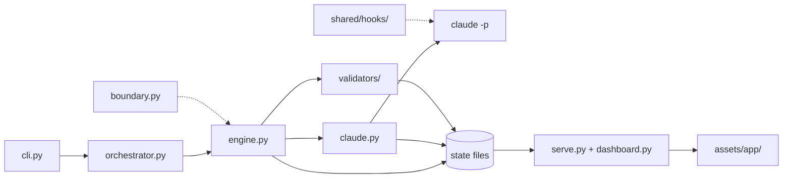

# Architecture

devloops is one Python package, standard library only, with no runtime dependencies. This page
names the parts of its code and what each one does, so you know where to look before you
change something.

## The kit and the project

devloops keeps what it ships apart from what it works on.

- **The kit** is the folder `loops/`: the loop definitions (`backend-dev/` and `frontend-dev/`,
  each a `loop.json`, its `Loop-instructions.md` and `task.md`), the prompts
  (`shared/prompts/`), the JSON schemas (`shared/schemas/`), the hooks (`shared/hooks/`), the
  default settings (`shared/config/defaults.json`), and the templates `devloops init` installs
  (`shared/skills/`, `shared/project/`). Runs only read it (`kit.py`).
- **The driver** is the Python code in `loops/shared/devloops/`. `pyproject.toml` ships it as
  the package `devloops`, and the kit as the data package `devloops_kit`.
- **A project** is any folder with `.devloops/devloops.json`, made by `devloops init`
  (`project.py`, `initcmd.py`). Its [workspaces](../glossary.md#workspace) hold everything a run
  writes.

Nothing in the kit or the driver is specific to one application: the requirements, the targets
and the settings are inputs. A test, `test_no_app_specifics.py`, fails when application details
appear there.

From a checkout, `bin/devloops` runs the driver without installing it.

## From a command to a call

- **`cli.py`** reads the command line and calls the code for each command: `run`, `approve`,
  `replan` and `retry` go to the orchestrator (with `--no-continue`, a decision goes straight
  to the engine); `check`, `init` and `dashboard` have their own
  modules (`checkcmd.py`, `initcmd.py`, `serve.py` and `dashboard_export.py`); `status` and
  `export-sessions` are in `cli.py` itself.
- **`orchestrator.py`** decides which [loops](../glossary.md#loop) a run includes, runs them in
  order (backend first), records the [handoff](../glossary.md#handoff) between them, and keeps
  the run's own state in `run/state.json`.
- **`engine.py`** runs one loop: it takes the loop's lock, checks the tools and inputs, makes
  the [plan](../glossary.md#plan), waits for or makes the [approval](../glossary.md#approval),
  then runs the [milestones](../glossary.md#milestone)' [trials](../glossary.md#trial) until the
  loop completes or stops. `selector.py` picks the next milestone and trial.
- **`claude.py`** makes each call to Claude Code (`claude -p`): it composes the prompt
  (`prompts.py`), runs the call in its own process group under a timeout, checks the answer,
  sorts any failure, and appends the call's record. It also copies the call's transcript into
  the workspace.
- **`validators/`** holds the code of [validation](../glossary.md#validation). The `validator`
  in each loop's `loop.json` names its module: `curl.py` (the backend's HTTP
  [checks](../glossary.md#check)) or `playwright.py` (the frontend, in a browser through the
  Playwright MCP server). `unit_tests.py` runs the optional unit tests, for both. `runtime.py`
  starts, waits for and stops the application while it is validated.

A milestone is achieved only when its validator passes; the engine never takes the model's word
for it. See [validation](../how-it-works/validation.md).

## The write boundary

Two parts keep Claude Code's writes inside the loop's [target](../glossary.md#target):

- **The hooks** in `loops/shared/hooks/` run inside Claude Code before each tool use:
  `guard_writes.py` refuses an edit or write outside the allowed folders, and
  `guard_processes.py` refuses commands that kill processes by name or pattern. `claude.py`
  passes them to every call.
- **`boundary.py`** takes a snapshot before each implement or fix call and compares after it: a
  file changed outside the allowed folders fails the trial. It never undoes a change.

See [security](../guides/security.md).

## State is files

Everything a run knows is in its workspace, in `<loop>/state/` and `<loop>/outputs/`: the run
state (`run.json`), the plan, the record of every call, the events, and one folder per trial
with its [evidence](../glossary.md#evidence). `state.py` writes each file atomically (to a temporary file, then renamed),
and the engine writes before the action it records. A run that stops resumes from these files
alone. The Markdown in `outputs/` and `progress.md` is written from the state by `render.py`
and never read back, except the answers you write in `outputs/open-questions.md`. The shape of each JSON file is a
schema in `loops/shared/schemas/`. See
[state and files](../how-it-works/state-and-files.md).

## The dashboard

- **`serve.py`** is a small HTTP server from the standard library. It serves the browser app
  and a JSON API whose answers are built by functions in `dashboard.py` (the views' data) and
  `artifacts.py` (file lists, file contents, conversations), every answer redacted. It only
  reads the workspaces.
- **`assets/app/`** is the browser app: plain JavaScript, no framework and no build step. The
  file `scripts.txt` lists its scripts in order, and `appbundle.py` joins them.
- **`dashboard_export.py`** writes the same app as one HTML file, with every answer inside it
  ([`devloops dashboard --export`](../reference/commands.md#dashboard--export)).

See [dashboard data](../how-it-works/dashboard-data.md).

## Other modules

| Module | What it does |
|---|---|
| `config.py` | Merges the settings from their layers into the settings a run uses |
| `inputs.py` | Checks the requirements and other inputs, and fingerprints them |
| `speckit.py` | Reads a spec-kit feature as the requirements |
| `plan.py` | Checks a plan beyond its schema |
| `schema.py` | A small JSON Schema validator, so devloops needs no dependency |
| `openapi.py` | Reads an OpenAPI document and matches requests to its operations |
| `preflight.py`, `checkcmd.py` | Check the tools a loop needs (`devloops check`) |
| `redact.py` | Replaces secrets before anything is written |
| `workspace.py` | Creates and opens workspaces, records targets, holds the lock |
| `progress.py` | Prints what a command is doing, and writes `run.log` |

## Tests

The tests run the real command line against temporary copies of the checkout, with a
[stand-in](../glossary.md#stand-in) for Claude Code (`loops/shared/tests/fake_claude.py`) that
answers from scenario files. See [testing](testing.md).
