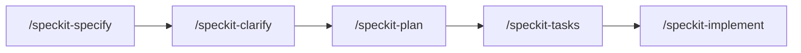

# Specs process

Every devloops feature is written down before it is built. The specifications live in
`specs/`, one folder per feature, and are made with
[spec-kit](https://github.com/github/spec-kit), whose files are in `.specify/` and whose
commands are Claude Code skills in `.claude/skills/` (`/speckit-specify`, `/speckit-plan` and
the others).

## The steps



| Step | Writes | What it is |
|---|---|---|
| `/speckit-specify` | `spec.md`, `checklists/requirements.md` | What the feature must do and why: user stories, functional requirements (`FR-…`), success criteria (`SC-…`), edge cases and assumptions. No design |
| `/speckit-clarify` | `spec.md` | Up to five targeted questions about what the spec leaves unclear; the answers go back into the spec |
| `/speckit-plan` | `plan.md`, `research.md`, `data-model.md`, `contracts/`, `quickstart.md` | How to build it: the design, each decision with its reasons (`R-…`), the data, the interfaces, and a check against the constitution |
| `/speckit-tasks` | `tasks.md` | The work in order, as numbered tasks (`T001`…) grouped by user story |
| `/speckit-implement` | the code, and `[X]` in `tasks.md` | Doing the tasks, phase by phase |

`/speckit-analyze` checks the spec, the plan and the tasks against each other, and
`/speckit-checklist` writes a checklist for reviewing the requirements themselves. The
templates every step fills are in `.specify/templates/`.

A feature folder is `specs/NNN-short-name/`, numbered in order: `001-reusable-dev-loops` built
the loops, `003-single-run-command` the single `devloops run`, `005-dashboard-redesign` the
dashboard, `006-docs-site` this site. Mark each task `[X]` in `tasks.md` when it is done.

## The constitution

`.specify/memory/constitution.md` holds the principles every design must follow: requirements
first, reusability (nothing specific to one application in the loops), small verified steps,
recoverable and bounded automation, separated concerns, reuse of the existing infrastructure,
testability and traceability, documentation that describes the system as built, and
simplicity. Each plan checks itself against them before and
after its design, and records any deviation with its reason.

The constitution changes only by a documented amendment, versioned as its Governance section
says.

## Requirement IDs in the code

Code comments and docstrings cite the requirements they implement, so a reader can go from the
code to the reason for it:

```python
def retry(self, milestone_id, reason=None, trials=None, continue_run=False):
    """Grant a failed milestone more trials and move the run back to `implementing` (FR-063)."""
```

An ID without a spec number (`FR-063`) belongs to the spec the code was written for; cite the
spec when it is ambiguous (`003 FR-008`). Research decisions are cited as `R-…`, success
criteria as `SC-…`. The site's pages cite their requirements the same way, in the `sources` of
their front matter (`spec 001 FR-063`; see [writing style](writing-style.md#front-matter)).

## When a later spec changes earlier behavior

Specs are not rewritten after the fact. When a later spec changes what an earlier one
specified, the earlier spec gets a note in place where the behavior is described:

```markdown
> **Revised by specs/003-single-run-command**: FR-039 required each loop to be runnable directly
> through the CLI. That command is removed; [...]
```

The pages of this site that describe that behavior are changed to describe it as it is now,
in the same commit as the code, and get a short "Changed by spec NNN" note where the change is
(spec 006 FR-025; see [documentation](documentation.md)). The note names what changed; the page
itself describes only the system as built, and the full history stays in the specs.

The user manual that came before this site is mentioned in older specs. Those specs stay as
they were written; the site replaces the manual.

devloops is still in development, so a breaking change needs no migration path: no shims, no
deprecated options kept alive. Where people may still type a removed option, it can get a clear
error that names its replacement instead, as the old dashboard options do (see the
[removed options](../reference/commands.md#removed-options)).
