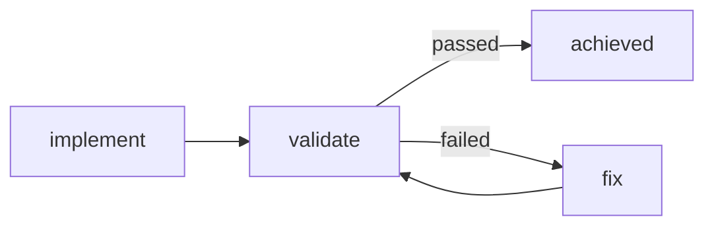

# Writing style

Every page of this site follows the rules below. They exist so that someone who has never used
devloops can read any page and understand it, without opening the source code.

## Who reads these pages

Write for a developer who:

- is at home in a terminal, and knows what a web application, an HTTP API and a test are;
- has never used devloops, and does not know how Claude Code runs without its interactive screen
  (headless Claude Code);
- reads a page to do something: understand a run, fix a stopped one, change a setting.

Do not assume they have read the other pages, or the specs in `specs/`.

## The rules

1. **Plain words.** Prefer the everyday word: "use", not "utilise"; "start", not "initiate".
2. **Short sentences.** One idea per sentence, and one idea per paragraph.
3. **Active voice.** Say who does what: "devloops starts the application", not "the application
   is started".
4. **What and why before how.** Say what a thing is and why it exists before the steps to use it.
5. **No source code needed.** Describe what devloops does, not how its code is written. Name a
   file or a function only on the [contributing](index.md) pages.
6. **Describe what devloops does today.** Not what it will do, and not what it used to do. When
   a later spec changes a behavior, change the page in the same commit.
7. **Use the words of the glossary**, and use each one the same way everywhere.

## Terms

Every devloops word (milestone, trial, check, workspace, and the others in the
[glossary](../glossary.md)) is either explained in the sentence where a page first uses it, or
linked to its glossary entry:

```markdown
Each milestone is built in [trials](../glossary.md#trial): attempts that end with validation.
```

The glossary's words also show their short definition when a reader hovers over them, on every
page. The definitions are in `docs-include/abbreviations.md`, one line per word:

```markdown
*[trial]: One attempt at a milestone: write or fix the code, then validate it.
```

When you add a word to the glossary, add its line there too; a test fails when the two lists
differ.

## Links to the reference

The reference pages are generated from devloops' code, so they are always right. When a page
mentions a command, an option, a configuration key, a step, a status or an exit code, link it to
its reference entry. The site's build fails when a link points at an entry that no longer
exists, so a renamed option cannot be left behind.

| You mention | Link to | Example |
|---|---|---|
| a command | `reference/commands.md#<command>` | [`devloops approve`](../reference/commands.md#approve) |
| an option | `reference/commands.md#<command>--<option>` | [`--max-trials`](../reference/commands.md#run--max-trials) |
| a configuration key | `reference/configuration.md#<key>` | [`max_trials`](../reference/configuration.md#max_trials), [`models.plan`](../reference/configuration.md#models.plan) |
| a step | `reference/steps.md#step-<step>` | [`implement`](../reference/steps.md#step-implement) |
| a status | `reference/statuses.md#<kind>-<status>` | [`achieved`](../reference/statuses.md#milestone-achieved) |
| a stop reason | `reference/statuses.md#stop-<reason>` | [`trials-exhausted`](../reference/statuses.md#stop-trials-exhausted) |
| an exit code | `reference/exit-codes.md#exit-<code>` | [exit code 10](../reference/exit-codes.md#exit-10) |
| a file a run writes | `reference/state-files.md#<file>` | [`run.json`](../reference/state-files.md#loop-state-run.json) |

Write the paths relative to the page you are writing (from `docs/guides/`, that is
`../reference/...`).

Commands, options, configuration keys and workspace paths in code are checked too: a test fails
when a page shows a command or option devloops does not have, a dotted configuration key the
schemas do not define, or a path in a workspace that a run never writes.

## Diagrams

Draw a flow, a sequence or a set of statuses as a [Mermaid](https://mermaid.js.org/) diagram,
in a `mermaid` code block. Keep labels short; explain the details in the text around it.



## Examples

Never type a command's output by hand. Every output on this site comes from a real run of
devloops, written by `tools/docs/examples.py` into `docs-include/examples/`, and included with
a snippet:

```markdown
;--8<-- "examples/status.txt"
```

A test fails when the outputs no longer match what devloops prints. The example application is generic (a small
service that lists and creates items), so no page describes one particular application.

## Front matter

Every page starts with its title, a one-sentence description (used by search and link previews)
and the sources it was checked against:

```yaml
---
title: How a run works
description: >-
  From requirements to a finished application: the plan, its approval, and each milestone.
sources:
  - loops/shared/devloops/engine.py
  - spec 001 FR-012
---
```

A source is a file or folder of this repository, or a requirement written as `spec NNN <ID>`. The
list is never shown to readers; it tells the next writer, and the reviewer, what to read to check
the page. A test fails when a source does not exist.

## Before and after

> **Before:** The driver invokes the implement step, after which validation is performed by the
> curl validator against the frozen checks.
>
> **After:** devloops asks Claude Code to write the milestone's code. Then it sends the
> milestone's HTTP requests to the running application and compares each answer with the one
> expected.

> **Before:** On exhaustion of `max_trials`, the run transitions to `stopped-on-failure` with
> reason `trials-exhausted`.
>
> **After:** When a milestone has used all its trials, the run stops. Its status says it stopped
> on a failure, and its reason says the trials ran out. `devloops retry` gives the milestone more
> trials.

> **Before:** Redaction is applied to configured secrets prior to persistence.
>
> **After:** Before devloops writes anything to disk, it replaces each secret you listed with
> `***`.
