# The dashboard

The [dashboard](../glossary.md#dashboard) is a web page, served on your own machine, that shows
everything a run did and is doing: each [loop](../glossary.md#loop) and
[milestone](../glossary.md#milestone), every [call](../glossary.md#call) to Claude Code with its
conversation and cost,
the files, the questions, and the events. It only reads the
[workspace](../glossary.md#workspace), so you can open it during a run or long after, and it
never changes anything. [Where the dashboard gets its data](../how-it-works/dashboard-data.md)
explains how.

The screenshots on this page come from the small sample run used throughout this site
(`tools/docs/screenshots.mjs` takes them), so their numbers are tiny.

## Start it

```sh
devloops dashboard
```

[`devloops dashboard`](../reference/commands.md#dashboard) serves the project's workspaces at
`http://127.0.0.1:8765/w/<workspace>/` and opens the page in your browser. It runs until you
press Ctrl+C. Run it from any folder inside the project.

| Option | What it does |
|---|---|
| [`--daemon`](../reference/commands.md#dashboard--daemon) | Serve in the background, and print the address and the log file once it answers |
| [`--stop`](../reference/commands.md#dashboard--stop) | Stop the project's dashboard, however it was started |
| [`--port`](../reference/commands.md#dashboard--port) | The port. Without it, devloops uses 8765, or the next free port up to 8784; `0` picks any free port |
| [`--no-open`](../reference/commands.md#dashboard--no-open) | Do not open a browser. Setting the environment variable `DEVLOOPS_NO_BROWSER=1` does the same for every dashboard command |
| [`--host`](../reference/commands.md#dashboard--host) | Listen on another address than `127.0.0.1`, to share it on a private network; see below |
| [`--export`](../reference/commands.md#dashboard--export) | Write the dashboard as one file instead of serving it; see [the export](#the-export) |

While a dashboard runs, the other devloops commands print its address instead of the command
to start it, and a second `devloops dashboard` prints that address instead of starting another.

**Sharing it.** By default only your own machine can reach the dashboard. With `--host 0.0.0.0`
(or one of the machine's addresses), others on the network can, and then every address the
command prints carries a random token, which the page needs;
[`--token`](../reference/commands.md#dashboard--token) sets your own and
[`--no-token`](../reference/commands.md#dashboard--no-token) turns it off. Anyone with the token sees the code, prompts and conversations, over
plain HTTP. Read [security](security.md#who-can-reach-the-dashboard) before you share it.

## Around every view

- **The sidebar** leads to every view: the overview and the run, each loop, and the details
  (Claude calls, questions and events, with their counts, and files). With more than one workspace,
  a menu at its top switches between them.
- **The status** in the top bar shows how the run stands, and **Live** says the page follows the
  run. Press it to pause following (it then shows **Paused**); it shows **Offline** when the server
  stopped.
- **The "now" panel**, above every view, shows the call to Claude Code running at this moment:
  its loop, milestone, trial, step and model, how long it has run, and the tools it used so far.
  When nothing runs, it shows the run's status and the next thing to do, or what it waits for.
- **The theme button** switches between light and dark.
- Hovering over a token count shows its parts (input, output, cache), and hovering over a
  [requirement](../glossary.md#requirements), [task](../glossary.md#task) or criterion ID shows
  its text.

## Overview

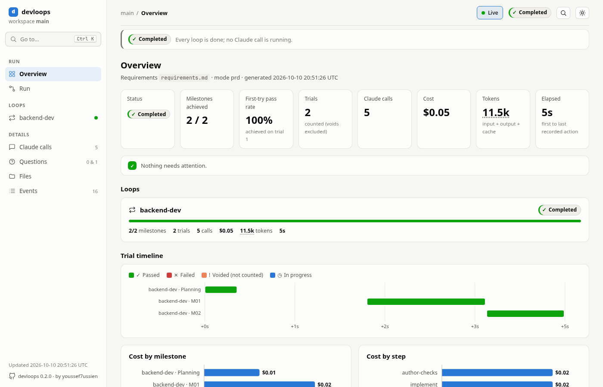

The first page answers "how is the run going?":

- **The headline numbers**, explained [below](#the-numbers): status, milestones achieved,
  first-try pass rate, trials, Claude calls, cost, tokens and elapsed time.
- **Needs attention**: what to look at first, most urgent first. A loop that stopped, was
  interrupted or waits for you, with the next thing to do; criteria failing on a milestone's
  latest trial; questions without an answer, and suggested answers not yet accepted; suggested
  answers accepted automatically, to review like assumptions; failed calls;
  [evidence](../glossary.md#evidence) files over 1 MB (the likeliest place for a secret to hide); and
  milestones that passed only after failed or voided trials. Each item links to its detail. When
  only notes are left, the box is titled **Worth knowing**; when there is nothing, it says so.
- **A card per loop**, with its progress bar, its counts and its next action.
- **The trial timeline**: every planning and milestone trial on one time line, colored by its
  result (passed, failed, voided, in progress).
- **Cost by milestone** and **cost by step**, as bars; hover one for its details.

## Run

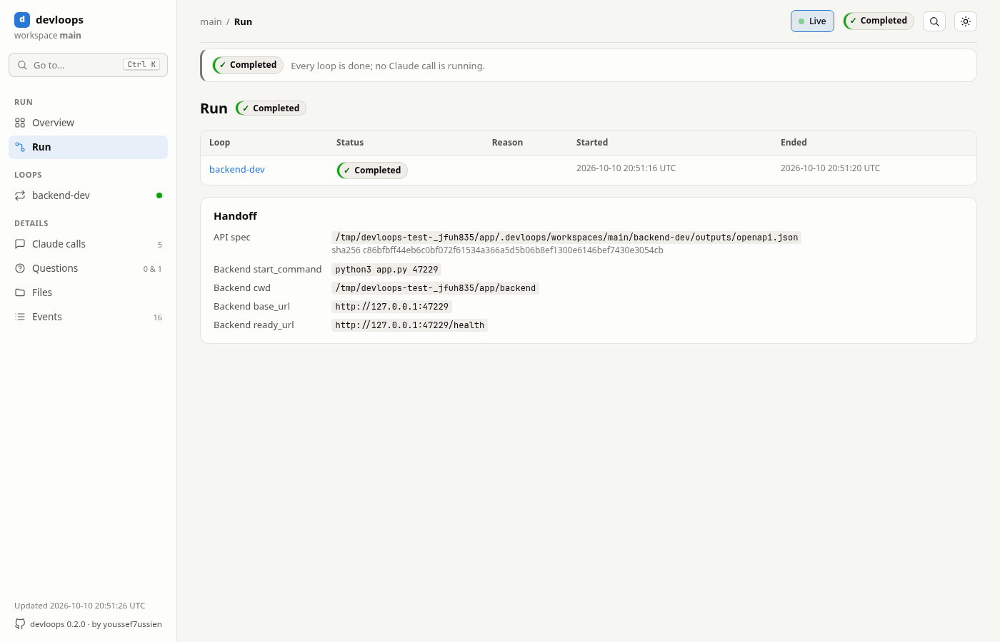

The run view lists the loops the run includes, with each one's status, the reason it stopped
(if it did), and when it started and ended. Below, **Handoff** shows what the backend passed to
the frontend (the [handoff](../glossary.md#handoff)): the OpenAPI document with its fingerprint,
and how to start the backend. See
[the run lifecycle](../how-it-works/run-lifecycle.md).

## A loop

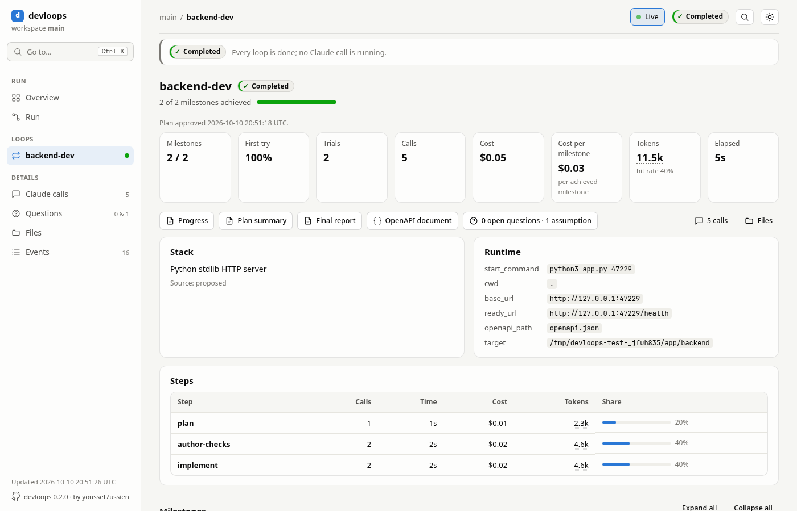

A loop's view answers "what did this loop build, and what did it cost?":

- its numbers, with the cost per achieved milestone and the cache hit rate;
- links to its outputs (progress, plan summary, final report, the OpenAPI document), its
  questions and assumptions, its calls and its files;
- the stack and the [runtime](../glossary.md#runtime) the [plan](../glossary.md#plan) chose, and
  the loop's [target](../glossary.md#target);
- **Steps**: the calls, time, cost and tokens of each [step](../glossary.md#step), and its
  share of the loop's cost. Each planning attempt has a row of its own; a step opens the loop's
  calls of that step;
- a card per milestone: its tasks, its [acceptance criteria](../glossary.md#acceptance-criterion)
  with the result, what was observed and the evidence (screenshots as thumbnails), and its
  trials, with any [retry grants](../glossary.md#retry-grant) shown before the trials they
  allowed.

## A trial

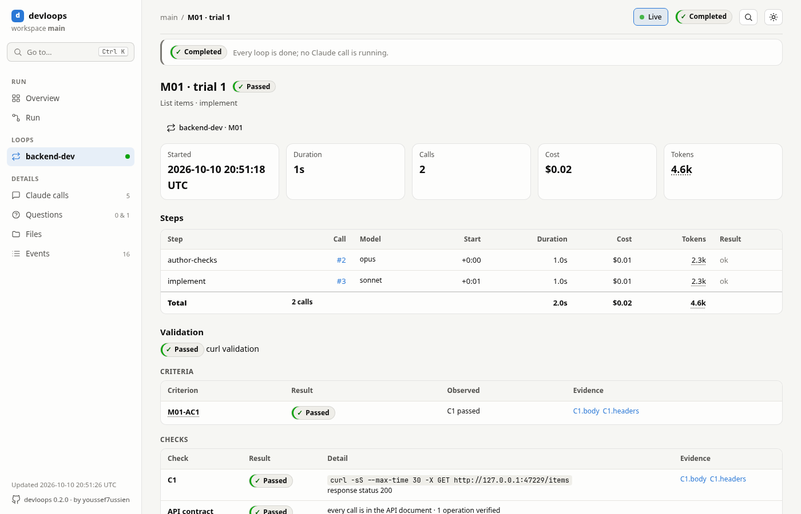

A [trial](../glossary.md#trial) opens from its milestone. It shows when it started, how long it
took, its calls, cost and tokens; **Steps**, with each call and its result; and **Validation**:
whether it passed (for the frontend, with the address of the user interface it tested), each
criterion with what was observed and its evidence, and each [check](../glossary.md#check), with
the request sent and the answer's status; then **Files changed** by its calls, and the files in
its folder. A failed trial first says why it failed. See [validation](../how-it-works/validation.md).

## Claude calls

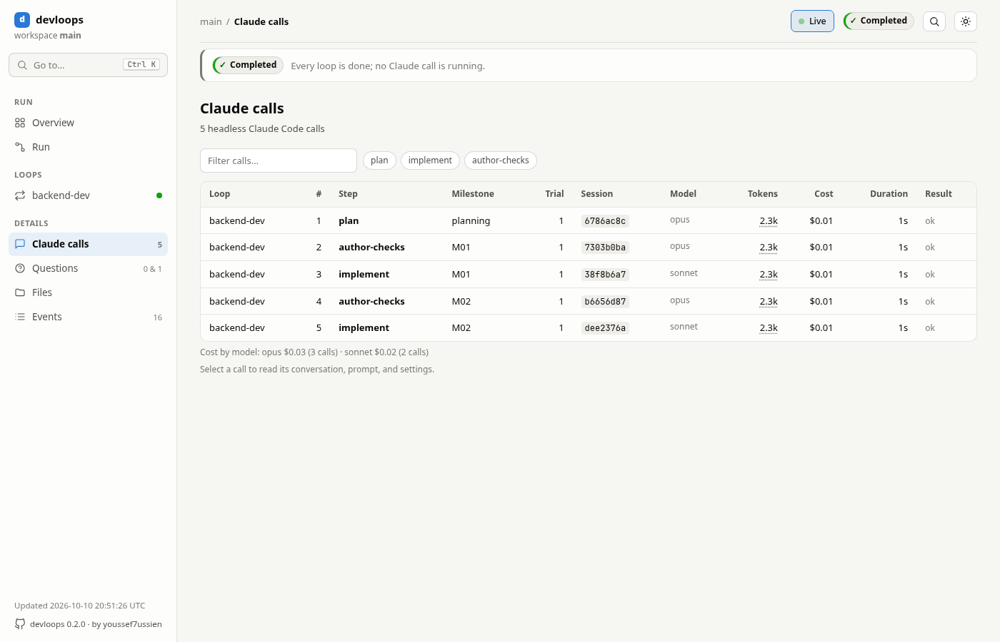

Every call to Claude Code, in order, with its loop, step, milestone, trial, model, tokens, cost,
duration and result. Filter them by text, by loop and by step. When the calls used more than one
model, the cost by model is under the table: the cost and number of calls for each model. A call that named no model, so that Claude Code used its
own default, shows as "(Claude Code default)"; a call recorded before devloops recorded models
shows as "(not recorded)" in the cost by model.

## A call and its conversation

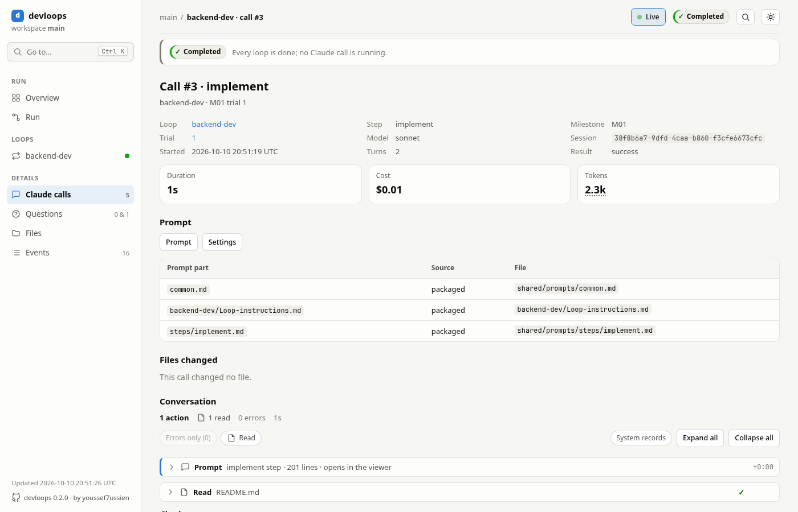

A call shows:

- its loop, step, milestone, trial, model and session, and its duration, cost and tokens;
- **Prompt**: the prompt devloops sent, and the parts it was made of, each with where it came
  from (packaged with devloops, or your project's [override](prompts.md)); **Settings**: the
  settings of the call;
- **Files changed** by the call;
- **Conversation**: what Claude Code did, in order. Each tool use is one line (a file read, a
  command run, a file written) that opens to show its input and result. Claude's replies are
  shown as text. You can show only errors, show or hide the system records, and expand or
  collapse everything.

## Files

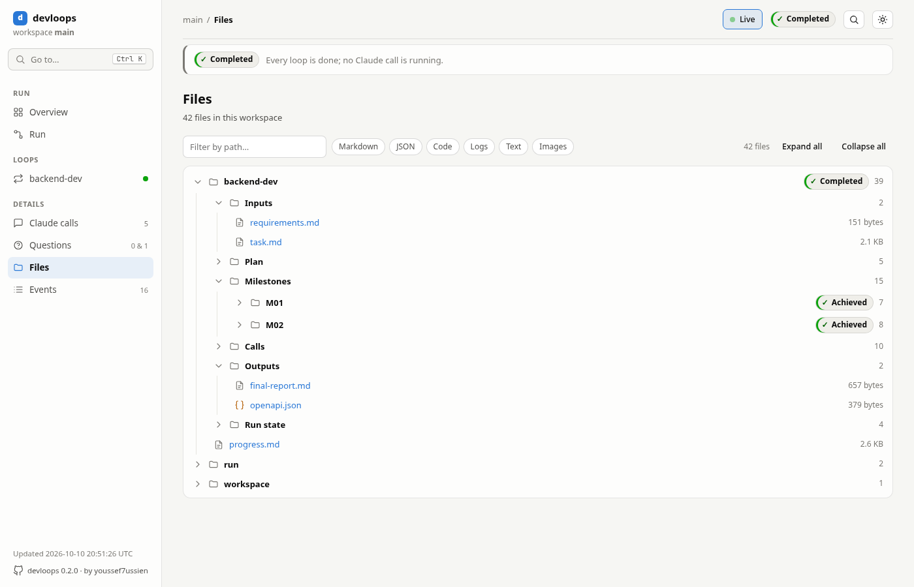

The files of the workspace, as a tree per loop (its inputs, plan, milestones with their trials
and evidence, calls, outputs and run state), then the run's files and the workspace's own. Filter by path, or by type (Markdown, JSON, code,
logs, text, images).

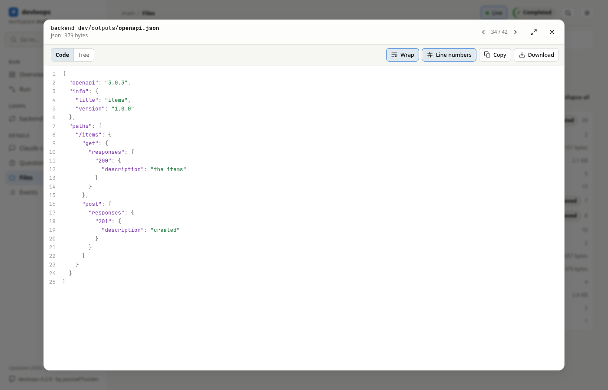

A file opens in a large viewer. It renders Markdown (or shows its source), indents and
highlights JSON (or shows it as a tree you can fold), shows JSON lines one record per row,
highlights code and logs, and fits images to the window. You can copy, download, wrap lines and
show line numbers. `[` and `]` step to the previous and next file, and Esc closes it. Before it
loads a file over 20 MB, the viewer asks, and offers a download instead.

## Questions and assumptions

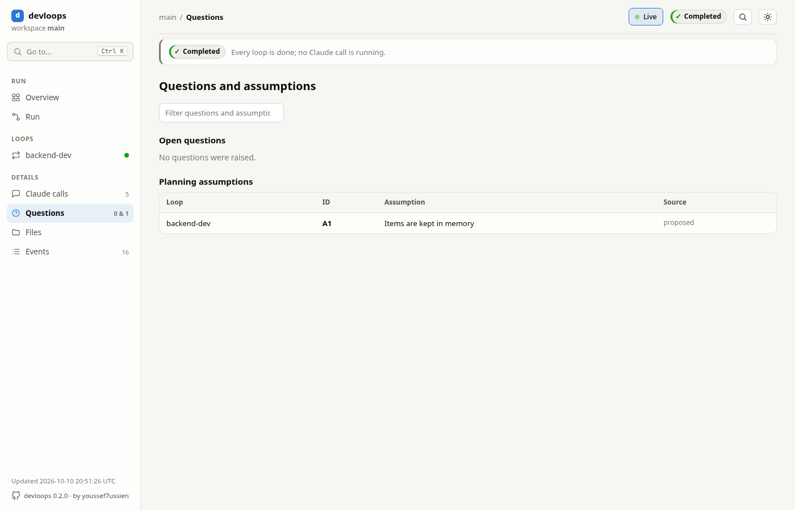

Every [open question](../glossary.md#open-question), with the answer used and where it came
from (yours, or a [suggested answer](../glossary.md#suggested-answer) accepted), and every
[assumption](../glossary.md#assumption) Claude made while planning. Filter them by text and by
loop. See
[approval and questions](approval-and-questions.md).

## Events

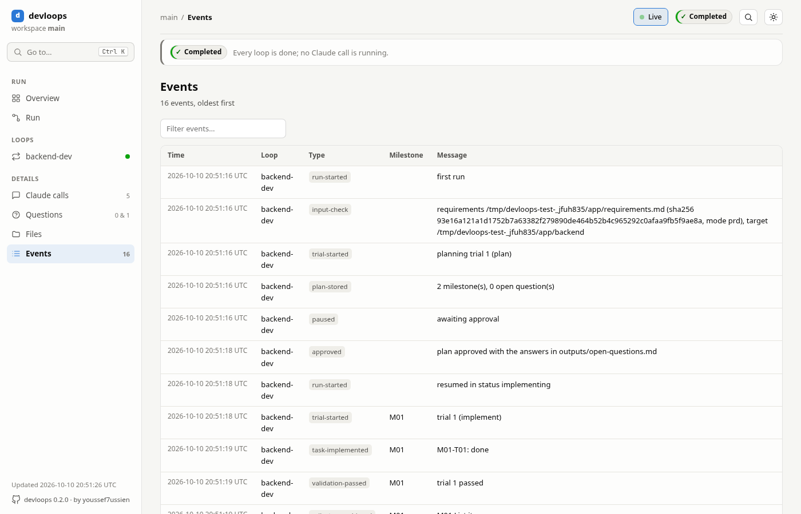

Everything that happened, oldest first: the run started, a plan stored, a trial started or
passed, a milestone achieved, a stop. Each event has its time, loop, type, milestone and message.
Filter them by text.

## Search

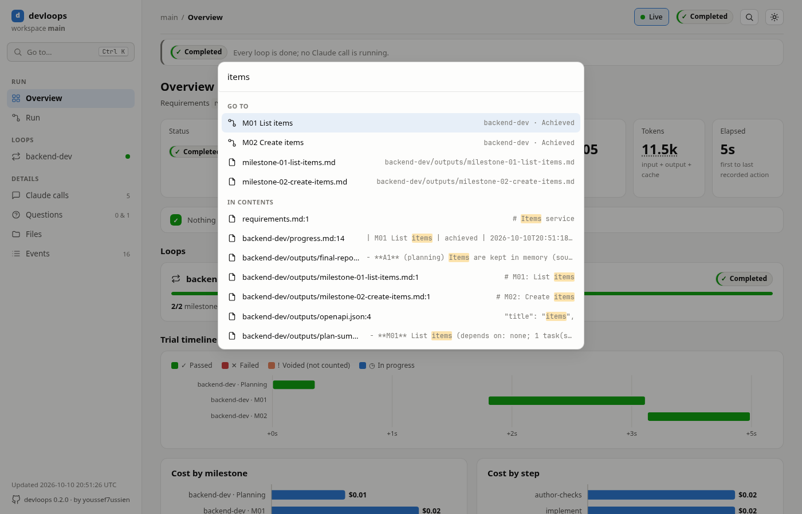

**Go to** (Ctrl+K, or `/`) jumps to any view, loop, milestone, trial, call or file as you type
its name. From three characters, it also searches the text of every file, conversation and
event, and shows each match in its line.

## Following a live run

While a run goes on, the page updates by itself. It checks for changes every 3 seconds and
redraws only the view you are on: open folders, filters and the file in the viewer stay where
they are, and a log that grows shows its new lines. The "now" panel follows the call that is
running. [Following a run](../how-it-works/dashboard-data.md#following-a-run) explains how.

## The numbers

| Number | What it is |
|---|---|
| Milestones achieved | Milestones that passed validation, out of all milestones in the plans |
| First-try pass rate | Of the achieved milestones, the share that passed on their first trial |
| Trials | Trials that count toward the limit: every milestone trial except voided ones |
| Claude calls | Calls to Claude Code, for planning, checks, code and validation |
| Cost | The cost Claude Code reported for each call, added up |
| Tokens | Input, output, and cache tokens (written and read), added up; hover for the parts |
| Cache hit rate | Of all the input tokens (new, written to the cache, and read from it), the share read from the cache. A high rate means calls reused earlier context |
| Cost per milestone | The loop's cost divided by its achieved milestones |
| Share (Steps) | A step's cost as a share of its loop's cost |
| Elapsed | From the first to the last recorded action (event or call) |

When a call's record lacks its cost or tokens, the sums include what is known and are a lower
bound.

## The export

```sh
devloops dashboard --export
```

```text
--8<-- "examples/export.txt"
```

`devloops dashboard --export` writes the dashboard of one workspace as a single HTML file, an
[export](../glossary.md#export), that opens anywhere, offline, with no other file. It has the same views, with all their data inside:
every input, plan file, output, check, trial record, piece of evidence (images included), prompt,
and the conversation of every call. Its top bar says **Snapshot**, when it was exported, with
which devloops version, and "run in progress" when a run was going on; it does not follow a run. Search works as in the live dashboard.

Without a path, the file goes to
[`exports/<stamp>.html`](../reference/state-files.md#exports-stamp.html) in the workspace, and
each export keeps its own file: delete old ones when you no longer need them. With a path, it
goes there, replacing a file of that name.

An export leaves out:

- files over 5 MB, which it lists but does not include (open them on disk, or in the live
  dashboard);
- syntax highlighting of code;
- conversations devloops could not find, which it shows as unavailable.

The command prints the file's size and its largest items, as above.

**Review an export before you share it.** It contains whole conversations, including the
contents of files Claude Code read. Only the values listed under
[`secrets`](../reference/configuration.md#secrets) are hidden. See [security](security.md).
