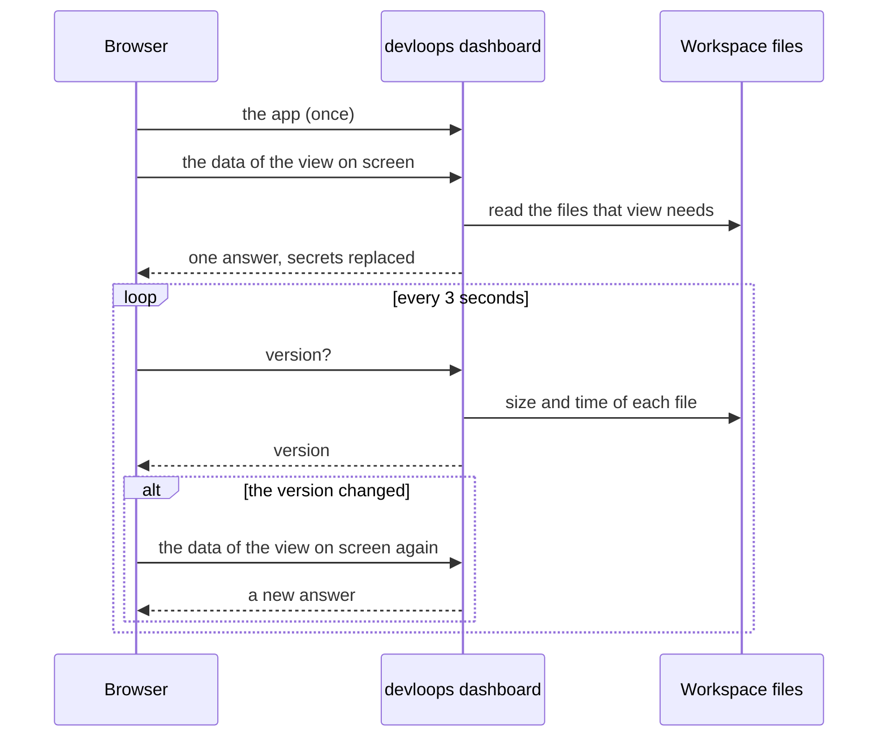

# Where the dashboard gets its data

The [dashboard](../glossary.md#dashboard) shows everything a run did. This page explains where
that comes from, and why opening it can never change a run. To use the dashboard, see
[the dashboard guide](../guides/dashboard.md).

## It only reads the workspace

A run keeps everything in files in its [workspace](../glossary.md#workspace): the plan, the state
of each loop, the record of every call to Claude Code, the evidence of each trial, and the
outputs (see [state and files](state-and-files.md)). The dashboard reads those files, and nothing
else.

[`devloops dashboard`](../reference/commands.md#dashboard) starts a small web server on your
machine. It never writes to the project, and it answers only requests that read. It starts no
other program, so you can open it while a run goes on, or long after.

The server does keep one small file, outside the project: a note of its address and process, in
your user's runtime folder. Other devloops commands read that note, so they can print the
dashboard's address instead of the command to start it. The note is outside the project, so a
run never sees it as a change.

## One answer per view

The browser loads the dashboard app once. After that, the server sends it only data.

Each view asks for its own data when you open it, and nothing else: the overview asks for a
summary of the workspace, a loop's view asks for that loop, a trial's view for that trial, and
so on. A file's contents, and the conversation of a call, are sent only when you open them. This
is why the page opens fast, however big the workspace is.

The server works out a view's answer the first time it is asked for, and keeps it. It works it
out again only after the workspace changed.

Before any answer leaves the server, devloops replaces each value listed under
[`secrets`](../reference/configuration.md#secrets) with `***`. This applies to every answer,
every file and every conversation the server sends.

The server sends only the files the workspace's listing holds, named by their place in that
listing, never by a path the request gives. A listed file must lie inside the workspace, or be
one of the run's recorded inputs, such as the requirements.

## Following a run

While a run goes on, the dashboard updates by itself:

1. The server works out a short **version** of the workspace: a fingerprint of the name, size
   and time of every file in it. It works this out at most once a second, however many pages
   ask.
2. Every 3 seconds, while the page is visible and not paused, the browser asks for that version.
3. When the version is the same, nothing happens.
4. When it changed, the browser forgets the answers it kept, and asks again only for what is on
   the screen: the view you are on, the navigation, and the "now" panel. Other views ask for
   fresh data when you next open them.

An update keeps your place: the scroll position, open sections and filters stay as they were.
A file open in the viewer is reloaded only when that file changed, at the same position, or at
its end when you were reading its end, so a growing log shows its new lines.

**Live**, in the top bar, pauses following. When the server stops answering, the page says
**Offline** and keeps showing what it has.



## The "now" panel

Above every view, the "now" panel says what is happening at this moment.

While devloops calls Claude Code, the running command keeps a small file up to date in the
loop's state folder: the loop, milestone, trial, [step](steps.md) and model of the call, when it
started, and the tools it used so far. The panel shows that file, but only while the command that
wrote it is still running. A file left behind by a stopped command is not shown as running.

When no call is running, the panel shows the run's status, and what happens next: the command to
run, or what the run is waiting for.

The server works out this answer on every request, and never keeps it, so it is always current.

## Search

`Ctrl K` jumps to any view, loop, milestone, trial, call or file by its name. From three
characters on, it also searches the text of every file and conversation in the workspace.

The server reads those texts, with secrets replaced, and keeps them between searches. Before each
search it checks each file's size and time, and reads again only the files that changed.

## The export

[`devloops dashboard --export`](../reference/commands.md#dashboard--export) writes the same app
into one HTML file, with the data inside it. It opens in a browser anywhere, without devloops,
without a network, and without any other file.

To build it, devloops works out every answer the app could ask the server for, with the same
code and the same secret replacement as the server, and puts each one in the page. Files and
images go in too; a file over 5 MB is listed with its size but left out. The text the search
looks through goes in as well, so the export searches its own data in the browser.

When the exported app asks for data, it reads it from the page instead of the server. Nothing
asks for a version, because an export never changes: its top bar says it is a snapshot, when it
was taken, and with which devloops version.

The command prints where it wrote the file, its size, and the largest items inside it:

```text
--8<-- "examples/export.txt"
```

Exports are kept in the workspace's [`exports/`](../reference/state-files.md#exports-stamp.html)
folder, and never replaced. The dashboard's file listing, and its version, leave that folder out.

!!! warning "Review an export before you share it"
    An export holds whole conversations with Claude Code, including the contents of the files
    Claude read. Only the values listed under `secrets` are hidden.
