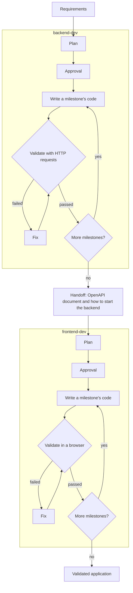

# How it works

This section explains what devloops does during a run, from the requirements you give it to the
validated application it leaves behind. You do not need to read devloops' code to follow it.

## The big picture

1. **Requirements in.** You give devloops the [requirements](../glossary.md#requirements), a
   description of what to build: a Markdown file, one [story](../glossary.md#story), or a spec-kit
   feature.
2. **Plan.** Claude Code reads the requirements and writes a [plan](../glossary.md#plan): the
   [milestones](../glossary.md#milestone) in order, their [tasks](../glossary.md#task), the statements each must make
   true, and how to start the application. devloops checks the plan before it keeps it.
3. **Approval.** By default devloops [approves](../glossary.md#approval) the plan by itself and
   accepts Claude's [suggested answers](../glossary.md#suggested-answer) to its questions. With
   [`--review-plan`](../reference/commands.md#run--review-plan) it waits for you.
4. **Milestones, one at a time.** Each milestone is built in [trials](../glossary.md#trial).
   Claude Code writes the code, then devloops validates it. When validation fails, the next
   trial fixes the code, until the milestone passes or runs out of trials.
5. **Validation decides.** A milestone passes only when devloops' own
   [validation](../glossary.md#validation) passes: real HTTP requests for the backend, a real
   browser for the frontend. Claude's report that the work is done is never enough.
6. **Outputs.** When every milestone has passed, the loop writes its final report. The backend
   loop publishes its OpenAPI document; the frontend loop records the address of the user
   interface.

A run includes the [loops](../glossary.md#loop) your project uses. The backend loop runs first.
When it completes, it hands its OpenAPI document and the way to start the backend to the
frontend loop (the [handoff](../glossary.md#handoff)), which then makes its own plan.

A project without a frontend stops after the backend loop. Everything a run does is kept in
files in its [workspace](../glossary.md#workspace), so a run that stops can resume where it
stopped.

## The pages of this section

| Page | What it explains |
|---|---|
| [The run lifecycle](run-lifecycle.md) | Which loops a run includes, the plan, approval, milestones, completion, and what a run prints |
| [Steps](steps.md) | Each kind of call to Claude Code: what it is given, what it may do, and what it must return |
| [Validation](validation.md) | What passes and fails a backend milestone and a frontend milestone, and why Claude's word never counts |
| [Trials and recovery](trials-and-recovery.md) | Trials, fixes, running out of trials, retries, questions during a trial, and resuming after a stop |
| [Statuses](statuses.md) | Every status of the run, a loop, a milestone, a task and a trial, and how one leads to the next |
| [State and files](state-and-files.md) | What devloops writes, where, and when, and why a run can resume from it |
| [Dashboard data](dashboard-data.md) | How the dashboard reads a workspace and follows a run as it happens |

For each loop on its own, see [the backend loop](../guides/backend-loop.md) and
[the frontend loop](../guides/frontend-loop.md).
