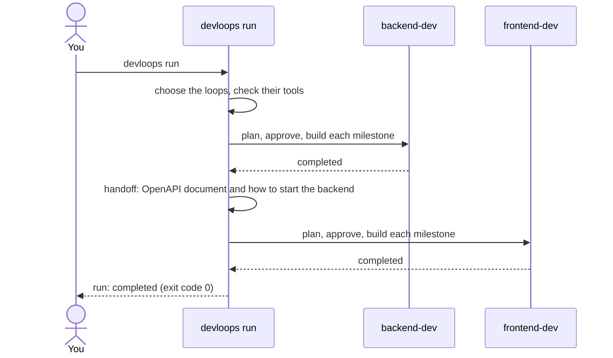
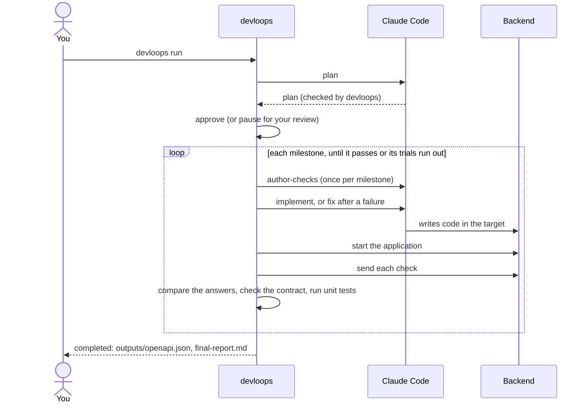
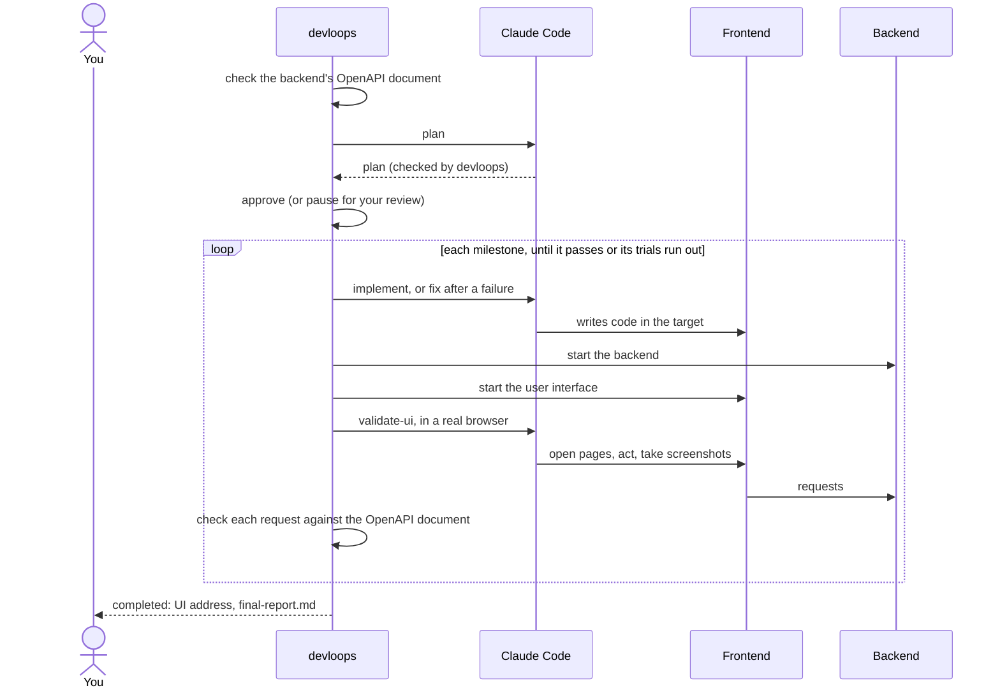

# The run lifecycle

A run is everything [`devloops run`](../reference/commands.md#run) does to turn your
[requirements](../glossary.md#requirements) into a validated application. This page follows a run
from start to end: which loops it includes, how each loop plans, gets its plan approved, builds
its milestones, and completes.

## Which loops a run includes

devloops has two [loops](../glossary.md#loop): backend-dev builds the HTTP API, and frontend-dev
builds the user interface. A loop is part of a run when it has a [target](../glossary.md#target),
the folder it writes code to. devloops takes the first of these that applies, for each loop:

1. the target already recorded in the workspace (once a loop has run, it stays in the run);
2. [`--backend-target`](../reference/commands.md#run--backend-target) or
   [`--frontend-target`](../reference/commands.md#run--frontend-target);
3. the project's [`targets`](../reference/configuration.md#targets) setting, when it is not
   `null` (placed under [`--target-root`](../reference/commands.md#run--target-root) when you give
   it).

The backend always runs first, because the frontend is built against what the backend publishes.
A project can use the backend alone, but not the frontend alone. devloops checks this before it
writes anything. With no loop at all, the run stops with the reason `no-loop`; with a frontend
but no backend, it stops with `frontend-needs-backend`. Both exit with
[code 30](../reference/exit-codes.md#exit-30), and nothing is written, not even the workspace.

Before it spends anything, devloops also checks the tools each included loop needs (Claude Code
and curl for the backend; Node, the Playwright MCP server and a browser for the frontend). A
missing tool stops the run with [`missing-tool`](../reference/statuses.md#stop-missing-tool), and
[`devloops check`](../reference/commands.md#check) says how to install it.

## The whole run



When the backend completes, devloops records the [handoff](../glossary.md#handoff): the backend's
published OpenAPI document and how to start the backend. The frontend loop gets both: it builds
against the document, and devloops starts the backend while it validates the frontend. The
handoff is recorded even when the project has no frontend, so a frontend added later starts from
it without building the backend again.

If a loop stops or pauses, the run stops there and exits with that loop's code. The frontend never
starts until the backend has completed. Running `devloops run` again resumes the run, and a loop
that already completed is not run again.

## One loop, step by step

Each loop goes through the same four stages: plan, approval, milestones, completion.

### 1. Plan

devloops asks Claude Code, in one [`plan`](../reference/steps.md#step-plan) call, to turn the
requirements into a [plan](../glossary.md#plan). The plan holds:

- a list of the requirements, each with its ID, so the rest of the plan can cite them;
- the [milestones](../glossary.md#milestone), in order, each with its tasks and its
  [acceptance criteria](../glossary.md#acceptance-criterion), every one citing the requirements it
  comes from;
- the stack (languages and frameworks) and the [runtime](../glossary.md#runtime): how to start
  the application and the address it answers on;
- the [open questions](../glossary.md#open-question) the requirements leave unclear, most with a
  [suggested answer](../glossary.md#suggested-answer), and the
  [assumptions](../glossary.md#assumption) Claude made.

devloops does not trust the plan as given. It checks that the plan has the expected shape, that
no two items share an ID, that every requirement a task cites is in the list, and that each
milestone comes after the milestones it depends on. It also checks that a run limited to one
[story](../glossary.md#story) plans only that story's work, and that the backend's runtime names
where its OpenAPI document will be. A plan that fails any check is a failed planning
[trial](../glossary.md#trial), and devloops asks again, telling Claude what was wrong. Planning
gets the same number of trials as a milestone ([`max_trials`](../reference/configuration.md#max_trials),
three by default). If every planning trial fails, the run stops with
[`planning-trials-exhausted`](../reference/statuses.md#stop-planning-trials-exhausted), and you
start a new workspace.

A valid plan is stored, and devloops writes readable copies of it into the loop's `outputs/`
folder: [`plan-summary.md`](../reference/state-files.md#loop-outputs-plan-summary.md), one file
per milestone, and the questions in
[`open-questions.md`](../reference/state-files.md#loop-outputs-open-questions.md).

### 2. Approval

No code is written until the plan is [approved](../glossary.md#approval). How that happens depends
on the [`questions`](../reference/configuration.md#questions) setting:

- **By default** (`accept-suggested`), devloops approves the plan at once and accepts Claude's
  suggested answers. The run goes on without you, and the final report lists the accepted answers
  for you to review afterwards.
- **With [`--review-plan`](../reference/commands.md#run--review-plan)** (or `questions` set to
  `ask`), the run pauses after the plan. In a terminal, devloops asks you to approve, edit the
  answers, plan again, or quit. Otherwise it exits with [code 10](../reference/exit-codes.md#exit-10),
  and you continue with [`devloops approve`](../reference/commands.md#approve) or
  [`devloops replan`](../reference/commands.md#replan).

Even by default, the run pauses when a question has no suggested answer, because there is nothing
to accept. Here is a run started with `--review-plan`, pausing after its plan:

```text
--8<-- "examples/run.txt"
```

`devloops approve` records the approval and continues the run in the same command. See
[approval and questions](../guides/approval-and-questions.md) for the details.

### 3. Milestones, one at a time

devloops builds the milestones in the order the plan lists them, which is their dependency order.
It always works on the first milestone that is not yet achieved. For each milestone:

1. **Checks first (backend only).** Before any code exists, Claude writes the milestone's
   [checks](../glossary.md#check), in an [`author-checks`](../reference/steps.md#step-author-checks)
   call: the HTTP requests to send, and the answers they must get. devloops stores them, and they
   stay the same for every trial of that milestone.
2. **Write the code.** Trial 1 is an [`implement`](../reference/steps.md#step-implement) call.
   Each later trial is a [`fix`](../reference/steps.md#step-fix) call that sees what failed last
   time and the evidence. These are the only calls in which Claude may change files, and only
   inside the target.
3. **Validate.** devloops tests the result itself. For the backend, it starts the application and
   sends every check. For the frontend, it starts the user interface and has Claude use it in a
   real browser, with every request checked against the backend's OpenAPI document. See
   [validation](validation.md).
4. **Pass or try again.** When validation passes, the milestone and its tasks become
   [achieved](../reference/statuses.md#milestone-achieved), and devloops moves to the next
   milestone. When it fails, the milestone uses a trial and the next trial fixes the code.

A milestone that uses all its trials stops the run with
[`trials-exhausted`](../reference/statuses.md#stop-trials-exhausted) (exit
[code 20](../reference/exit-codes.md#exit-20)). Everything is kept, and
[`devloops retry`](../reference/commands.md#retry) gives it more trials. See
[trials and recovery](trials-and-recovery.md).

Each time a backend milestone is achieved, devloops publishes the OpenAPI document again, into
[`outputs/openapi.json`](../reference/state-files.md#loop-outputs-openapi.json). It keeps only the
operations that a check of an achieved milestone actually called. When
[`git.commit_per_milestone`](../reference/configuration.md#git.commit_per_milestone) is on,
devloops also makes a git commit for each achieved milestone.

### 4. Completion

The loop is [completed](../reference/statuses.md#loop-completed) when every milestone is achieved.
devloops then writes [`final-report.md`](../reference/state-files.md#loop-outputs-final-report.md)
into the loop's `outputs/` folder. Its first sections are the decisions the requirements left
open: the suggested answers that were accepted, and the assumptions. Then come the milestones,
the trials each used, and a summary of each milestone's validation. A loop that stops on a
failure or on an input error gets a final report too, saying why it stopped.

The backend loop leaves its OpenAPI document in `outputs/openapi.json`. The frontend loop leaves
the address of the user interface in its `outputs/` folder, in `ui-url.txt`.

### The backend loop



### The frontend loop



## Following a run

While it works, `devloops run` prints one line for each thing that happens: a planning or
milestone trial starting, each call to Claude Code (with the model it uses, then its duration and
cost), a validation passing or failing, a milestone achieved, a pause or a stop. A line names the
loop, then the milestone and trial (`M01 #1`) or the planning trial (`plan #1`). Here is the rest
of the run above, continued by `devloops approve`:

```text
--8<-- "examples/approve.txt"
```

While a call to Claude Code runs, which can take many minutes, a terminal shows a status line
with the time so far, the number of tools used, and the last one. Without a terminal, devloops
prints a "still ..." line every minute instead.

| Option | Prints |
|---|---|
| (none) | the lines above, then a summary |
| [`--verbose`](../reference/commands.md#run--verbose) | also one line for each tool Claude uses |
| [`--quiet`](../reference/commands.md#run--quiet) | only the summary |
| [`--json`](../reference/commands.md#run--json) | only a JSON summary, unless `--verbose` is also given |

Every line, with the tools and whatever the option, also goes to the loop's
[`state/run.log`](../reference/state-files.md#loop-state-run.log). To follow a run started
elsewhere, for example in the background:

```sh
tail -f .devloops/workspaces/main/backend-dev/state/run.log
```

The [dashboard](../guides/dashboard.md) shows the same run in your browser.

## When a run does not complete

A run ends in one of a few ways, and each has its own [exit code](../reference/exit-codes.md):

| Exit code | What happened | What to do |
|---|---|---|
| [0](../reference/exit-codes.md#exit-0) | Every loop completed. | Read each loop's final report. |
| [10](../reference/exit-codes.md#exit-10) | A plan awaits your approval. | `devloops approve` or `devloops replan`. |
| [20](../reference/exit-codes.md#exit-20) | A milestone used all its trials, or a question needs your answer. | Read the evidence, then `devloops retry`. |
| [30](../reference/exit-codes.md#exit-30) | An input or a tool is missing or changed. | Fix it, then `devloops run`. |
| [50](../reference/exit-codes.md#exit-50) | Claude Code was unavailable, rate-limited, or logged out. | Fix the cause, then `devloops run`. No trial is lost. |

When a run stops, it prints the one command to run next. [Trials and
recovery](trials-and-recovery.md) explains each case, and [statuses](statuses.md) shows every
status a run, a loop and a milestone can have.
