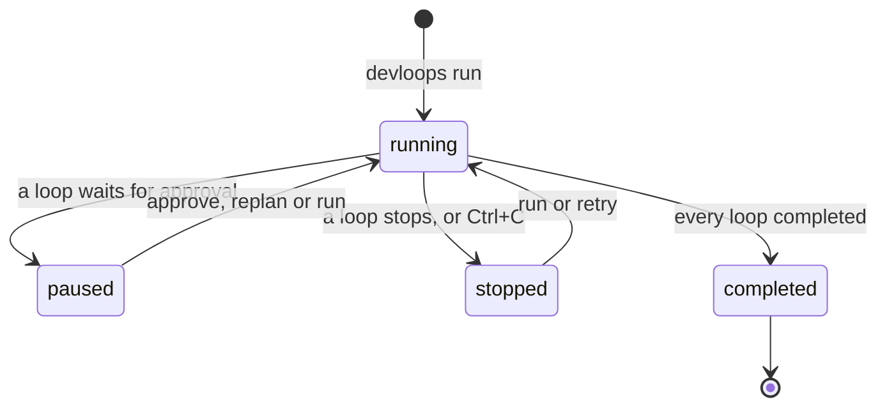
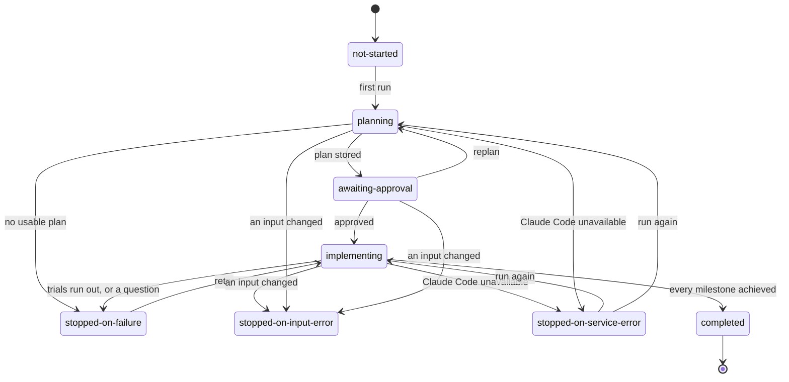
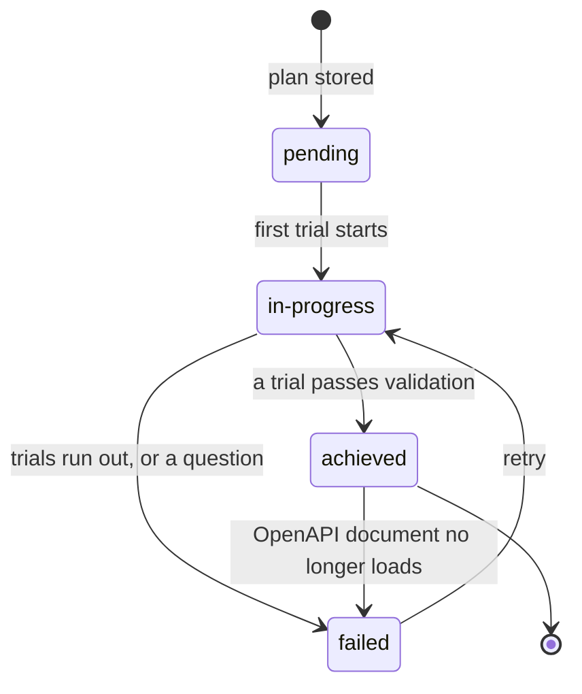
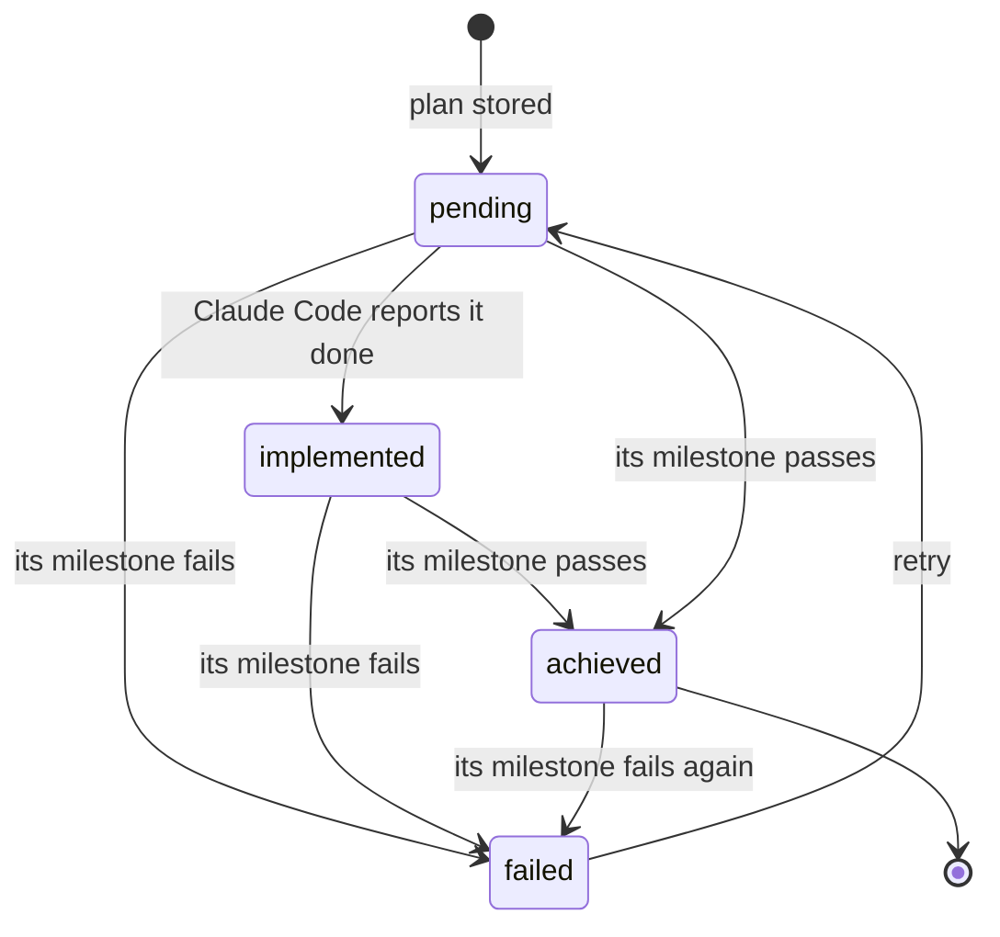
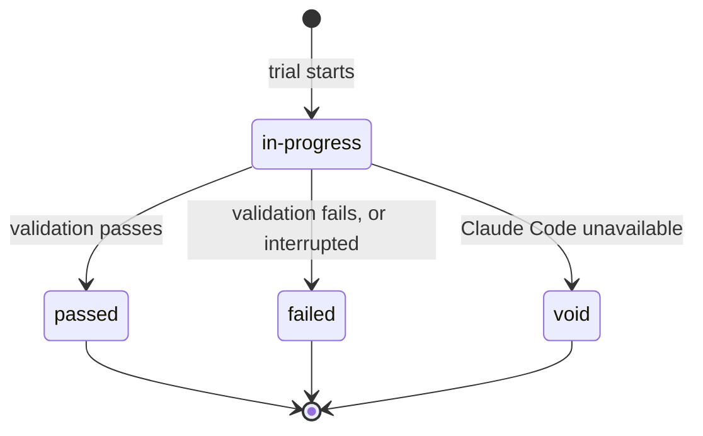
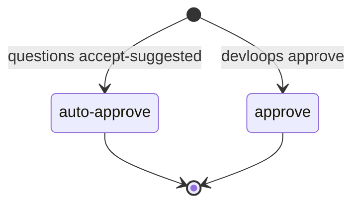

# Statuses

devloops records a status for each thing it tracks: the whole run, each
[loop](../glossary.md#loop), each [milestone](../glossary.md#milestone) and its
[tasks](../glossary.md#task), each [trial](../glossary.md#trial), and the approval of the
[plan](../glossary.md#plan). This page shows how one status leads to the next, and what causes
each change. The [statuses reference](../reference/statuses.md) has the one-line meaning of
every value.

`devloops status` and the [dashboard](../guides/dashboard.md) show these statuses as they are
now.

## Run {#run}

The run is everything one `devloops run` does in a [workspace](../glossary.md#workspace), across the loops it includes.

- [`running`](../reference/statuses.md#run-running): a devloops command starts or resumes the
  run, and works through its loops in order.
- [`paused`](../reference/statuses.md#run-paused): a loop stored its plan and waits for you to
  approve it ([exit code 10](../reference/exit-codes.md#exit-10)). `devloops approve`,
  `devloops replan` or `devloops run` sets the run running again.
- [`stopped`](../reference/statuses.md#run-stopped): a loop stopped (its status says why), or
  you pressed Ctrl+C. `devloops run` resumes it; after a stop on a failure, `devloops retry`
  does.
- [`completed`](../reference/statuses.md#run-completed): every loop the run includes is
  completed.

## Loop {#loop}

Each loop has its own status, in its `run.json`.

- [`not-started`](../reference/statuses.md#loop-not-started): the loop has no run in this
  workspace yet. The first `devloops run` that includes it starts planning.
- [`planning`](../reference/statuses.md#loop-planning): Claude Code writes the plan. A plan that
  passes devloops' checks is stored, and the loop moves to `awaiting-approval`.
- [`awaiting-approval`](../reference/statuses.md#loop-awaiting-approval): the plan waits for
  approval. By default devloops approves it at once, with Claude's
  [suggested answers](../glossary.md#suggested-answer), and moves on. With
  [`--review-plan`](../reference/commands.md#run--review-plan) (given to any command, it holds
  for the rest of the run), with `questions` set to
  `ask`, or when a question has no suggested answer, it waits for `devloops approve` (to `implementing`) or `devloops replan`
  (back to `planning`).
- [`implementing`](../reference/statuses.md#loop-implementing): devloops builds and validates
  the milestones, one at a time.
- [`completed`](../reference/statuses.md#loop-completed): every milestone is achieved. Nothing
  moves a completed loop.
- [`stopped-on-failure`](../reference/statuses.md#loop-stopped-on-failure): something failed. A
  milestone used all its trials, a question needs your answer, the plan step found no usable
  plan within its trials, or the run reached its limit of calls to Claude Code.
  [`devloops retry`](../reference/commands.md#retry) moves it back to `implementing` when a
  milestone failed; the other stops are final for this workspace.
- [`stopped-on-input-error`](../reference/statuses.md#loop-stopped-on-input-error): an input is
  wrong or changed since the run started, such as the requirements. This can happen when any
  devloops command resumes the loop, in `planning`, `awaiting-approval` or `implementing`. The
  stop is final for this workspace: restoring the input does not resume it; start a new
  workspace. A problem found before the loop
  first starts (a missing tool, say) records no run at all, so the loop stays `not-started`.
- [`stopped-on-service-error`](../reference/statuses.md#loop-stopped-on-service-error): Claude
  Code could not be used (an outage, a rate limit, an expired login). The trial does not count.
  `devloops run` restores the status the loop had, `planning` or `implementing`, and goes on.

Ctrl+C is not a status of its own: the loop keeps `planning` or `implementing`, with the reason
[`interrupted`](../reference/statuses.md#stop-interrupted), until `devloops run` resumes it. See
[trials and recovery](trials-and-recovery.md).

## Milestone {#milestone}

- [`pending`](../reference/statuses.md#milestone-pending): every milestone starts here when the
  plan is stored.
- [`in-progress`](../reference/statuses.md#milestone-in-progress): its first trial starts.
  Milestones are built in the plan's order, so one is in progress at a time.
- [`achieved`](../reference/statuses.md#milestone-achieved): a trial passed
  [validation](validation.md). An achieved milestone is never built again, with one exception
  in the backend loop: when its OpenAPI document no longer loads as devloops publishes it, the
  milestone fails again (see [validation](validation.md#the-published-openapi-document)).
- [`failed`](../reference/statuses.md#milestone-failed): it used all its trials
  ([`max_trials`](../reference/configuration.md#max_trials), plus any granted), or Claude Code
  asked a question devloops may not answer by itself (it has no suggested answer, or
  [`questions`](../reference/configuration.md#questions) is `ask`). A
  [retry grant](../glossary.md#retry-grant) sets it back to
  `in-progress`.

## Task {#task}

- [`pending`](../reference/statuses.md#task-pending): every task starts here.
- [`implemented`](../reference/statuses.md#task-implemented): Claude Code reported the task done
  in a trial. This is Claude's word only, so it does not make the task achieved.
- [`achieved`](../reference/statuses.md#task-achieved): its milestone passed validation. Every
  task of the milestone becomes achieved then, whatever Claude reported.
- [`failed`](../reference/statuses.md#task-failed): its milestone failed. Every task not
  achieved becomes failed (all of them, when an achieved milestone fails again); a retry grant
  sets them back to `pending`.

## Trial {#trial}

A trial is one attempt at a milestone, or at the plan.

- [`in-progress`](../reference/statuses.md#trial-in-progress): Claude Code works, then devloops
  validates the result.
- [`passed`](../reference/statuses.md#trial-passed): validation passed (for a planning trial:
  the plan passed devloops' checks).
- [`failed`](../reference/statuses.md#trial-failed): validation failed, the call failed, or the
  trial was interrupted (Ctrl+C, or devloops was killed). It counts toward the limit, and the
  next trial fixes the code.
- [`void`](../reference/statuses.md#trial-void): Claude Code could not be used. The trial does
  not count, and the next one gets the same number.

## Plan approval {#approval}

When a plan is approved, devloops records how.

- [`auto-approve`](../reference/statuses.md#approval-auto-approve): devloops approved the plan
  by itself and accepted Claude's suggested answers, because the
  [`questions`](../reference/configuration.md#questions) setting is `accept-suggested` (the
  default) and every question has an answer or a suggestion.
- [`approve`](../reference/statuses.md#approval-approve): you approved it with
  [`devloops approve`](../reference/commands.md#approve).

[`devloops replan`](../reference/commands.md#replan) sends a plan back instead: it clears the
recorded approval, and Claude Code plans again with your answers. The new plan is then approved
like the first, and recorded as `auto-approve` or `approve`.

See [approval and questions](../guides/approval-and-questions.md).

## Stop reasons {#stop-reasons}

When a loop stops, its status says how (`stopped-on-…`), and its reason says why.

| Reason | Status | What to do |
|---|---|---|
| [`trials-exhausted`](../reference/statuses.md#stop-trials-exhausted) | `stopped-on-failure` | Read the last trial's evidence, then `devloops retry` |
| [`needs-input`](../reference/statuses.md#stop-needs-input) | `stopped-on-failure` | Answer in `outputs/open-questions.md`, then `devloops retry` |
| [`publish-failed`](../reference/statuses.md#stop-publish-failed) | `stopped-on-failure` | Fix the target's OpenAPI document, then `devloops retry` |
| [`planning-trials-exhausted`](../reference/statuses.md#stop-planning-trials-exhausted) | `stopped-on-failure` | Final: start a new workspace, perhaps with clearer requirements |
| [`invocation-cap`](../reference/statuses.md#stop-invocation-cap) | `stopped-on-failure` | Final: start a new workspace with a higher limit |
| [`missing-input`](../reference/statuses.md#stop-missing-input) | `stopped-on-input-error` | Give the missing file |
| [`story-not-found`](../reference/statuses.md#stop-story-not-found) | `stopped-on-input-error` | Name a [story](../glossary.md#story) the requirements have |
| [`invalid-api-spec`](../reference/statuses.md#stop-invalid-api-spec) | `stopped-on-input-error` | Give a valid OpenAPI document |
| [`missing-tool`](../reference/statuses.md#stop-missing-tool) | `stopped-on-input-error` | Install it (`devloops check` shows how), then `devloops run` |
| [`input-changed`](../reference/statuses.md#stop-input-changed) | `stopped-on-input-error` | Final: start a new workspace |
| [`workspace-mismatch`](../reference/statuses.md#stop-workspace-mismatch) | `stopped-on-input-error` | Use the workspace's own [target](../glossary.md#target), or another workspace |
| [`target-unwritable`](../reference/statuses.md#stop-target-unwritable) | `stopped-on-input-error` | Make the target folder writable |
| [`service-unavailable`](../reference/statuses.md#stop-service-unavailable) | `stopped-on-service-error` | Wait, then `devloops run` |
| [`rate-limited`](../reference/statuses.md#stop-rate-limited) | `stopped-on-service-error` | Wait, then `devloops run` |
| [`auth-failed`](../reference/statuses.md#stop-auth-failed) | `stopped-on-service-error` | Log in to Claude Code again, then `devloops run` |
| [`interrupted`](../reference/statuses.md#stop-interrupted) | none: the loop keeps its status | `devloops run` |

Most input errors are found before the loop first starts, and then nothing is recorded: fix the
cause and run again. See [trials and recovery](trials-and-recovery.md) for each case.
