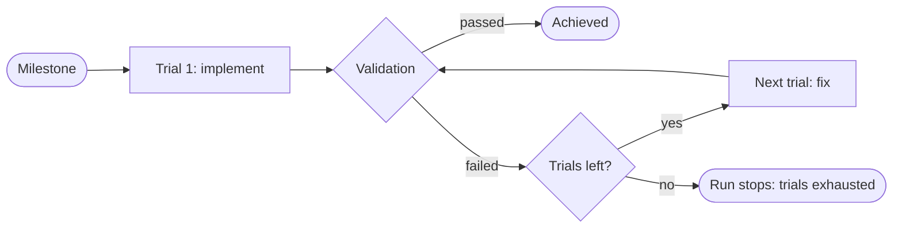

# Trials and recovery

devloops builds each [milestone](../glossary.md#milestone) in
[trials](../glossary.md#trial). A trial is one attempt: Claude Code writes the code, then
devloops tests the result with its own [validation](validation.md). This page explains what a
trial is given, what happens when it fails, and how a run continues after it stops.

## What a trial is

Each trial has two parts:

1. **One call to Claude Code.** The first trial of a milestone uses the
   [`implement`](../reference/steps.md#step-implement) step: write the milestone's code. Every
   later trial uses the [`fix`](../reference/steps.md#step-fix) step: change the code so that the
   last failure goes away.
2. **devloops' own validation** of what that call left behind.

Only validation decides whether the trial passes. What Claude Code says about its work is
recorded, but it never passes a trial. When validation fails, devloops records why, with a short
reason, a detail, and the [evidence](../glossary.md#evidence) it collected.

## How many trials a milestone gets

A milestone gets [`max_trials`](../reference/configuration.md#max_trials) trials, three by
default. You can set it in the project's configuration, or for one run with
[`--max-trials`](../reference/commands.md#run--max-trials).

The limit keeps a run from trying forever. When a milestone uses its last trial and still fails,
the run stops, and the milestone's status becomes
[`failed`](../reference/statuses.md#milestone-failed). You then decide what happens next (see
[when a milestone runs out of trials](#when-a-milestone-runs-out-of-trials)).

devloops can use a stronger model for a milestone's last chance: when
[`models.fix_last_trial`](../reference/configuration.md#models.fix_last_trial) is set, the last
allowed `fix` trial runs on that model.

## What a trial sees

The first trial gets the milestone itself: its goal, its tasks, and its
[acceptance criteria](../glossary.md#acceptance-criterion), plus how to start the application.

A `fix` trial also gets:

- **the last failure**: its reason and detail, and where to find that trial's validation result
  and evidence (the HTTP requests and answers, screenshots, the application's log);
- **your answers** to the [open questions](../glossary.md#open-question), and the suggested
  answers that were accepted;
- **your guidance**: the reason you gave with each [retry grant](../glossary.md#retry-grant) for
  this milestone.

What the milestone must do does not change between trials. Its acceptance criteria stay the same,
and for the backend so do its [checks](../glossary.md#check): they are written once, before the
first trial's code. A fix changes the code, never the test.

## Why a trial fails

Each failed trial records one reason.

| Reason | What happened | Counts as a trial? |
|---|---|---|
| `validation-failed` | Validation found a problem: a check failed, the code broke the OpenAPI document's rules, the unit tests failed, or a page called the backend outside its [contract](../glossary.md#contract). | Yes |
| `needs-input` | Claude Code asked a question the run cannot answer by itself. The run stops at once. | Yes, and the run stops |
| `boundary-violation` | Something was written outside the loop's [target](../glossary.md#target) folder. | Yes |
| `claude-error` | Claude Code ended with an error. | Yes |
| `timeout` | The call ran longer than [`invocation_timeout_seconds`](../reference/configuration.md#invocation_timeout_seconds). | Yes |
| `invalid-output` | Claude Code's answer did not have the required shape. | Yes |
| `runtime-start-failed` | The application did not start, or did not answer on its ready address in time ([`runtime.ready_timeout_seconds`](../reference/configuration.md#runtime.ready_timeout_seconds)). | Yes |
| `interrupted` | devloops itself was stopped during the trial. | Yes |
| a service error | Claude Code's service failed: a rate limit, an outage, or an expired login. | No: the trial is void |

[Validation](validation.md) explains in detail what passes and fails a milestone.

## Void trials

Sometimes a trial fails for a reason that has nothing to do with the code: Claude Code hit a rate
limit, its service was down, or its login expired. Counting that trial would be unfair, so
devloops marks it [`void`](../reference/statuses.md#trial-void) instead.

A void trial does not count toward the limit. The run stops at once, with
[exit code 50](../reference/exit-codes.md#exit-50), and its status says it stopped on a service
error. Fix the cause (for example, log in to Claude Code again), then run
[`devloops run`](../reference/commands.md#run). The same trial number runs again.

## Questions raised during a trial

Sometimes Claude Code needs a decision the requirements do not make, such as "should deleting a
missing item return 404 or 204?". It returns that decision as an open question, usually with a
[suggested answer](../glossary.md#suggested-answer), and builds the rest of the milestone on that
suggestion.

What happens next depends on the [`questions`](../reference/configuration.md#questions) setting:

- **`accept-suggested`** (the default): devloops accepts the suggestion, records it in
  `open-questions.md` for your review, and validates the trial as it was built. If the trial
  passes, the milestone is achieved. If it fails, it is an ordinary failed trial, and the next
  `fix` trial gets the answer.
- **`ask`**, or a question without a suggestion: the trial fails with `needs-input`, and the run
  stops at once, with [exit code 20](../reference/exit-codes.md#exit-20). Write your answer in
  `open-questions.md` (an empty answer accepts the suggestion), then run
  [`devloops retry`](../reference/commands.md#retry) for that milestone.

When a milestone runs out of trials after questions were answered automatically, the stop message
names those questions, because every trial was built on them. Check them before you retry. You
can rewrite an answer first; the retry uses the file as it is then.

[Approval and questions](../guides/approval-and-questions.md) explains questions in full.

## Processes Claude starts

During a trial, Claude Code often starts the application to try it out. Stopping it carelessly
can be dangerous. Claude Code's own process, and devloops', have the target folder's path on
their command line. So a command that stops processes by name, such as
`pkill -f "<target>/backend"`, can stop Claude Code itself. The call then dies, its answer is
lost, and the trial fails with `claude-error`.

devloops prevents this in four ways:

- **The instructions.** Claude Code is told to stop only the processes it started, by their
  process number, and to stop them before it answers.
- **A guard.** devloops reads every command Claude Code runs, and blocks the ones that stop
  processes by name or pattern (`pkill`, `killall`, or `kill` together with a process search).
  The message tells Claude Code how to stop its process instead. Stopping a process by its
  number, or freeing a port, is allowed.
- **Clean-up after each call.** When a call ends, devloops stops whatever the call left running:
  a server started in the background, a file watcher. It asks them to stop, then forces them a
  few seconds later. A process that detached itself completely (a daemon) escapes this.
- **Its own copy of the application.** For validation, devloops starts the application itself,
  from the plan's [runtime](../glossary.md#runtime), and stops it afterwards. What Claude Code
  left running does not matter.

## Example: one milestone, three trials

A milestone "Notes on cards" adds an API to read the notes on a card. Its code works, yet it runs
out of trials:

1. **Trial 1 (implement).** Every check passes. But the OpenAPI document also lists an operation,
   `GET /cards/{id}/notes`, that no check called.
2. **Trial 2 (fix).** Claude Code removes that operation from the document, and asks whether it
   should add it back.
3. **Trial 3 (fix).** Claude Code tests every criterion by hand, then stops its test server with
   `pkill`, which also stops Claude Code itself. The trial fails with `claude-error`.

Here is how devloops handles each trial today:

1. Trial 1 **passes**. An operation no check called does not fail the milestone. devloops leaves
   it out of the document it publishes and lists it as unverified, so the frontend knows not to
   call it.
2. A trial that asks a question is still validated, with the suggested answer accepted. Trial 2
   would also have passed.
3. The `pkill` is **blocked**, and Claude Code is told to stop its server by its process number.

## When a milestone runs out of trials

The run stops with the reason
[`trials-exhausted`](../reference/statuses.md#stop-trials-exhausted) and
[exit code 20](../reference/exit-codes.md#exit-20). Nothing is lost: every trial's record,
validation result and evidence stay in the [workspace](../glossary.md#workspace).

1. **Read why.** [`devloops status`](../reference/commands.md#status) shows the last failure.
   The [dashboard](../guides/dashboard.md) and `progress.md` show every trial: its reason and
   detail ([`trial.json`](../reference/state-files.md#loop-state-milestones-id-trials-n-trial.json)),
   the result of each criterion and check
   ([`validation.json`](../reference/state-files.md#loop-state-milestones-id-trials-n-validation.json)),
   and the evidence.
2. **Grant more trials.** Run `devloops retry --milestone M03 --reason "<what to change>"`.
   devloops gives the milestone more trials ([`--trials`](../reference/commands.md#retry--trials),
   `max_trials` by default) and continues the run in the same command. The
   [`--reason`](../reference/commands.md#retry--reason) reaches the next `fix` trial as your
   guidance; leave it out when the evidence says enough.
3. **If the plan itself is wrong**, start a new workspace with clearer requirements. A milestone
   that already passed is never planned again.

`retry` works only on a run stopped on a failure, and only for the milestone that failed. With
[`--no-continue`](../reference/commands.md#retry--no-continue) it only records the grant, and the
next `devloops run` uses it.

## Interruptions and resuming

A run keeps everything it does in files, written so that a crash never leaves one half-written
([state and files](state-and-files.md)). That is why a run can always continue where it stopped.

- **You press Ctrl+C.** devloops stops the call and the servers it started, and records the trial
  in progress as failed, with the reason `interrupted`. It counts toward the limit. The command
  ends with [exit code 130](../reference/exit-codes.md#exit-130). Run `devloops run` to continue:
  the next trial is a `fix`, with the interruption as its last failure. If that was the
  milestone's last trial, `devloops run` stops with `trials-exhausted` instead.
- **devloops was killed, or the machine stopped.** Run `devloops run` again. devloops finds the
  unfinished trial, records it as `interrupted`, and continues. If the kill left the workspace
  locked, add [`--force-unlock`](../reference/commands.md#run--force-unlock).
- **Claude Code's service failed** (exit code 50). No trial was used: fix the cause and run
  `devloops run` again.

Running `devloops run` on a run stopped on a failure changes nothing until you grant a retry.

Every stop, and what to do about it, is listed in the [statuses](statuses.md) and the
[exit codes](../reference/exit-codes.md).
