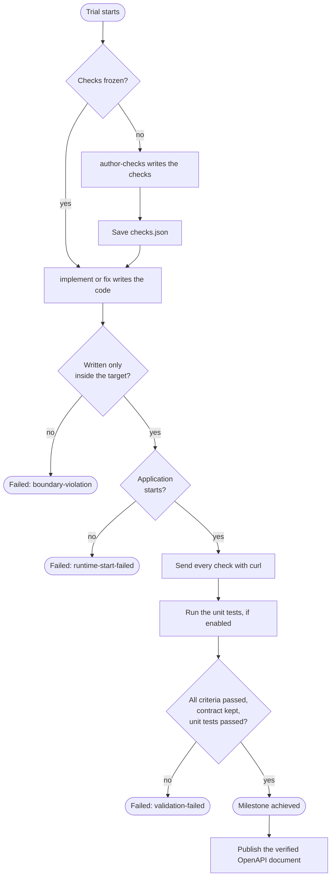
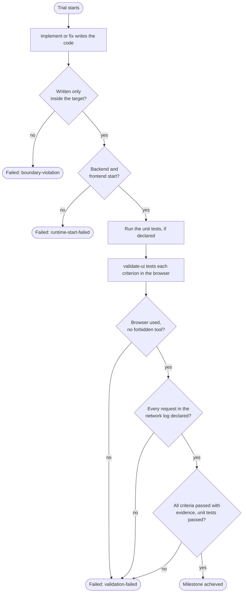

# Validation

After Claude Code writes or fixes a milestone's code, devloops tests the result itself. This test
is [validation](../glossary.md#validation), and it alone decides whether the
[milestone](../glossary.md#milestone) passes. This page explains what validation checks for each
loop, and every reason a [trial](../glossary.md#trial) can fail.

## Why Claude's word never counts

Claude Code reports what it did at the end of each call: the tasks it finished, the decisions it
made, the files it changed. devloops records that report, but never uses it to pass a milestone.
A model can be wrong about its own work, and it can be sure of it anyway.

So devloops gathers its own proof:

- For the backend, devloops starts the application and sends the HTTP requests itself, with
  curl. It keeps each request and each answer.
- For the frontend, a separate call to Claude Code drives a real browser, but devloops checks
  that call: it must really have used the browser, every result must cite evidence that exists,
  and the requests the page sent are read from the browser's own log, not from Claude's account.

A milestone passes only when every part of its validation passes. Then, and only then, its
milestone and [tasks](../glossary.md#task) become
[`achieved`](../reference/statuses.md#milestone-achieved).

## What every trial must also pass

Two rules apply to both loops, before validation even starts.

**Nothing written outside the target.** Claude Code may change files only inside the loop's
[target](../glossary.md#target) folder. A write tool aimed anywhere else is blocked as it
happens. A write through a shell command is caught afterwards: devloops takes a fingerprint of
the protected folders before each call and compares it after. Either way, the trial fails with
the reason `boundary-violation`, and devloops never validates it. Extra places Claude may write
to can be listed in [`boundary.allowed_extra`](../reference/configuration.md#boundary.allowed_extra).

**The application must start.** devloops starts the application with the plan's
[runtime](../glossary.md#runtime): the command in
[`runtime.start_command`](../reference/configuration.md#runtime.start_command), run in
[`runtime.cwd`](../reference/configuration.md#runtime.cwd). It then waits for
[`runtime.ready_url`](../reference/configuration.md#runtime.ready_url) to answer, for up to
[`runtime.ready_timeout_seconds`](../reference/configuration.md#runtime.ready_timeout_seconds)
(120 seconds by default). If it never answers, the trial fails with the reason
`runtime-start-failed`. Whatever happens, devloops stops the application when validation ends,
and keeps what it printed in the trial's
[`runtime.log`](../reference/state-files.md#loop-state-milestones-id-trials-n-runtime.log).

## What passes a backend milestone

The backend loop tests a milestone with its [checks](../glossary.md#check). A check is one HTTP
request and the answer it must get: a status code, text the body must contain, or values the
JSON body must hold.

### The checks are written first, and frozen

At the start of a milestone's first trial, before any of its code is written, a separate call to
Claude Code writes the milestone's checks: the
[`author-checks`](../reference/steps.md#step-author-checks) step. It may read the project, but
not change it. devloops then makes sure that:

- every [acceptance criterion](../glossary.md#acceptance-criterion) of the milestone is covered by
  at least one check;
- every check has its own name, made of letters, digits, `_`, `.` and `-`.

If not, the trial fails with the reason `invalid-output`. Otherwise devloops saves the checks in
[`checks.json`](../reference/state-files.md#loop-state-milestones-id-checks.json), and they stay
the same for every later trial of that milestone. A [`fix`](../reference/steps.md#step-fix) can
change the code, but never the test it has to pass.

### devloops runs the checks

With the application running, devloops sends each check's request with curl, in order. Each
check has 30 seconds to answer. For each one, devloops keeps the command it ran, the answer's
headers and the answer's body, as evidence in the trial's folder.

A check can save a value from its answer, such as the id of an item it just created, and a later
check can use it, for example to ask for that item. When the check that should save a value
fails, every later check that needs the value fails too, without being sent. So when several
checks fail, fix the first one: the others usually follow from it.

### What passes

The milestone passes when all of these hold:

- **Every acceptance criterion passed.** A criterion passes when all the checks that cover it
  passed.
- **The contract.** No check calls an operation the target's OpenAPI document does not declare.
  devloops reads the document from
  [`runtime.openapi_path`](../reference/configuration.md#runtime.openapi_path); a missing or
  unreadable document fails this rule. A check that expects 404 or 405 on an undeclared path is
  fine: it shows that the path does not exist.
- **The unit tests**, when [`unit_tests.enabled`](../reference/configuration.md#unit_tests.enabled)
  is on: the command in [`unit_tests.command`](../reference/configuration.md#unit_tests.command),
  or else the one the plan names, must exit with code 0. A missing command fails too.
- **Nothing written outside the target**, as above.

### The published OpenAPI document

When a backend milestone passes, devloops publishes the target's OpenAPI document as
[`outputs/openapi.json`](../reference/state-files.md#loop-outputs-openapi.json). It publishes
only the operations that the checks of an achieved milestone really called and got a success
answer from. An operation the document declares but no check verified does not fail the
milestone; it is left out of the published document, and listed in it as unverified. A later
milestone whose checks call that operation adds it back.

The [frontend loop](../guides/frontend-loop.md) builds against this document, so it can only
rely on operations that devloops has seen working.

## What passes a frontend milestone

The frontend loop tests a milestone in a real browser.

### devloops starts both sides

When the configuration says how, devloops starts the backend first
([`backend.start_command`](../reference/configuration.md#backend.start_command)), or uses one
already running at [`backend.base_url`](../reference/configuration.md#backend.base_url). Then it
starts the frontend with the plan's runtime, and records the address it answers on: the UI
address, the loop's output.

If unit tests are declared, devloops runs them now, with both sides up.

### A browser call, with limited tools

Then devloops makes one more call to Claude Code: the
[`validate-ui`](../reference/steps.md#step-validate-ui) step. This call may only read files and
use the browser, through the Playwright MCP server. It is given the UI address, the milestone's
acceptance criteria, the backend's OpenAPI document, and the result of devloops' own unit-test
run. For each criterion, it reports whether it passed, what it observed, and the screenshots that
show it.

A browser cannot run a command. So a criterion about the unit tests is judged on devloops' own
run of them, which the call is given: it passes only if those tests passed.

### What passes

The milestone passes when all of these hold:

- **Every acceptance criterion passed**, with a description of what was observed and at least one
  piece of evidence that really exists in the trial's folder.
- **The call really used the browser.** A call that made no browser action, or tried a tool it is
  not allowed, fails every criterion, whatever it reports.
- **The contract.** Every request the page sent to the backend is an operation the backend's
  OpenAPI document declares. This includes requests sent through the frontend's own server (a
  proxy). Requests that load the page itself, its scripts, styles and images, are not API calls,
  and requests to other sites (fonts, for example) are not the backend's.
- **The unit tests**, when [`unit_tests.enabled`](../reference/configuration.md#unit_tests.enabled)
  is on, exited with code 0. When unit tests are declared but not enabled, they still run for the
  browser call, but their failure fails nothing by itself.
- **Nothing written outside the target**, as for the backend.

### The browser's network log

devloops never takes Claude's word for which requests the page sent. It reads them from the
browser's own network log: the result of each time the call read that log.

The log starts again at each page load, so Claude is told to read it before leaving a page. The
contract fails when devloops cannot check every request:

- the call never read the log;
- a line of the log could not be read;
- the call used the browser again after its last read of the log, for example by clicking.
  Taking a screenshot or a snapshot of the page afterwards is fine: neither can send a request.

A request that a page load sends by itself, such as a classic form that loads a new page, can
still be missed.

When no backend is configured, any API call nothing could have answered fails the contract, so a
criterion that needs the backend can never pass by accident.

If the Playwright MCP server itself fails to start, the browser was never available, so the
trial does not count: it is void, and the run stops with
[exit code 50](../reference/exit-codes.md#exit-50).

## Why a trial fails

Every failed trial is recorded with a reason, a detail, and its evidence. The next trial, a
[`fix`](../reference/steps.md#step-fix), starts from them. See
[trials and recovery](trials-and-recovery.md) for what happens next.

| Reason | What happened | Uses up the trial? |
|---|---|---|
| `validation-failed` | A criterion failed, the contract was broken, or the enabled unit tests failed. | Yes |
| `boundary-violation` | Something was written outside the target. | Yes |
| `runtime-start-failed` | The application did not start, or did not answer in time. | Yes |
| `invalid-output` | The call's answer did not have the required shape, or the checks it wrote break a rule above. | Yes |
| `claude-error` | Claude Code exited with an error. | Yes |
| `timeout` | The call ran longer than [`invocation_timeout_seconds`](../reference/configuration.md#invocation_timeout_seconds). | Yes |
| `needs-input` | The call asked a question devloops cannot answer by itself. The run stops at once, with [exit code 20](../reference/exit-codes.md#exit-20). See [approval and questions](../guides/approval-and-questions.md). | Yes |
| `interrupted` | devloops itself was stopped during the trial: by `Ctrl C`, a crash, or a kill. | Yes |
| `rate-limited`, `service-unavailable`, `auth-failed` | Claude Code could not be used. The trial is [void](../reference/statuses.md#trial-void) and the run stops with [exit code 50](../reference/exit-codes.md#exit-50). | No: the same trial runs again next time |

When a milestone's last trial fails, the run stops with the reason
[`trials-exhausted`](../reference/statuses.md#stop-trials-exhausted).
[`devloops retry`](../reference/commands.md#retry) gives it more trials.

Each trial's result, with every criterion, the contract and the unit tests, is in its
[`validation.json`](../reference/state-files.md#loop-state-milestones-id-trials-n-validation.json).
