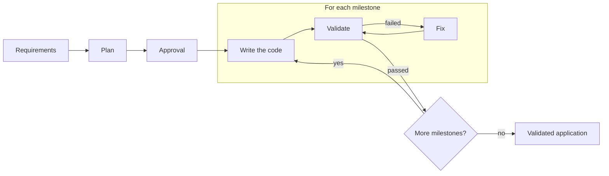

# devloops

devloops turns written requirements into a working, tested application. It does this by running
Claude Code without its interactive screen ([headless](glossary.md#headless-claude-code)), one
small part of the application at a time, and testing each part itself before it moves on.

## The problem it solves

Ask an AI model to build an application and it will tell you the work is done, whether it is or
not. Checking that claim by hand takes as long as the work. On a large application, the model
also loses track: it rewrites what already worked, or forgets what it was asked for.

devloops removes both problems. It splits the work into small parts and builds them in order, and
it never takes the model's word that a part works.

## The core idea

A [milestone](glossary.md#milestone) passes only when devloops' own
[validation](glossary.md#validation) passes. For an API, devloops sends real HTTP requests to the
running application and compares each answer with the one expected. For a user interface, it
opens the pages in a real browser. What Claude Code says about its work is recorded, but it never
decides whether a milestone passes.

First Claude Code reads the requirements and writes a [plan](glossary.md#plan): the milestones in
order, each with the statements that must be true for it to pass. Once the plan is
[approved](glossary.md#approval), devloops builds the milestones one by one. Each attempt at a
milestone is a [trial](glossary.md#trial). When validation fails, the next trial fixes the code,
and a milestone gets a limited number of trials (three by default).

[How a run works, step by step](how-it-works/run-lifecycle.md){ .md-button }

## Two loops

devloops builds an application with two [loops](glossary.md#loop). Each makes its own plan, then
builds and validates its milestones one at a time.

**[backend-dev](guides/backend-loop.md)** builds the HTTP API. Before writing a milestone's code,
it writes the milestone's [checks](glossary.md#check): the requests to send and the answers they
must get. The checks stay the same for every trial, so the code cannot be bent to fit the test.
When the backend is done, it publishes an OpenAPI document that lists only the operations its
validation actually called.

**[frontend-dev](guides/frontend-loop.md)** builds the user interface, from the same requirements
and the backend's OpenAPI document. Each milestone is validated in a real browser, and every
request a page sends to the backend must be an operation that document lists.

[`devloops run`](reference/commands.md#run) runs the loops your project uses, in order: the
backend first, then the frontend. A project can use the backend loop alone.

## Key features

- **Real validation.** HTTP requests against the running backend; a real browser for the
  frontend. See [validation](how-it-works/validation.md).
- **Bounded trials.** Each milestone gets a fixed number of attempts
  ([`max_trials`](reference/configuration.md#max_trials)), so a run never loops forever.
- **Recovery.** A run keeps everything it did in files. Stop it, or let it crash, and it resumes
  where it stopped; [`devloops retry`](reference/commands.md#retry) gives a stuck milestone more
  trials, with your guidance. See [trials and recovery](how-it-works/trials-and-recovery.md).
- **Runs without you, or waits for you.** By default devloops accepts Claude's
  [suggested answers](glossary.md#suggested-answer) to its questions and keeps building, and you review them afterwards.
  [`--review-plan`](reference/commands.md#run--review-plan) pauses for you to approve each plan
  first. See [approval and questions](guides/approval-and-questions.md).
- **A dashboard.** [`devloops dashboard`](reference/commands.md#dashboard) shows a run as it
  happens: each milestone, every call to Claude Code with its cost, the files, and the questions.
  See [the dashboard](guides/dashboard.md).
- **spec-kit input.** The requirements can be a Markdown file, one user story, or a
  [spec-kit](guides/spec-kit.md) feature.

## What you need

- Python 3.10 or later.
- [Claude Code](https://code.claude.com/docs) 2.1.283 or later, installed and logged in.
- curl, for the backend loop.
- Node and a Chrome browser, for the frontend loop.

[`devloops check`](reference/commands.md#check) tells you what is missing. See
[installation](getting-started/install.md) for the details.

## Where to start

- **[Getting started](getting-started/install.md)**

    Install devloops, set up a project, and make your first run.

- **[How it works](how-it-works/index.md)**

    The run from requirements to a validated application: the plan, the steps, validation,
    trials, and the files a run writes.

- **[Guides](guides/backend-loop.md)**

    Each loop, the dashboard, approval, configuration, prompts, spec-kit, security, and upgrades.

- **[Reference](reference/index.md)**

    Every command, option, setting, exit code, step, status and file, generated from devloops
    itself.

