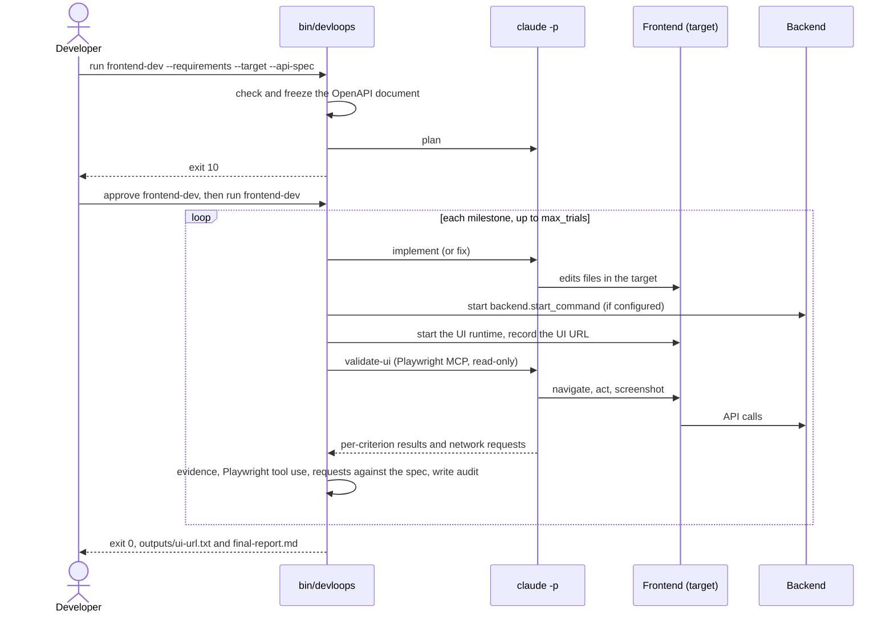
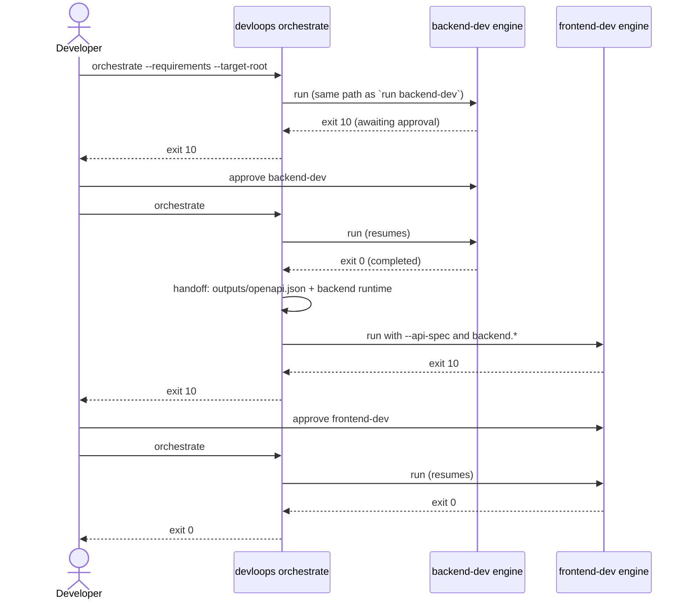

# Reusable development loops

Two loops turn requirements into working, validated code by driving headless Claude Code
(`claude -p`) one milestone at a time:

- **`backend-dev`** builds a backend from a PRD or a single story. Each milestone is validated by
  real HTTP requests (`curl`) against the running backend. The verified OpenAPI document is
  published as `outputs/openapi.json`.
- **`frontend-dev`** builds a frontend from the requirements and that OpenAPI document. Each
  milestone is validated in a real browser through the Playwright MCP server. Every backend call
  the page makes is checked against the document. The UI URL is published as `outputs/ui-url.txt`.

An optional **orchestrator** runs `backend-dev`, then `frontend-dev`, in one workspace and hands
the backend's contract to the frontend.

The loops never trust the model's own claims. A milestone is achieved only when the driver's
validation passes. Each milestone gets a limited number of trials. Every run pauses once for you
to approve the plan before any code is written. Nothing in `loops/` or `bin/` is specific to an
application: the requirements, the target directories, and the configuration are all inputs.

## Prerequisites

- **Claude Code**, installed and logged in (`claude` on `PATH`; run `claude` once to log in).
- **Python ≥ 3.10**. The driver uses the standard library only; there is nothing to install.
- **curl**, for `backend-dev`.
- **node / npx** and a browser for the Playwright MCP server, for `frontend-dev`:
  `npx playwright install chromium`. The server is started as
  `npx @playwright/mcp@latest --headless` (config `playwright.mcp_command`).

Each start checks the tools its loop needs and stops with exit 30 if one is missing.

## Quick start

```sh
# 1. Plan the backend. The run pauses for approval (exit 10).
bin/devloops run backend-dev --workspace myapp \
  --requirements path/to/PRD.md --target /path/to/myapp/backend

# 2. Review workspaces/myapp/backend-dev/outputs/ and answer outputs/open-questions.md, then:
bin/devloops approve backend-dev --workspace myapp
bin/devloops run backend-dev --workspace myapp            # implements every milestone; exit 0

# 3. The frontend, against the backend's verified contract:
bin/devloops run frontend-dev --workspace myapp \
  --requirements path/to/PRD.md --target /path/to/myapp/frontend \
  --api-spec workspaces/myapp/backend-dev/outputs/openapi.json
bin/devloops approve frontend-dev --workspace myapp
bin/devloops run frontend-dev --workspace myapp

# Or both loops in one command (run it again after each approval):
bin/devloops orchestrate --workspace myapp --requirements path/to/PRD.md \
  --target-root /path/to/myapp
```

To implement a single user story instead of the whole PRD, add `--story-id <id>` (the story
within the PRD) or `--story-file` (the requirements file is one standalone story).

## Commands

Every command takes `--workspace <name|path>` (required), `--config <file>`, and `--json`. A bare
name means `workspaces/<name>/`. With `--json`, a command prints one JSON status object instead of
the text summary.

| Command | What it does |
|---------|--------------|
| `run <backend-dev\|frontend-dev>` | Start or resume one loop. It exits when the run pauses for approval, stops, or completes |
| `approve <loop>` | Accept the stored plan and the answers in `outputs/open-questions.md`. Allowed only in `awaiting-approval`. It does not start implementation: run `run` next |
| `replan <loop>` | Plan again with the answers, then pause again. Uses a planning trial |
| `retry <loop> --milestone <id> --reason <text> [--trials <n>]` | Give a failed milestone more trials (default `max_trials`). The reason is passed to later fix prompts |
| `status [<loop>]` | Show the status, next milestone, trials used, last failure, UI URL, OpenAPI artifact, and evidence files over 1 MB. Read-only |
| `orchestrate` | Run `backend-dev`, then `frontend-dev` ([orchestrator/README.md](orchestrator/README.md)) |
| `export-sessions [--csv <file>]` | Write every Claude invocation as CSV (standard output by default) |

`approve`, `replan`, `retry`, and `run` also take `--force-unlock` (see [Recovery](#recovery)).

### `run` options

| Option | Rule |
|--------|------|
| `--requirements <file>` | A PRD or a story file. Required on the first run. If given later, it must be byte-identical to the recorded file |
| `--story-id <id>` | Implement only this story of the PRD. The ID must appear in the file as a whole ID, with matching case, or the run stops with `story-not-found` |
| `--story-file` | The requirements file is one standalone story. Cannot be combined with `--story-id` |
| `--target <dir>` | Where this loop writes application code. Required on the first run. It is created if missing. It must be writable, outside `loops/`, `bin/`, and the workspace, and must not overlap the other loop's target |
| `--api-spec <file>` | The backend's OpenAPI 3 JSON document. **Required for `frontend-dev`** |
| `--max-trials <n>` | Override `max_trials` for this start |

On later starts, omit the flags or repeat them unchanged. Different story options are refused
(exit 2) and leave the run as it was. Changed requirement or API-spec bytes stop the run for good
(`input-changed`), because the plan was made for the old input: start a new workspace.

### `orchestrate` options

`--requirements`, `--story-id` / `--story-file` (passed to both loops), `--target-root <dir>`
(targets `<dir>/backend` and `<dir>/frontend`), `--backend-target`, `--frontend-target`, and
`--force-unlock`. Targets and inputs are recorded on the first call, so later calls need only
`--workspace`.

### Exit codes

| Code | Meaning |
|------|---------|
| 0 | `completed` |
| 10 | `awaiting-approval`: review the plan, then `approve` or `replan` |
| 20 | `stopped-on-failure`: a milestone used all its trials, a question needs an answer, a planning or invocation limit was hit |
| 30 | `stopped-on-input-error`: a missing or changed input, an unknown story, a missing tool, an unusable target |
| 40 | Another driver holds the lock, or a stale lock is left (see [Recovery](#recovery)) |
| 50 | `stopped-on-service-error`: a Claude Code outage, rate limit, or authentication failure. No trial was used; run again to resume |
| 2 | Usage error: nothing was changed |

## How a run works

1. **Plan.** One planning call turns the requirements into milestones. Each milestone has tasks
   and acceptance criteria that cite the requirement IDs, a stack, a runtime (how to start, where
   it answers), open questions, and assumptions. The driver validates the plan: unique IDs,
   dependency order, refs in the inventory, the story scope, and an `openapi_path` for the
   backend. An invalid plan is a failed planning trial.
2. **Pause for approval** (exit 10). The plan is rendered into `outputs/`.
3. **Milestones, in dependency order.** For each milestone:
   - `backend-dev` first has Claude author HTTP checks for the milestone's criteria. The checks
     are frozen in `state/milestones/<id>/checks.json` before any code is written.
   - Trial 1 is an `implement` call; later trials are `fix` calls that see the previous failure
     and its evidence.
   - The driver then validates: it starts the runtime and runs the checks (backend), or serves
     the UI and runs a restricted `validate-ui` browser call (frontend). It checks the contract,
     runs the optional unit tests, and audits that nothing was written outside the target.
   - A pass marks the milestone and its tasks achieved. A failure uses one of `max_trials` trials.
4. **Complete** when every milestone is achieved. The final report is written to
   `outputs/final-report.md`.

Claude may write only inside the loop's target, and only in `implement` and `fix` calls. A write
elsewhere is blocked by a hook, or detected by a before/after audit, and fails the trial.

### backend-dev

```mermaid
sequenceDiagram
    actor Dev as Developer
    participant CLI as bin/devloops
    participant Claude as claude -p
    participant App as Backend (target)
    Dev->>CLI: run backend-dev --requirements --target
    CLI->>Claude: plan
    Claude-->>CLI: plan (milestones, runtime, open questions)
    CLI-->>Dev: exit 10, outputs/ and open-questions.md
    Dev->>CLI: approve backend-dev, then run backend-dev
    loop each milestone, up to max_trials
        CLI->>Claude: author-checks (first trial only; frozen)
        CLI->>Claude: implement (or fix with the last failure)
        Claude->>App: edits files in the target
        CLI->>App: start runtime, wait for ready_url
        CLI->>App: curl each frozen check
        CLI->>CLI: criteria, OpenAPI contract, unit tests, write audit
    end
    CLI-->>Dev: exit 0, outputs/openapi.json and final-report.md
```

### frontend-dev



### orchestrate



## Approval, replan, and open questions

At the pause, review:

- `outputs/plan-summary.md`: the stack and where it came from, conflicts, the runtime, and the
  milestone list;
- `outputs/milestone-NN-<slug>.md`: one file per milestone, with its tasks and criteria;
- `outputs/open-questions.md`: the model's questions. Write each answer after its `**Answer:**`
  marker.

Then either:

- `approve <loop>`: accept the plan together with your answers. The answers become part of every
  later prompt. After approval, `open-questions.md` is fingerprinted: editing it stops the run
  with `input-changed`, except as part of a `retry` (below).
- `replan <loop>`: plan again with your answers, then pause again. This uses a planning trial. If
  no valid plan comes back within the limit, the previous plan still awaits approval.

When an `implement` or `fix` call raises a question that the requirements cannot answer, the
milestone fails at once (`needs-input`, exit 20). The question is appended to
`open-questions.md` as a new `OQ<n>`. Answer it, then `retry` the milestone.

## Recovery

| Situation | What to do |
|-----------|------------|
| The driver was killed or the machine stopped mid-trial | Run the same command again. The unfinished trial is recorded as failed (`interrupted`) and counts toward the limit |
| A milestone used all its trials (exit 20, `trials-exhausted`) | Read the last trial's `validation.json` and `evidence/`, then `retry <loop> --milestone <id> --reason "<guidance>" [--trials n]` and `run` |
| A question stopped the run (exit 20, `needs-input`) | Answer it in `open-questions.md`, then `retry` (refused until every question is answered) and `run` |
| Planning failed `max_trials` times (`planning-trials-exhausted`) | Final: start a new workspace, perhaps with clearer requirements |
| Claude Code outage, rate limit, or expired login (exit 50) | Fix the cause (for example, log in again), then run again. No trial was used; the same trial number is retried |
| `max_invocations_per_run` reached (`invocation-cap`) | Final for this run: the config is frozen at the first start and no milestone is left failed, so `retry` has nothing to grant. Start a new workspace with a higher limit in its config |
| Exit 40, "another driver is running" | Wait for it; only one driver runs per loop and workspace |
| Exit 40, "stale lock" | The process that held it is gone: re-run with `--force-unlock` (recorded as `lock-cleared`) |
| An input changed (exit 30, `input-changed`) | Restore the original file, or start a new workspace |

Without a `retry` grant, `run` on a stopped workspace changes nothing.

## Configuration

Settings are merged in this order: `loops/shared/config/defaults.json`, then the workspace config
(`--config <file>`, remembered for the workspace; otherwise `workspaces/<ws>/config.json` if it
exists), then CLI flags. The merged config is frozen into `run.json` on the first start. Later
edits to the files do not apply to that run, but CLI flags such as `--max-trials` do, and are
recorded as `config-override` events.

| Key | Default | Meaning |
|-----|---------|---------|
| `max_trials` | 3 | Trials per milestone, and planning trials per run |
| `max_invocations_per_run` | 60 | Hard ceiling on Claude calls per run |
| `invocation_timeout_seconds` | 1800 | A call that runs longer fails its trial (`timeout`) |
| `max_budget_usd_per_invocation` | null | Passed to Claude Code as a per-call budget when set |
| `model` | null | Passed as `--model` when set |
| `implement_tools` | Read, Edit, Write, Glob, Grep, Bash | Tools allowed in `implement` and `fix` calls |
| `unit_tests.enabled` / `unit_tests.command` | false / null | Run unit tests as part of validation; the command defaults to the plan's `runtime.unit_test_command` |
| `runtime.*` | `ready_timeout_seconds`: 120 | Overrides for the plan's runtime: `start_command`, `cwd`, `base_url`, `ready_url`, `openapi_path`. Dependencies are installed by the `implement` step, not by the driver |
| `backend.*` | {} | frontend-dev only: `base_url` of a running backend, or `start_command`, `cwd`, and `ready_url` to start one during validation |
| `playwright.mcp_command` | `npx @playwright/mcp@latest --headless` | How the Playwright MCP server is started |
| `git.commit_per_milestone` | false | After each achieved milestone, commit the target's changes (only paths under the target) as `feat(<loop>): complete <id> <title>`. The outcome is a `git-commit` event; a failed commit does not fail the milestone |
| `secrets.env` / `secrets.literals` | [] / [] | Values to redact (see below) |
| `boundary.allowed_extra` | [] | Paths inside an audited git repository that tools may write to, such as a cache directory |

## Secrets

List secret environment variable names in `secrets.env` and literal values in
`secrets.literals`. Before any prompt, invocation record, stream log, curl response, evidence
file, question, or report is written, every occurrence of those values is replaced with `***`.

Redaction only covers values you list. **Review a workspace before committing or sharing it.**
`status` lists evidence files over 1 MB (screenshots, traces, response bodies), since they are
the likeliest place for a secret to hide.

## Workspace layout

```text
workspaces/<name>/
├── workspace.json            # requirements fingerprint, mode, story ID, targets, config path
├── config.json               # optional workspace config
├── backend-dev/
│   ├── task.md               # the rendered assignment
│   ├── progress.md           # action items; per-milestone start, end, tokens, cost, sessions
│   ├── outputs/
│   │   ├── plan-summary.md
│   │   ├── milestone-NN-<slug>.md
│   │   ├── open-questions.md
│   │   ├── openapi.json      # the verified contract
│   │   └── final-report.md
│   └── state/                # the driver's state; never edit it
│       ├── run.json  plan.json  events.jsonl  invocations.jsonl  lock
│       ├── prompts/<seq>-<step>.md
│       └── milestones/<id>/{checks.json, trials/<n>/{trial.json, validation.json, stream.jsonl, evidence/}}
├── frontend-dev/             # the same shape; outputs/ has ui-url.txt instead of openapi.json
└── orchestrator/{state.json, progress.md}
```

Everything under `outputs/` and `progress.md` is rendered from `state/`. The one exception is
your answers in `open-questions.md`. `export-sessions` turns every `invocations.jsonl` into one
CSV: workspace, loop, step, milestone, trial, session ID, prompt path, the four token counts,
cost, start, and end.

## Claude Code skills

`.claude/skills/loops-backend-dev`, `loops-frontend-dev`, and `loops-orchestrate` let you start a
loop from Claude Code (`/loops-backend-dev --workspace myapp ...`). Each runs one `bin/devloops`
command with `--json` and summarizes the result. They contain no loop logic.

## Repository layout

- `bin/devloops`: the command-line entry point.
- `loops/backend-dev/` and `loops/frontend-dev/`: each loop's `loop.json`, standing
  instructions (`Loop-instructions.md`), and assignment template (`task.md`).
- `loops/shared/devloops/`: the driver.
- `loops/shared/prompts/`: the prompts shared by every step, and one prompt per step.
- `loops/shared/schemas/`: the JSON Schemas for every file the loops read or write.
- `loops/shared/tests/`: the offline test suite, which uses a fake `claude`:
  `python3 -m unittest discover -s loops/shared/tests -v`.
