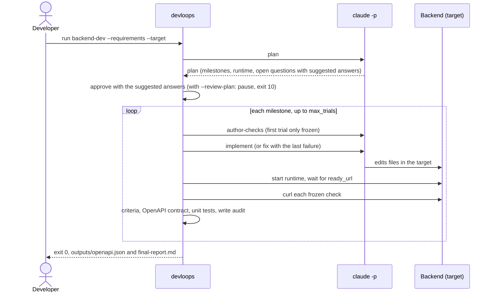
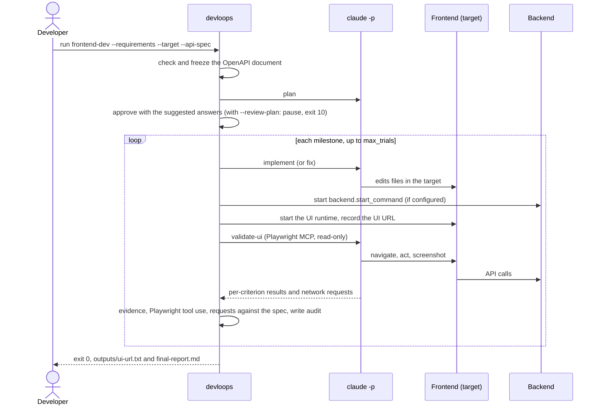
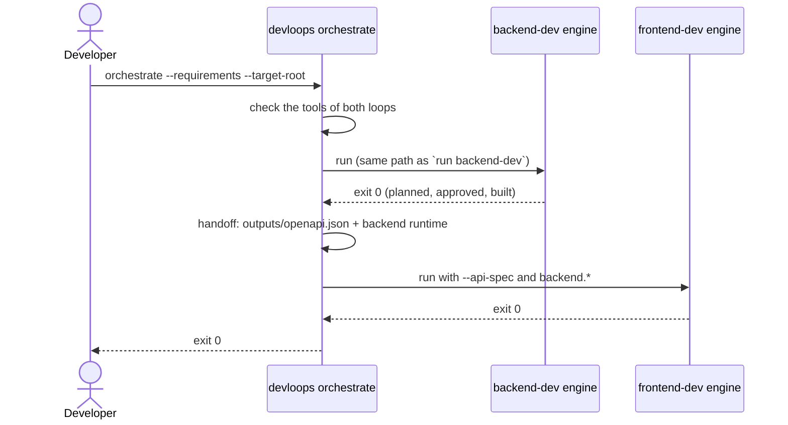

# Reusable development loops

Two loops turn requirements into working, validated code by driving headless Claude Code
(`claude -p`) one milestone at a time:

- **`backend-dev`** builds a backend from a PRD or a single story. Each milestone is validated by
  real HTTP requests (`curl`) against the running backend. The verified OpenAPI document is
  published as `outputs/openapi.json`.
- **`frontend-dev`** builds a frontend from the requirements and that OpenAPI document. Each
  milestone is validated in a real browser through the Playwright MCP server. Every backend call
  the page makes is checked against the document. The UI URL is published as `outputs/ui-url.txt`.

An optional **orchestrator** runs `backend-dev`, then `frontend-dev`, in one workspace and hands
the backend's contract to the frontend.

The loops never trust the model's own claims. A milestone is achieved only when the driver's
validation passes. Each milestone gets a limited number of trials. By default a run needs no
attention: it plans, accepts Claude's suggested answers to its open questions, and builds, and you
review its assumptions afterwards. `--review-plan` pauses after each plan for you to approve it
before any code is written. Nothing in `loops/` or `bin/` is specific to an application: the
requirements, the target directories, and the configuration are all inputs.

## Install

devloops is one Python package with no runtime dependencies. Install it once, then use it in any
number of projects:

```sh
uv tool install git+https://github.com/youssef7ussien/claude-devloops   # from the repository
uv tool install .                     # from a checkout
uv tool install -e .                  # from a checkout, picking up your edits
devloops --version
```

`pip install .` works too. From a checkout you can also run `bin/devloops` without installing; it
behaves the same, and the skills it installs call `bin/devloops` by its path.

Prerequisites:

- **Claude Code** 2.1.283 or later, installed and logged in (`claude` on `PATH`; run `claude` once
  to log in).
- **Python ≥ 3.10**.
- **curl**, for `backend-dev`.
- **node / npx** and a Chrome-channel browser for the Playwright MCP server, for `frontend-dev`
  (`npx playwright install chrome`, or set `playwright.executable_path`; see
  [Visible browser](#visible-browser)).
- **git**, only for `git.commit_per_milestone`.

`devloops check` reports each of these (see below). Each run also checks the tools its loop needs
and stops with exit 30 if one is missing; `orchestrate` checks the tools of both loops before
it starts, so a missing frontend tool stops it before the backend spends anything.

## Quick start

```sh
cd /path/to/myapp
devloops init          # once: asks for the backend and frontend folders and the requirements
devloops orchestrate   # plans and builds the backend, then the frontend; exit 0
```

That is the whole run. `orchestrate` goes through these phases without stopping:

| # | Phase | What happens |
|---|-------|--------------|
| 1 | Machine check | claude, curl, the Playwright MCP server, and the browser are checked for both loops. A missing tool stops here, before anything is spent (exit 30); `devloops check` shows the full report and the fixes |
| 2 | Backend plan | Claude turns the requirements into milestones, with tasks, acceptance criteria, a stack, and a runtime. What the requirements leave open becomes an assumption, or an open question with a suggested answer. The plan is approved with the suggestions |
| 3 | Backend build | For each milestone in dependency order: Claude writes the HTTP checks (frozen before any code), implements, and curl validates. A failure gets a `fix` trial, up to `max_trials` (3) |
| 4 | Handoff | The backend's verified `openapi.json` and how to start it go to the frontend |
| 5 | Frontend plan | As in phase 2, for the UI |
| 6 | Frontend build | For each milestone: implement, then validate in a real browser (Playwright), up to 3 trials |
| 7 | Done | `final-report.md` per loop and the dashboards are written |

Progress shows in the terminal and the [dashboard](#dashboards). If you stop it (`Ctrl C`, a
crash, a reboot), `devloops orchestrate` again resumes where it stopped.

**Review afterwards.** Read `.devloops/workspaces/main/<loop>/outputs/final-report.md`. Its first
sections, **Suggested answers accepted** and **Assumptions for review**, are the decisions the
requirements left open. `open-questions.md` has every question with the answer used, and
`devloops dashboard` or `devloops status` show the rest.

**When it stops**, it prints the one command to run next. `retry`, `approve`, and `replan` record
your decision and then continue the run in the same command, so `orchestrate` is not needed again:

| Stop | What to do |
|------|------------|
| A milestone used all its trials (exit 20) | Read its evidence, then `devloops retry <loop> --milestone M03 --reason "<guidance>"`, which continues |
| A question Claude could not suggest an answer for (exit 20; rare) | Write the answer in `open-questions.md`, then `devloops retry <loop> --milestone M03`, which continues |
| A missing tool (exit 30) | Install it, then `devloops orchestrate` |
| Claude Code outage, rate limit, or expired login (exit 50) | Fix the cause, then `devloops orchestrate`. No trial is lost |
| The run was killed | `devloops orchestrate`; it resumes |

The full list is under [Recovery](#recovery).

**To review each plan first**, run `devloops orchestrate --review-plan`. Each plan then pauses
before any code is written. In a terminal it asks:

```text
backend-dev plan: 6 milestone(s), 3 question(s): 1 answered, 2 with a suggested answer
Review: .devloops/workspaces/main/backend-dev/outputs/plan-summary.md
[a]pprove  [e]dit answers  [r]eplan  [q]uit:
```

`a` approves (empty answers take their suggestions) and keeps building; `e` opens
`open-questions.md` in `$VISUAL` or `$EDITOR`, then asks again; `r` plans again with your answers;
`q` exits with code 10, and `devloops approve <loop>` later approves and continues. Without a
terminal (CI, `--json`), a review pause exits 10 and never asks. To review plans by default, set
`"questions": "ask"` in `.devloops/devloops.json` (see [Approval](#approval-replan-and-open-questions)).

Every command works from any folder inside the project. Each loop can also run on its own:

```sh
devloops run backend-dev          # target, requirements, and workspace from the project
devloops run frontend-dev --api-spec .devloops/workspaces/main/backend-dev/outputs/openapi.json \
  --config frontend-config.json   # see "frontend-dev on its own" below
```

### `devloops init`

`init [DIR]` sets up `DIR` (default: the current folder) as a project. On a terminal it asks three
questions; press Enter to keep the default:

- *Backend target* [`backend`] and *Frontend target* [`frontend`]: the folders each loop writes code
  into, relative to the project root. Each loop needs its own folder; neither can be the project
  root.
- *Requirements*: a PRD or story file, a spec-kit feature folder, or `active` for the active
  spec-kit feature. The default is the active feature when `.specify/feature.json` names one.

| Flag | Effect |
|------|--------|
| `--backend-target <dir>`, `--frontend-target <dir>` | The targets, without asking |
| `--requirements <file>` / `--speckit-feature [DIR]` | The default requirements (`active` with no `DIR`) |
| `--no-prompt` | Never ask (implied when stdin or stdout is not a terminal, and by `--json`) |
| `--track-workspaces`, `--track-dashboards` | Leave that folder out of the `.gitignore` block |
| `--allow-skills` | Pre-approve devloops for Claude Code (see [Claude Code skills](#claude-code-skills)) |
| `--upgrade [--restore]` | Upgrade an initialized project (see [Upgrades](#upgrades)) |
| `--json` | Print the result as JSON |

`init` never overwrites a file. If an installed file already exists with different content, it
lists every such file, writes nothing, and exits 30 (`init-conflict`). Running it again on an
initialized project changes nothing. An existing `.devloops/devloops.json` is kept as it is.

### `devloops check`

```text
$ devloops check
  ready    python          3.12.7
  ready    claude          2.1.283
  ready    curl            8.10.1
  ready    playwright-mcp  npx
  missing  browser         no Chrome-channel browser found
           fix: npx playwright install chrome, or set playwright.executable_path
  ready    git             /usr/bin/git
```

Each item says what it is needed for and how to fix it. The exit code is 0 when nothing needed is
missing, else 30; warnings (such as a visible browser with no display) never change it. `check`
works outside a project too, with the packaged defaults. `--json` prints `{ready, project, items}`.

## The project

```text
myapp/
├── .devloops/
│   ├── devloops.json            # project configuration (commit it)
│   ├── devloops.local.json      # your machine's settings (optional, git-ignored)
│   ├── manifest.json            # devloops version and fingerprints of the installed files (commit it)
│   ├── prompts/README.md        # how to override prompts
│   ├── workspaces/<ws>/         # run records (git-ignored by default)
│   └── dashboards/<ws>/*.html   # full dashboards (git-ignored by default)
├── .claude/skills/devloops-*/   # the Claude Code skills (commit them)
├── .gitignore                   # one block added under a "# >>> devloops" marker
├── backend/                     # backend-dev's target
└── frontend/                    # frontend-dev's target
```

The project is found from the current folder upward; `DEVLOOPS_PROJECT=<dir>` names it explicitly.
`workspaces/` and `dashboards/` are created when first used.

`devloops.json`, as `init` writes it:

```json
{
  "schema_version": 1,
  "workspace": "main",
  "workspaces_dir": ".devloops/workspaces",
  "dashboards_dir": ".devloops/dashboards",
  "targets": {"backend-dev": "backend", "frontend-dev": "frontend"},
  "requirements": {"speckit_feature": "active"},
  "config": {}
}
```

- `workspace`: the workspace commands use without `--workspace`. A bare name maps to
  `<workspaces_dir>/<name>`.
- `targets` and `requirements` (`{"path": "docs/prd.md"}` or `{"speckit_feature": "active" | "<dir>"}`):
  what `run` and `orchestrate` use when no flag is given.
- `config`: run settings, with the keys of [Configuration](#configuration).

Paths are relative to the project root. The workspace stores the targets and inputs relative to the
project root too, so a moved or cloned project resumes where it was.

**`devloops.local.json`** has the same shape and overrides `devloops.json` key by key. Use it for
what belongs to your machine, such as a browser path or `"playwright": {"headless": false}`. devloops
never creates it, and `init` git-ignores it.

**Configuration precedence**, each level overriding the one before:

1. the packaged defaults (`shared/config/defaults.json`);
2. `devloops.json` `config`;
3. `devloops.local.json` `config`;
4. the workspace config (`--config <file>`, remembered for the workspace; otherwise
   `<workspace>/config.json` if it exists);
5. command-line flags.

The workspace, targets, and requirements follow the same order: the local file over the shared
one, and flags over both. The merged run configuration is frozen into `run.json` on the first
start; see [Configuration](#configuration).

## Commands

Every command except `init` and `check` takes `--workspace <name|path>` (default: the project's
`workspace`), `--config <file>`, and `--json`. With `--json`, a command prints one JSON object
instead of the text summary. If the project was set up with another devloops version, every
command warns (in `warnings` with `--json`): run `devloops init --upgrade`, or, when the project's
version is newer, install that version.

| Command | What it does |
|---------|--------------|
| `init [DIR]` | Set up a project ([above](#devloops-init)) |
| `check` | Report whether this machine is ready ([above](#devloops-check)) |
| `run <backend-dev\|frontend-dev>` | Start or resume one loop. It exits when the run completes, stops, or pauses for review |
| `approve <loop>` | Accept the stored plan and the answers in `outputs/open-questions.md`, then continue the run. Allowed only in `awaiting-approval` |
| `replan <loop>` | Plan again with the answers (a planning trial), then continue: the new plan is approved and built, or, when plans are reviewed, pauses again. Allowed only in `awaiting-approval` |
| `retry <loop> --milestone <id> [--reason <text>] [--trials <n>]` | Give a failed milestone more trials (default `max_trials`), then continue the run. The reason, when given, is guidance passed to later fix prompts |
| `status [<loop>]` | Show the status, next milestone, trials used, last failure, UI URL, OpenAPI artifact, spec-kit feature, evidence files over 1 MB, configuration and prompt changes since the first start, and the full dashboards. Read-only |
| `orchestrate` | Run `backend-dev`, then `frontend-dev` ([orchestrator/README.md](orchestrator/README.md)) |
| `export-sessions [--csv <file>]` | Write every Claude invocation as CSV (standard output by default) |
| `dashboard [--light]` | Write a new full dashboard, then refresh the lightweight one; `--light` refreshes only the lightweight one (see [Dashboards](#dashboards)) |

`approve`, `replan`, `retry`, `run`, and `orchestrate` also take `--force-unlock` (see
[Recovery](#recovery)), and `--review-plan` or `--accept-suggested` (see `run` options).

### `approve`, `replan`, and `retry`

Each records a decision, then continues the run as `run` would, in the same command:

- the run goes on until it completes, stops, or pauses for review, and the command exits with
  that code (0, 20, 10, ...), printing the same summary as `run`;
- in a workspace started by `orchestrate`, it continues the whole orchestrated run: retrying a
  backend milestone finishes the backend, then plans and builds the frontend;
- for a single loop, the lock is held from the decision to the end of the run;
- a refused decision changes nothing and runs nothing: exit 2 (for example `approve` when nothing
  awaits approval), 40 (another driver holds the lock), or 30 when a tool the run needs is
  missing, so a decision is never recorded for a run that cannot go on.

`--no-continue` only records the decision; the run continues on the next `run` or `orchestrate`
(pass `--review-plan` or `--accept-suggested` there: with `--no-continue` they are refused).
Use it to grant several retries first, or in a script that must not wait: without it, these
commands run until the loop ends, which can take hours.

### `run` options

| Option | Rule |
|--------|------|
| `--requirements <file>` | A PRD or a story file. Default: the project's `requirements`. Needed on the first run. If given later, it must be byte-identical to the recorded file |
| `--speckit-feature [DIR]` | A spec-kit feature folder as the requirements; with no `DIR`, the active feature (see [Spec-kit features](#spec-kit-features)). Not combined with `--requirements` or `--story-file` |
| `--story-id <id>` | Implement only this story. In a PRD, the ID must appear as a whole ID, with matching case, or the run stops with `story-not-found`. With a spec-kit feature, `US<n>` selects `User Story <n>` |
| `--story-file` | The requirements file is one standalone story. Cannot be combined with `--story-id` |
| `--target <dir>` | Where this loop writes application code. Default: the project's `targets.<loop>`. It is created if missing. It must be writable, outside the project's `.devloops/` and the installed devloops files, and must not overlap the other loop's target |
| `--api-spec <file>` | The backend's OpenAPI 3 JSON document. **Required for `frontend-dev`** run on its own |
| `--max-trials <n>` | Override `max_trials` for this start |
| `--review-plan` | Pause after each plan for review, and stop on open questions (`questions: ask`, see [Approval](#approval-replan-and-open-questions)). Recorded: later starts keep it |
| `--accept-suggested` | Approve plans and accept Claude's suggested answers without pausing (`questions: accept-suggested`, the default). Use it on a later start to stop reviewing a run that was started with `--review-plan` |

On later starts, omit the flags or repeat them unchanged. Different story options are refused
(exit 2) and leave the run as it was. Changed requirement or API-spec bytes stop the run for good
(`input-changed`), because the plan was made for the old input: start a new workspace.

### `orchestrate` options

`--requirements` / `--speckit-feature`, `--story-id` / `--story-file` (passed to both loops),
`--target-root <dir>` (targets `<dir>/backend` and `<dir>/frontend`), `--backend-target`,
`--frontend-target`, `--review-plan` or `--accept-suggested` (for both loops), and `--force-unlock`.
Without them, the project's targets and requirements are used. Targets, inputs, and
`--review-plan` / `--accept-suggested` are recorded on the first call, so later calls (and
`approve`, `replan`, `retry`) need no flags. A workspace orchestrated before this was recorded
keeps the backend's mode for the frontend. Before running anything, `orchestrate` checks the
tools of each loop that has work left; a missing one stops it with exit 30 and nothing recorded.

### frontend-dev on its own

`orchestrate` hands the backend's contract and runtime to the frontend for you. To run
`frontend-dev` alone, pass the backend's `outputs/openapi.json` with `--api-spec`, and tell it how
to start the backend in a workspace config. Copy the runtime from the backend's
`outputs/plan-summary.md`, with `cwd` set to the backend target:

```json
{"backend": {"start_command": "node server.js", "cwd": "/path/to/myapp/backend",
             "ready_url": "http://127.0.0.1:8000/health"}}
```

Without a `backend` block the frontend is validated with no backend, and every criterion that
needs one fails.

### Exit codes

| Code | Meaning |
|------|---------|
| 0 | `completed` (or, for `init` and `check`, success) |
| 10 | `awaiting-approval`: plans are reviewed (`--review-plan`, `questions: ask`), or a question has no suggested answer. Review the plan, then `approve` or `replan` |
| 20 | `stopped-on-failure`: a milestone used all its trials, a question needs an answer, a planning or invocation limit was hit |
| 30 | `stopped-on-input-error`: a missing or changed input, an unknown story, a missing tool, an unusable target, an invalid project configuration. Also: `check` found something missing; `init` refused (`init-conflict`, `downgrade-refused`, `settings-unreadable`, `target-unwritable`) |
| 40 | Another driver holds the lock, or a stale lock is left (see [Recovery](#recovery)) |
| 50 | `stopped-on-service-error`: a Claude Code outage, rate limit, or authentication failure. No trial was used; run again to resume |
| 2 | Usage error (including no project found): nothing was changed |

## How a run works

1. **Plan.** One planning call turns the requirements into milestones. Each milestone has tasks
   and acceptance criteria that cite the requirement IDs, a stack, a runtime (how to start, where
   it answers), open questions, and assumptions. The driver validates the plan: unique IDs,
   dependency order, refs in the inventory, the story scope, and an `openapi_path` for the
   backend. An invalid plan is a failed planning trial.
2. **Approve.** The plan is rendered into `outputs/`. By default it is approved at once, with
   Claude's suggested answers to its open questions. When plans are reviewed (`--review-plan`)
   or a question has no suggested answer, the run pauses here (exit 10, or the
   [review prompt](#quick-start) in a terminal) until `approve` or `replan`.
3. **Milestones, in dependency order.** For each milestone:
   - `backend-dev` first has Claude author HTTP checks for the milestone's criteria. The checks
     are frozen in `state/milestones/<id>/checks.json` before any code is written.
   - Trial 1 is an `implement` call; later trials are `fix` calls that see the previous failure
     and its evidence.
   - The driver then validates: it starts the runtime and runs the checks (backend), or serves
     the UI and runs a restricted `validate-ui` browser call (frontend). It checks the contract,
     runs the optional unit tests, and audits that nothing was written outside the target. What
     passes and what fails is under [Trials and failures](#trials-and-failures).
   - A pass marks the milestone and its tasks achieved. A failure uses one of `max_trials` trials.
4. **Complete** when every milestone is achieved. The final report is written to
   `outputs/final-report.md`.

Claude may write only inside the loop's target, and only in `implement` and `fix` calls. A write
elsewhere is blocked by a hook, or detected by a before/after audit, and fails the trial.

### backend-dev



### frontend-dev



### orchestrate



With `--review-plan`, each loop pauses after its plan: `orchestrate` exits 10 (or asks in a
terminal), and `devloops approve <loop>` approves and continues the orchestrated run from there.

## Dashboards

**The lightweight dashboard**, `<workspace>/dashboard.html`, is rewritten by every command that
touches a workspace (`run`, `approve`, `replan`, `retry`, `orchestrate`), so after each pause,
stop, or completion one page shows everything without opening the files one by one. Open it in a
browser; it is a single offline file (no network). A sidebar switches between its pages, `Ctrl K`
(or `/`) jumps to any page, call, or file (and, from three characters, searches their text), and
the theme button switches light and dark. While a command is running a loop, the page is
rewritten after each recorded event and reloads itself every 10 seconds, keeping your place;
**Live** in the top bar pauses it:

- **Overview**: status, milestones achieved, first-try pass rate, trials, Claude calls, cost,
  tokens, and elapsed time; **Needs attention** (stopped or paused loops and their next action,
  failing criteria, unanswered questions, failed calls, evidence over 1 MB, and milestones that
  passed only after failed or voided trials, each linked to its detail); a card per loop with its progress and next action; the **trial
  timeline** (every planning and milestone trial, colored and labeled by result), **cost by
  milestone**, and **cost by step** (hover a bar for its details).
- **Orchestrator**: its steps and the handoff to frontend-dev.
- **Per loop**: buttons for its outputs (progress, plan summary, final report, OpenAPI document),
  the UI URL, stack and runtime, and a card per milestone with its tasks, acceptance-criteria
  results with observations and evidence (screenshots as thumbnails), the exact curl commands or
  the browser's network requests, the API contract result, and every trial with its failure
  detail, duration, cost, and calls.
- **Claude calls** (filter by text or loop), **Questions** (open questions, planning assumptions,
  retries granted), **Events**, and links to the **full dashboards**.

It links to the workspace's files, so it only works next to them: a screenshot opens in the page's
viewer, other files in a new browser tab.

**Full dashboards** are single self-contained HTML files that can be opened anywhere, offline, with
no other file. Besides everything above, they embed every input, plan file, output, check, trial
record, piece of evidence (images inline), prompt with the source of each of its parts, and the
full Claude Code **conversation** of every call: the prompt, Claude's messages, its thinking, every
tool call, and every tool result.

- **Files**: a tree per loop (inputs, plan, each milestone's trials and evidence, prompts, outputs,
  run state), with a path filter and type filters. A file opens in a large viewer that can be
  maximized and closed with `Esc`, steps to the previous or next file with `[` and `]`, and offers
  copy, download, wrapping, and line numbers. Markdown is rendered (or shown as source), JSON is
  indented and highlighted (or shown as a collapsible tree), JSON lines are shown one record per
  row, code and logs are highlighted, and images fit the window or show at full size.
- **Claude calls**: selecting a call opens its conversation (Claude's replies rendered, tool calls
  summarized on one line and opened for their input, results, thinking, and system records shown
  or hidden), its prompt with the parts it was composed from, and its settings.

- **When**: a new one is written when `run`, `approve`, `replan`, `retry`, or `orchestrate` ends in
  `completed` or a `stopped-*` status, and by `devloops dashboard`. The command prints its path and
  size; `dashboard` also lists the five largest embedded items. A file over 5 MB is listed but
  not embedded (the command names it); open it on disk.
- **Where**: `<dashboards_dir>/<workspace>/<YYYYMMDDTHHMMSSZ>.html` (UTC), `.devloops/dashboards/`
  by default. A file is never replaced, so they **accumulate**: delete old ones when you no longer
  need them. `status` reports how many there are and their total size.
- **Review before sharing.** A full dashboard contains whole conversations, including file contents
  Claude read. Values listed under `secrets` are redacted, as everywhere, but nothing else is.
- Conversations are copied, redacted, into `state/conversations/` after each call. A call whose
  transcript could not be found is shown as unavailable, with its session ID.

Both pages are views: they are built from `state/` only and never read back. Writing them can
never change a run's outcome; if it fails, the command prints a warning and keeps its exit code.

## Approval, replan, and open questions

Every plan comes with `outputs/`:

- `outputs/plan-summary.md`: the stack and where it came from, conflicts, the runtime, and the
  milestone list;
- `outputs/milestone-NN-<slug>.md`: one file per milestone, with its tasks and criteria;
- `outputs/open-questions.md`: the model's questions. Each has the answer Claude suggests and
  why (`**Suggested answer:**`, `**Why:**`). Leave `**Answer:**` empty to accept the suggestion, or
  write your own answer after the marker.

Why Claude asks rather than just deciding: it already settles every ambiguity it can within the
requirements, and records each as an assumption. A question is raised only when every answer
would add, remove, or contradict a requirement, so it is a decision about the product (FR-055a).
That is why each one also carries a suggested answer, and why you review them.

The `questions` setting decides who answers:

| `questions` | Plan | A question during implementation (`needs-input`) |
|-------------|------|--------------------------------------------------|
| `accept-suggested` (default) | Approved at once with the suggested answers (`approval.action: auto-approve`), including a stack Claude proposed (FR-058) | Its suggestion is accepted and the trial, which Claude built on that suggestion, is validated as it is: it passes or fails like any trial, and a later `fix` trial gets the answer |
| `ask` (`--review-plan`) | The run pauses (exit 10, or the [review prompt](#quick-start)) until `approve` or `replan` | The milestone fails at once (exit 20) until you answer and `retry` |

Under both, a question **without** a suggested answer pauses the plan or stops the milestone,
because there is nothing to accept. See [Trials and failures](#trials-and-failures) for how a
question fits into a milestone's trials.

### Reviewing a plan

When a run pauses at a plan, review the files above, then either:

- `approve <loop>`: accept the plan together with your answers, then continue the run. Each
  suggestion you left unanswered is copied into its answer and marked with an
  `**Answer source:**` line, so the file says exactly what the run uses. The answers become part
  of every later prompt. After approval, `open-questions.md` is fingerprinted: editing it stops
  the run with `input-changed`, except as part of a `retry` (below).
- `replan <loop>`: plan again with your answers (a planning trial), then continue: under `ask`
  it pauses at the new plan; with `--accept-suggested` the new plan is approved and built. With
  `--no-continue` it always pauses at the new plan. If no valid plan comes back within the limit,
  the previous plan still awaits approval.

A plan can be replanned only while it awaits approval. To redo a finished run with different
answers, start a new workspace (`--workspace <name>`).

### Questions during implementation

When an `implement` or `fix` call raises a question that the requirements cannot answer, it is
appended to `open-questions.md` as a new `OQ<n>`, with Claude's suggested answer. Under `ask`, or
when the question has no suggestion, the milestone fails at once (`needs-input`, exit 20): answer
it, or leave the answer empty to accept the suggestion, then `devloops retry <loop> --milestone
<id>`, which continues the run.

### Reviewing accepted suggestions

Every suggestion accepted without you is marked `accepted automatically` in `open-questions.md`,
is recorded in `run.json` (`approval.accepted_suggestions`, `auto_answers`) and as an `approved`
or `answers-accepted` event, and is listed first in `final-report.md`, under **Suggested answers
accepted**, next to **Assumptions for review**. The dashboards show them under **Needs
attention**. Review them like assumptions: they decided something the requirements left open.

## Trials and failures

A milestone is built in **trials**. Each trial is one Claude call (`implement` the first time,
`fix` after that) followed by the driver's own validation. A milestone has `max_trials` trials
(3 by default; `retry` grants more). A trial is failed only by what the driver finds, never by
what Claude says, and every failure is recorded with a reason, a detail, and its evidence.

### What a trial sees

A `fix` trial starts from the previous trial's failure: its reason and detail, and the paths of
its `validation.json` and `evidence/` (curl commands and responses, screenshots, runtime logs).
It also gets every answer in `open-questions.md` (yours and accepted suggestions), and the
`--reason` of each `retry` for that milestone as developer guidance. The milestone's acceptance
criteria and, for the backend, its HTTP checks are frozen: a fix changes the implementation,
never the checks.

### Why a trial fails

| Reason | What happened | Counts toward `max_trials`? |
|--------|---------------|-----------------------------|
| `validation-failed` | A criterion's check failed, a check called an operation the OpenAPI document does not declare, the enabled unit tests failed, or (frontend) the browser called the API outside the contract | Yes |
| `needs-input` | The call raised a question, and the run reviews questions (`ask`) or the question has no suggested answer. The run stops at once, whatever trials remain | Yes, and the run stops (exit 20) |
| `boundary-violation` | Something was written outside the target. A write tool is blocked by a hook; a write through Bash is caught by the before/after audit | Yes |
| `claude-error` | Claude Code exited with an error. Exit code 143 means the call was killed (SIGTERM), most often by a `pkill` or `killall` it ran itself (see [Processes Claude starts](#processes-claude-starts)) | Yes |
| `timeout` | The call ran longer than `invocation_timeout_seconds` | Yes |
| `invalid-output` | The call's structured result did not match its schema, or `author-checks` returned unusable checks | Yes |
| `runtime-start-failed` | The application did not start, or `ready_url` did not answer within `runtime.ready_timeout_seconds` | Yes |
| `interrupted` | The driver itself was stopped mid-trial (`Ctrl C`, a crash); found on the next start | Yes |
| a service error | Rate limit, outage, or expired login (`rate-limited`, `service-unavailable`, `auth-failed`). The trial is **void** and the run stops with exit 50 | **No**: the same trial number runs again on the next start |

When the last trial fails, the run stops with `trials-exhausted` (exit 20). `retry` grants more
trials and continues.

### What passes a backend milestone

All of these, from the driver's own run of the application:

- every acceptance criterion is covered by checks that all passed, with evidence;
- **the contract**: no check calls an operation the target's OpenAPI document does not declare
  (a check expecting 404 or 405 on an undocumented path is fine: it shows the path is absent);
- the unit tests pass, when `unit_tests.enabled`;
- nothing was written outside the target.

An operation the document declares but **no check verifies** does not fail the milestone. A
check verifies an operation when it expects a success status on a path the operation matches,
using the path it really called (with captured values filled in); a check expecting 404 or 405
does not, since it never reaches the operation's success path. Each passing trial records what
its checks verified (`contract.covered_operations`), and later milestones and publishing use that
record. An operation nothing verifies is *unverified*: `validation.json` lists it under `contract.unverified_operations`, and it is left
out of the published `outputs/openapi.json`, which only ever names operations an achieved
milestone's checks have called. Each achieved milestone republishes the document from every
achieved milestone's checks, so a later milestone whose checks call the operation adds it. The
operations left out are listed in `run.json` (`openapi_artifact.omitted_operations`), in
`final-report.md`, and in the published document itself, under
`x-devloops-unverified-operations`: `frontend-dev` is told they exist but must not be called, and
to raise a question if a requirement needs one. A path item that is only a `$ref` is published as
it is. Claude is told never to delete an implemented endpoint from the document to get past
validation.

Checks chain through captured values: a check's `capture` (`{"planId": "id"}`) saves a value from
its response, and a later check writes it as `${planId}` in its request (path, headers, body) or
its expectations (`json_equals` values, `body_contains` items). A string that is exactly
`"${planId}"` stands for the captured value with its JSON type, so `{"id": "${planId}"}` expects
the number `1` when the create answered `"id": 1`; inside a longer string (`/plans/${planId}`) it
is spliced in as text (paths and headers always get text: `true`, not `True`). A path that exists
captures its value, even `null`; a path that is missing captures nothing. When the check that
should capture a value fails (a create answering 400), every later check using it fails with
`uses ${planId}, which no earlier check captured` and is not sent, so fix the first failing check:
the rest follow from it.

### Questions raised during a trial

An `implement` or `fix` call that needs a decision the requirements do not make returns it as a
question with a suggested answer, and builds the rest of the milestone on that suggestion.

- **`accept-suggested` (default)**: the suggestion is accepted (marked in `open-questions.md`,
  recorded in `run.json` `auto_answers` and an `answers-accepted` event), and the trial goes on to
  validation as built. If it passes, the milestone is achieved; if not, it is an ordinary
  `validation-failed` trial and the next `fix` gets the answer. Asking costs nothing by itself.
  When such a milestone runs out of trials, the stop message names the questions answered
  automatically, since its trials were built on them: check them before a `retry`. You can
  rewrite an answer first; the `retry` records the file as it is then.
- **`ask`, or a question with no suggestion**: the trial fails with `needs-input` and the run stops
  at once. Answer in `open-questions.md` (an empty answer accepts the suggestion), then
  `devloops retry <loop> --milestone <id>`.

### Processes Claude starts

Claude often starts the application to try it during a trial. Each call runs with the target
path, the prompt, and the inputs on its own command line, and so does the driver, so stopping
processes by pattern can kill the call itself: `pkill -f "<target>/backend"` matches Claude's own
process, the call dies with exit 143, its result is lost, and the trial fails with
`claude-error`. So:

- the prompts tell Claude to stop only processes it started, by PID (`cmd & echo $! > app.pid`,
  then `kill $(cat app.pid)`), and to stop them before returning;
- a Bash hook reads every command in every call (each simple command, including `$(...)`,
  backticks, and `sh -c '...'`, and past launchers such as `sudo -u me` or `timeout 5`) and
  blocks:
  - `pkill`, `killall`, and `killall5`;
  - `kill 0`, `kill -1`, and `kill -- -<group>`, which kill the process group or every process
    of the user;
  - any `kill` (or `xargs kill`) in a command that also looks processes up with `pgrep`, `pidof`,
    or `ps`, even split across lines (`P=$(pgrep -f app); kill $P`).

  Killing by PID (`kill $(cat app.pid)`), checking it (`kill -0 $(cat app.pid)`,
  `ps -p $(cat app.pid)`), freeing a port (`fuser -k 8000/tcp`, `kill $(lsof -t -i:8000)`), and a
  mere mention (`grep -rn pkill .`) are allowed. The block message says how to do it instead;
- the driver starts the application itself for validation, from the plan's runtime, and stops it
  afterwards, whatever Claude left running.

### Example: one milestone, three trials

A run reported milestone M07 as `trials-exhausted` although its code worked:

1. Trial 1 passed every endpoint check, but `openapi.json` declared `GET
   /learning-cards/{id}/notes`, which no check called. That failed the contract.
2. Trial 2 deleted the operation from the document to pass, and raised a question about adding it
   back. The question failed the trial before it was validated.
3. Trial 3 checked every criterion by hand, then ran `pkill -f "quickflow/backend"` to stop its
   test server. That killed its own Claude process (exit 143), so the trial failed with
   `claude-error`.

Now trial 1 passes, with the notes operation left out of the published document and listed as
omitted. If the target's document stops loading right after a milestone passes, the milestone is
failed again and the run stops (`retry` publishes it), so an older artifact is never left in
place. Trial 2 would have been validated and passed with its question's suggestion accepted.
Trial 3's `pkill` is blocked, and Claude is told to stop its server by PID.

### When a milestone runs out of trials

1. Read why: `devloops status <loop>` shows the last failure. `progress.md`, the dashboard, and
   `state/milestones/<id>/trials/<n>/` have each trial's `trial.json` (reason and detail),
   `validation.json` (per criterion, the checks, and the contract), and `evidence/`.
2. Grant more trials and continue: `devloops retry <loop> --milestone <id> --reason "<what to
   change>"`. The reason reaches the next `fix` call as guidance; leave it out if the evidence
   says enough. `--trials n` grants `n` trials (default `max_trials`).
3. If the plan itself is wrong, start a new workspace with clearer requirements: a finished
   milestone cannot be replanned.

## Recovery

| Situation | What to do |
|-----------|------------|
| The driver was killed or the machine stopped mid-trial | Run the same command again. The unfinished trial is recorded as failed (`interrupted`) and counts toward the limit |
| A milestone used all its trials (exit 20, `trials-exhausted`) | Read the last trial's `validation.json` and `evidence/`, then `retry <loop> --milestone <id> --reason "<guidance>" [--trials n]`; it continues the run (see [Trials and failures](#when-a-milestone-runs-out-of-trials)) |
| A question stopped the run (exit 20, `needs-input`) | Answer it in `open-questions.md`, or leave the answer empty to accept Claude's suggestion, then `retry <loop> --milestone <id>`; it continues the run. `retry` is refused while a question has neither an answer nor a suggestion |
| A tool is missing (exit 30, `missing-tool`) from `orchestrate` | Nothing was recorded: install it (`devloops check` shows how), then `orchestrate` again |
| Planning failed `max_trials` times (`planning-trials-exhausted`) | Final: start a new workspace, perhaps with clearer requirements |
| Claude Code outage, rate limit, or expired login (exit 50) | Fix the cause (for example, log in again), then run again. No trial was used; the same trial number is retried |
| `max_invocations_per_run` reached (`invocation-cap`) | Final for this run: the config is frozen at the first start and no milestone is left failed, so `retry` has nothing to grant. Start a new workspace with a higher limit in its config |
| Exit 40, "another driver is running" | Wait for it; only one driver runs per loop and workspace |
| Exit 40, "stale lock" | The process that held it is gone: re-run with `--force-unlock` (recorded as `lock-cleared`) |
| An input changed (exit 30, `input-changed`) | Restore the original file, or start a new workspace |

Without a `retry` grant, `run` on a stopped workspace changes nothing. A `retry --no-continue`
grant is used by the next `run` or `orchestrate`.

## Configuration

The settings below come from the five levels of [configuration precedence](#the-project). The
merged result is frozen into `run.json` on the first start. Later edits to the files do not apply
to that run: `status` lists the keys that would now differ (`config_drift`). CLI flags such as
`--max-trials` still apply on a later start, and are recorded as `config-override` events.

| Key | Default | Meaning |
|-----|---------|---------|
| `max_trials` | 3 | Trials per milestone, and planning trials per run |
| `max_invocations_per_run` | 60 | Hard ceiling on Claude calls per run |
| `invocation_timeout_seconds` | 1800 | A call that runs longer fails its trial (`timeout`) |
| `max_budget_usd_per_invocation` | null | Passed to Claude Code as a per-call budget when set |
| `model` | null | Passed as `--model` when set |
| `questions` | accept-suggested | `accept-suggested`: plans are approved and Claude's suggested answers accepted without pausing, and flagged for review. `ask`: each plan pauses for review, and open questions stop the run (`--review-plan`; see [Approval](#approval-replan-and-open-questions)) |
| `implement_tools` | Read, Edit, Write, Glob, Grep, Bash | Tools allowed in `implement` and `fix` calls |
| `unit_tests.enabled` / `unit_tests.command` | false / null | Run unit tests as part of validation; the command defaults to the plan's `runtime.unit_test_command` |
| `runtime.*` | `ready_timeout_seconds`: 120 | Overrides for the plan's runtime: `start_command`, `cwd`, `base_url`, `ready_url`, `openapi_path`. Dependencies are installed by the `implement` step, not by the driver |
| `backend.*` | {} | frontend-dev only: `base_url` of a running backend, or `start_command`, `cwd`, and `ready_url` to start one during validation |
| `playwright.headless` | true | false shows the browser while frontend-dev validates (see below) |
| `playwright.executable_path` | null | The browser the Playwright MCP server starts; `~` is expanded |
| `playwright.mcp_command` | null | The full command that starts the Playwright MCP server, used exactly as written. When null, it is `npx @playwright/mcp@latest`, plus `--headless` and `--executable-path` from the two keys above |
| `git.commit_per_milestone` | false | After each achieved milestone, commit the target's changes (only paths under the target) as `feat(<loop>): complete <id> <title>`. The outcome is a `git-commit` event; a failed commit does not fail the milestone |
| `secrets.env` / `secrets.literals` | [] / [] | Values to redact (see below) |
| `boundary.allowed_extra` | [] | Paths inside an audited git repository that tools may write to, such as a cache directory |

### Visible browser

To watch frontend-dev's browser, set this in your `.devloops/devloops.local.json` (not in the shared
file, since a machine without a display cannot show it):

```json
{"config": {"playwright": {"headless": false, "executable_path": "/usr/bin/chromium"}}}
```

`executable_path` is only needed when the Chrome channel is not installed. `devloops check` warns
when a visible browser is configured with no display, or in the shared `devloops.json`. Like every
setting, it is frozen at a run's first start.

## Prompt overrides

Each Claude Code prompt is built from three packaged parts: the shared rules, the loop's
instructions, and the step's instructions. A file in `.devloops/prompts/` with the same relative
path replaces the packaged part for this project, for example to add "use the existing logger":

| File in `.devloops/prompts/` | Replaces |
|------------------------------|----------|
| `common.md` | `shared/prompts/common.md` |
| `steps/<step>.md` (`plan`, `replan`, `implement`, `fix`, `author-checks`, `validate-ui`) | `shared/prompts/steps/<step>.md` |
| `backend-dev/Loop-instructions.md`, `frontend-dev/Loop-instructions.md` | `<loop>/Loop-instructions.md` |

Start from a copy of the packaged file (under `loops/` in a checkout, in the `devloops_kit`
package when installed), then edit it.

- Every call records the source of each part (`packaged` or `override`), its path, and its sha256
  in its invocation record (`prompt_sources`). The full dashboard shows them with the prompt.
- Overrides are not frozen: a change applies from the next start. That start records a
  `prompt-sources-changed` event, and `status` reports the changed parts (`prompt_drift`) until
  the run ends. Milestones already achieved are never re-run, so their prompts never change.
- Any other file in the folder is ignored, and `status` lists it under its warnings, so a
  misspelled name is visible.

## Spec-kit features

A [spec-kit](https://github.com/github/spec-kit) feature folder can be the requirements:

```sh
devloops orchestrate --speckit-feature               # the active feature (.specify/feature.json)
devloops run backend-dev --speckit-feature specs/003-billing --story-id US2
```

Or set it once in `devloops.json`: `"requirements": {"speckit_feature": "active"}` (what `init`
writes when the project has an active feature).

- `spec.md` is the requirements. `plan.md` (its stack counts as named in the requirements) and
  `tasks.md` are used when present. All three are fingerprinted: changing any of them, or adding a
  `plan.md` or `tasks.md` after the first start, stops the run with `input-changed`.
- With `tasks.md`, the plan follows its phases, one or more milestones per phase, and each planned
  task names the spec-kit task IDs it implements. Every in-scope spec-kit task must be planned or
  left out with a reason (for example, a frontend task in backend-dev). A task marked done in
  `tasks.md` is planned anyway unless the code shows it.
- `--story-id US<n>` selects `User Story <n>` of `spec.md`, its labelled tasks, and the setup or
  foundational tasks it needs.
- The plan summary's **Spec-kit tasks** section lists the planned tasks, the ones left out and
  why, the setup tasks a story needs, the devloops tasks with no spec-kit task, and the tasks
  already marked done, so the differences are reviewed at approval.
- A folder without `spec.md` stops with `missing-input`; a `US<n>` with no heading, with
  `story-not-found` (both exit 30). devloops only reads spec-kit's files; it never runs spec-kit.

## Secrets

List secret environment variable names in `secrets.env` and literal values in
`secrets.literals`. Before any prompt, invocation record, stream log, curl response, evidence
file, question, or report is written, every occurrence of those values is replaced with `***`.

Redaction only covers values you list. **Review a workspace before committing or sharing it.**
`status` lists evidence files over 1 MB (screenshots, traces, response bodies), since they are
the likeliest place for a secret to hide.

## Workspace layout

```text
.devloops/workspaces/<name>/
├── workspace.json            # requirements fingerprint, mode, story ID, targets, config path
├── config.json               # optional workspace config
├── dashboard.html            # the lightweight dashboard, rewritten after every command
├── backend-dev/
│   ├── task.md               # the rendered assignment
│   ├── progress.md           # action items; per-milestone start, end, tokens, cost, sessions
│   ├── outputs/
│   │   ├── plan-summary.md
│   │   ├── milestone-NN-<slug>.md
│   │   ├── open-questions.md
│   │   ├── openapi.json      # the verified contract
│   │   └── final-report.md
│   └── state/                # the driver's state; never edit it
│       ├── run.json  plan.json  events.jsonl  invocations.jsonl  lock
│       ├── prompts/<seq>-<step>.md
│       ├── conversations/<seq>-<step>.jsonl   # the call's Claude Code transcript, redacted
│       └── milestones/<id>/{checks.json, trials/<n>/{trial.json, validation.json, stream.jsonl, evidence/}}
├── frontend-dev/             # the same shape; outputs/ has ui-url.txt instead of openapi.json
└── orchestrator/{state.json, progress.md}
```

Everything under `outputs/` and `progress.md` is rendered from `state/`. The one exception is
your answers in `open-questions.md`. `export-sessions` turns every `invocations.jsonl` into one
CSV: workspace, loop, step, milestone, trial, session ID, prompt path, the four token counts,
cost, start, and end.

## Claude Code skills

`devloops init` installs seven skills in `.claude/skills/`: `devloops-run`, `devloops-orchestrate`,
`devloops-approve`, `devloops-replan`, `devloops-retry`, `devloops-status`, and
`devloops-dashboard` (for example `/devloops-run backend-dev`). Each runs one devloops command with
`--json` and summarizes the result. They contain no loop logic. Like the commands, the approve,
replan, and retry skills continue the run; pass `--no-continue` to only record the decision. They call `devloops`, or
`bin/devloops` by its path when `init` ran from a checkout.

The skills pre-approve their own command. To let Claude Code run devloops outside the skills
without asking, run `devloops init --allow-skills` (also on an initialized project). It adds
`Bash(devloops *)` to `permissions.allow` in `.claude/settings.json`, keeping every other setting.
A settings file that is not valid JSON is left alone (exit 30), and the rule is printed so you can
add it by hand.

## Upgrades

After installing a newer devloops, run `devloops init --upgrade` in each project. Using the
fingerprints in `.devloops/manifest.json`, it:

- replaces each installed file (skills, `prompts/README.md`) that you did not change;
- keeps each file you changed, and writes the new version next to it as `<file>.devloops-new` for
  you to compare;
- reports a file you deleted without re-creating it, unless you add `--restore`;
- adds files that are new in this version, and removes the ones devloops no longer ships (a
  removed file you changed is kept);
- records the new version in the manifest.

It never touches `devloops.json`, `devloops.local.json`, your prompt overrides, the `.gitignore`
block, or the workspaces. New settings come from the packaged defaults. An older devloops refuses
to upgrade a project set up by a newer one (`downgrade-refused`, exit 30, nothing changed).

## Known limitations

- **No target at the project root.** Each loop writes into its own folder (`backend/`,
  `frontend/`, or any other), never the project root itself, since `.devloops/` is inside it.
- **Transcript format.** Conversations are copied from Claude Code's local session files, whose
  format is internal and undocumented. Records devloops does not recognize are shown as raw JSON;
  a transcript that cannot be found is marked unavailable. Neither ever fails a run.
- **Not under `~/.claude`.** Claude Code treats files there as sensitive and blocks writes, so a
  target inside it fails (the model reports it as a question). Keep projects elsewhere.
- **The first Playwright start downloads the server.** When `npx` must fetch a new
  `@playwright/mcp` release, the server can miss Claude Code's start-up time and the run stops
  with exit 50 (`the Playwright MCP server did not start`); no trial is used, so run the command
  again. Running `npx @playwright/mcp@latest --help` once beforehand avoids it.
- **Redaction covers only listed values.** Review workspaces and full dashboards before sharing
  them.

## Migrating this repository

This repository is itself a devloops project, set up with `bin/devloops init --no-prompt
--track-workspaces`. Its `devloops.json` sets `"workspaces_dir": "workspaces"`, so the committed
example workspaces stay in `workspaces/`, and its skills are the rendered `.claude/skills/devloops-*`
(calling `bin/devloops`). The tests build each temporary checkout the same way. To use the loops on
another application, install devloops and run `devloops init` in that application's folder instead
of working inside this repository.

## Repository layout

- `bin/devloops`: the command-line entry point from a checkout (installed: `devloops`).
- `pyproject.toml`: the packaging. `loops/` is shipped as the `devloops_kit` package.
- `loops/backend-dev/` and `loops/frontend-dev/`: each loop's `loop.json`, standing
  instructions (`Loop-instructions.md`), and assignment template (`task.md`).
- `loops/shared/devloops/`: the driver.
- `loops/shared/prompts/`: the prompts shared by every step, and one prompt per step.
- `loops/shared/schemas/`: the JSON Schemas for every file the loops read or write.
- `loops/shared/skills/` and `loops/shared/project/`: the templates `init` installs.
- `loops/shared/tests/`: the offline test suite, which uses a fake `claude`:
  `python3 -m unittest discover -s loops/shared/tests -v`.
