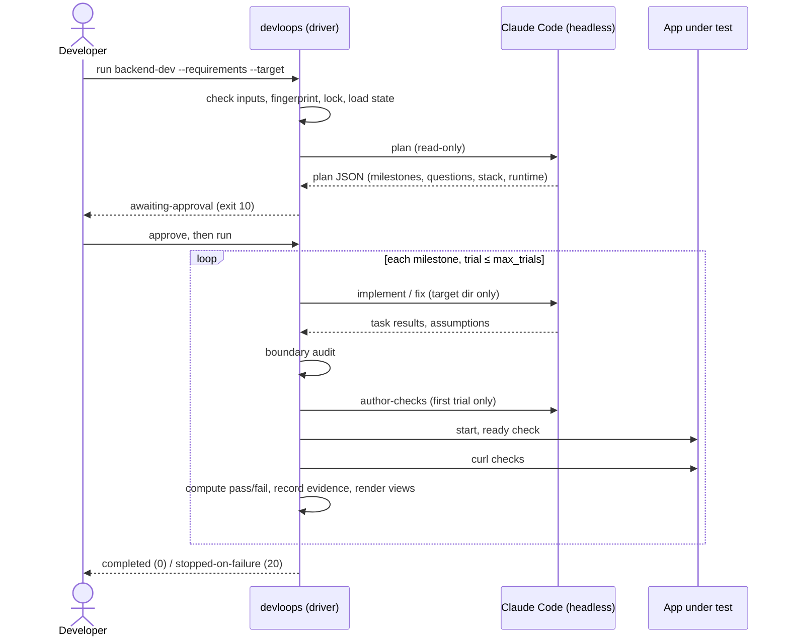

# Implementation Plan: Reusable Development Loops

**Branch**: `001-reusable-dev-loops` (the git branch is currently `main`) | **Date**: 2026-09-27 |
**Spec**: [spec.md](./spec.md)

**Input**: Feature specification from `specs/001-reusable-dev-loops/spec.md`

**Scope**: Goal #1 only. This plan covers the `backend-dev` and `frontend-dev` loops, the
infrastructure they share, and optional orchestration. The QuickFlow PRD (`quickflow/PRD.md`) is a
later consumer and adds nothing to this design.

**Decision tags** (following the user's classification):

| Tag | Meaning |
|-----|---------|
| **[ER]** | Explicit requirement, with the task description or spec reference |
| **[RD]** | Repository-derived |
| **[RC]** | Recommendation (alternatives exist; the rationale is in [research.md](./research.md)) |
| **U-n** | Formerly unresolved decision, since settled by the spec review of 2026-09-27 (now ER) |

## Summary

The loops are built as one **shared, stack-agnostic driver** (Python standard library, CLI
`bin/devloops`) plus two thin **loop definitions** (`loops/backend-dev`, `loops/frontend-dev`).
Each loop definition holds its authoritative `Loop-instructions.md`, a `task.md` template, and the
name of its validator adapter.

**The driver** owns everything that must be deterministic:
- input checks and fingerprints;
- the per-application workspace;
- state;
- choosing the next milestone;
- trial counting and stop conditions;
- the write-boundary audit;
- running curl checks;
- rendering the Markdown views;
- session and token accounting.

**Headless Claude Code** (`claude -p`, one call per step) does the work that needs judgement:
- planning milestones from a PRD or a single story;
- implementing and fixing code;
- turning acceptance criteria into curl checks;
- driving the UI through the Playwright MCP server.

**Supporting pieces**:
- An optional orchestrator runs `backend-dev`, then `frontend-dev`, in one workspace, and passes
  the backend's OpenAPI artifact to the frontend loop.
- Optional thin skills in `.claude/skills/` let a developer start any of these from inside Claude
  Code.

## Technical Context

**Language/Version**: Python ≥ 3.10, standard library only, for the driver [RC, R-2]. Python
3.14.7 is present locally [RD]. The applications built by the loops use whatever stack is chosen
per run (D-5); the driver assumes none (FR-059).

**Primary Dependencies**:
- Claude Code CLI 2.1.283, headless mode [ER: FR-044; RD: version verified].
- `curl` [ER: FR-017].
- The Playwright MCP server (`@playwright/mcp` via `npx`) [ER: FR-022; RC: package choice].
- `git`, for the boundary audit only [RC].

**Storage**: JSON and JSONL files under `workspaces/<ws>/<loop>/state/`, written atomically
(temporary file, then rename) [RC].

**Testing**: `unittest` (standard library), with a fake `claude` executable and a local
`http.server` fixture. No model or network access is needed [ER: constitution VIII; RC for tools].

**Target Platform**: A Linux or macOS developer machine with Claude Code logged in [RD].

**Project Type**: CLI tool plus prompt and instruction assets (developer tooling).

**Performance Goals**: None required by the spec. Driver overhead per step should be negligible
next to model time [RC].

**Constraints**:
- Hard limits: `max_trials` (default 3), a per-call timeout, an optional per-call budget, a per-run
  call cap, and one driver per workspace (a lock) [ER: FR-005/006; RC for the extra limits, R-18].
- `--max-turns` is not available in this CLI version [RD].

**Scale/Scope**: Two loops, one orchestrator, and about 15 driver modules. Up to about 20 milestones
per run are expected; the limit is configurable.

No `NEEDS CLARIFICATION` items remain, and no decisions are unresolved. U-1 to U-6 are settled by
the spec (see [Settled decisions](#settled-decisions)).

## Constitution Check

*GATE: checked before Phase 0 and again after Phase 1.*

| # | Principle | How this plan complies | Pre | Post |
|---|-----------|------------------------|-----|------|
| I | Requirements-driven; ambiguity surfaced | Planning must cite requirement references for every task. Open questions pause the run (FR-053). Later ambiguities become flagged assumptions in the final report (FR-055). Recommendations are tagged [RC] and never presented as requirements | ✅ | ✅ |
| II | Reusability | The driver has no application or stack knowledge. The stack and runtime come from the plan or config (R-7). Each run has its own workspace and target (D-3, D-7). SC-006 is tested with two unrelated fixtures | ✅ | ✅ |
| III | Verifiable increments | Work is split into milestones with acceptance criteria. Tasks are marked achieved only by the driver, after validation that checks observable behavior: curl responses checked by the driver, and Playwright results per criterion with evidence (R-8, R-10) | ✅ | ✅ |
| IV | Controlled, recoverable automation | Tool allowlists per step, a PreToolUse write guard, a post-call audit (R-11), per-trial persisted state, atomic writes, resume by the next-unit rule, a lock (FR-065), least privilege per step (FR-071), and secret redaction (FR-070) | ✅ | ✅ |
| V | Bounded execution | Trials per milestone and for planning, a timeout, a budget, a call cap, and explicit run outcomes (FR-028). Failures are recorded along with their evidence | ✅ | ✅ |
| VI | Separation of concerns | Plan, implement, validate, state, and orchestration are separate modules and separate Claude calls. The loops run on their own; the orchestrator only calls the same engine. Shared behavior lives once in `loops/shared` | ✅ | ✅ |
| VII | Existing infrastructure first | Reuses Claude Code headless flags, curl, git, and the `.claude/skills/` convention. No third-party Python packages | ✅ | ✅ |
| VIII | Testability and traceability | An offline test suite with a fake Claude. Traceability runs requirement ref → task → trial → session → evidence | ✅ | ✅ |
| IX | Documentation | `loops/README.md` with Mermaid sequence diagrams, configuration, and recovery (FR-047/048). The docs are updated with the code | ✅ | ✅ |
| X | Simplicity | A single driver, sequential orchestration, no service, no database, no SDK. The three-layer boundary guard is justified below | ✅ | ✅ |
| — | Constitutional boundary | The retry value, tools, and flags live in config and the plan, not in the constitution | ✅ | ✅ |

**Gate result**: PASS, before and after design. There are no unjustified violations.

## Project Structure

### Documentation (this feature)

```text
specs/001-reusable-dev-loops/
├── spec.md  plan.md  research.md  data-model.md  quickstart.md
├── contracts/
│   ├── cli.md  workspace-layout.md  claude-invocation.md
│   └── config / plan / checks / validation-result / invocation-record / run-state .schema.json
├── checklists/requirements.md
└── tasks.md            # created by /speckit-tasks
```

### Source code (repository root)

The full tree is in [contracts/workspace-layout.md](./contracts/workspace-layout.md).

```text
bin/devloops                 # CLI entry point
loops/
├── README.md                    # FR-047/048
├── shared/{devloops/, hooks/, prompts/, schemas/, config/, tests/}
├── backend-dev/{Loop-instructions.md, task.md, loop.json}
├── frontend-dev/{Loop-instructions.md, task.md, loop.json}
└── orchestrator/README.md
workspaces/<name>/{workspace.json, backend-dev/, frontend-dev/, orchestrator/}
.claude/skills/{loops-backend-dev, loops-frontend-dev, loops-orchestrate}/SKILL.md   # optional
```

**Structure decisions**:
- `loops/` holds only reusable infrastructure [ER: FR-037].
- `workspaces/` holds per-run artifacts [ER: D-3, FR-049].
- Application code lives in the target directory for each run [ER: D-7]. For the reference
  application that is expected to be under `quickflow/` [RD: the existing folder]. This is decided
  in the consumer phase, not here.
- The spec requires each loop to have `Loop-instructions.md`, `task.md`, `progress.md`, `state/`,
  and `outputs/` (FR-001). The first two live under `loops/<loop>/`; `progress.md`, `state/`, and
  `outputs/` live under `workspaces/<ws>/<loop>/` [ER: FR-001 as located by D-3; RC for the
  `task.md` split, R-14].

## Shared Loop Infrastructure

Everything common to both loops is implemented once, in `loops/shared/devloops/`
[ER: FR-038]. The loops differ only in their `Loop-instructions.md`, `task.md`, `loop.json`, and
validator adapter.

| Concern | Shared module | Behavior | Tag |
|---------|---------------|----------|-----|
| Configuration | `config.py` | Defaults < workspace `config.json` < CLI flags, checked against the schema and frozen into `run.json` at the first run | RC |
| Requirement intake | `inputs.py` | The file exists, is readable, and is not empty. Its SHA-256 is recorded. Mode is `prd`, `story-file`, or `prd-story`. The story ID must occur in the text. Semantic understanding is left to the plan step | ER: FR-009/010/013, D-6, D-8 |
| Workspace and lock | `workspace.py` | Create or attach, identity check, `state/lock` (PID + host), stale-lock detection | ER: FR-049–051; RC: lock |
| Phase and task management | `plan.py`, `state.py` | Plan schema plus semantic checks. Milestone, task, and trial state machines ([data-model.md](./data-model.md)) | ER: FR-014/020/025; RC: format |
| Next-unit selection | `selector.py` | See the [iteration model](#iteration-model), step 4 | ER: FR-026 |
| Retry and stop | `engine.py` | Trial count against `max_trials` plus grants (FR-063), planning trials (FR-061), `needs-input` fast fail (FR-055a), the time limit and call cap (FR-062), and run outcomes, including `stopped-on-service-error` (FR-067) | ER: FR-005–007, FR-028, FR-061–063, FR-067, D-1 |
| Validation tracking | `validators/*`, `state.py` | The driver computes the pass/fail result and records the evidence | ER: FR-027, FR-032 |
| Claude calls | `claude.py` | Prompt composition, allowlists, guard settings, timeout, structured output, invocation records | ER: FR-044–046, FR-033; RC: mechanism |
| Boundary safety | `boundary.py`, `hooks/guard_writes.py` | Guard plus audit (R-11), with tool caches and temporary directories outside the audit (R-23) | ER: FR-035–035d, FR-071 |
| Input and tool preflight | `preflight.py`, `openapi.py` | Required tools on `PATH`; `--api-spec` parses as OpenAPI 3 (R-22) | ER: FR-013a/b |
| Secret redaction | `redact.py` | Configured secret values become `***` before any prompt, record, stream, or evidence is written (R-21) | ER: FR-070 |
| Artifact rendering | `render.py` | Milestone files, `progress.md`, `task.md`, `plan-summary.md` (FR-058), `open-questions.md`, `final-report.md`, all from state | ER: FR-002–004; RC: rendering |
| Logging | `state.py` (events.jsonl) | Every action is an event; `progress.md` action items are rendered from events | ER: FR-004 |
| Error handling | `engine.py`, `claude.py` | Every exception during a trial is recorded as a trial failure with a reason code. Claude Code service failures void the trial and stop the run (R-19). Errors outside a trial (bad input, lock) exit with a code and never leave state half-written | ER: FR-007, FR-067; RC |
| Recovery | `engine.py` | An `in-progress` trial found at start becomes failed with reason `interrupted`, and it counts. After a service error, the next run restores the stored pre-stop state. Resume uses the next-unit rule | ER: FR-030, FR-030a, FR-067; RC |
| Runtime control | `runtime.py` | Starts the app with the plan's `start_command` in its own process group, polls `ready_url` until `ready_timeout_seconds`, and always stops the process group afterwards | RC |

## backend-dev design

| Topic | Design | Tag |
|-------|--------|-----|
| Accepted inputs | `--requirements` (a PRD or a story file), `--story-id`, `--target`, and optional `--config` | ER: FR-009/010, D-6, D-7 |
| Full PRD vs single story | In `prd` mode the plan covers the whole inventory. In story modes every task and criterion must cite the story ID. With `prd-story`, other PRD sections are context only (the driver rejects plans that break this) | ER: FR-010/010a |
| Requirement analysis | The plan step (read-only tools) reads the requirements and any existing code in the target, and returns a requirements inventory, open questions, assumptions, the stack with its source, and the runtime commands | ER: FR-053, FR-057; RC |
| Decomposition | Milestones (API-first ordering, following `Loop-instructions.md` guidance), each with tasks and observable acceptance criteria. Dependencies form a DAG | ER: FR-014; RC: guidance |
| Next unit | The shared selector | ER: FR-026 |
| Implementation workflow | One `implement` call per milestone (trial 1), or `fix` on trials 2 and later with the previous failure evidence. The target directory is the only writable root. The step must also keep the OpenAPI JSON at `runtime.openapi_path` current | ER: FR-015/016; RC: granularity (R-3) |
| Swagger/OpenAPI | An OpenAPI 3.x JSON document written by the implementation. After each achieved milestone it is copied to `outputs/openapi.json` and its fingerprint recorded; only verified endpoints reach the published copy. Serving a Swagger UI is optional | ER: FR-016/019; RC: JSON |
| curl validation | `author-checks` (read-only, once per milestone, frozen), then the driver starts the backend and runs each check through `curl` with expectations and captured variables | ER: FR-017/018; RC: mechanism (R-8) |
| Contract check | Every exercised operation must be in the OpenAPI document. At every milestone validation, before publication, every documented operation must be exercised by this milestone or an earlier achieved one, and this is repeated at completion. `outputs/openapi.json` therefore never lists an unverified endpoint | ER: FR-019; RC |
| Unit tests | Optional (`unit_tests.enabled`). They run after curl and must exit with 0 | ER: FR-008 |
| Result recording | `validation.json` with, for each check, the command, status, headers, body files, and failures, plus the per-criterion rollup | ER: FR-032 |
| Failure, retry, stop | Shared engine: at most 3 trials (configurable), then `stopped-on-failure` with the last evidence; no later milestone starts. `needs-input` fails at once. Service errors do not consume trials | ER: FR-005–007, FR-055a, FR-067, D-1 |
| Completion | All milestones achieved, the final contract check passes, and `outputs/openapi.json` and `final-report.md` are written. Status is `completed` | ER: FR-028 |
| Resume | Shared engine | ER: FR-030 |

## frontend-dev design

| Topic | Design | Tag |
|-------|--------|-----|
| Accepted inputs | `--requirements`, `--story-id`/`--story-file`, **`--api-spec`** (required), `--target`, optional `--config` (with the `backend.*` settings) | ER: FR-011, D-6 |
| Full PRD vs single story | Same rules as backend-dev (shared) | ER: FR-010 |
| Relationship with the backend | The API spec is copied into the workspace state and fingerprinted (a change stops the run, D-8). The prompts say to call only documented operations. Validation checks the network calls actually made against the spec | ER: FR-011, FR-024; RC: network check (R-10) |
| Requirement analysis and decomposition | The plan step, with milestones organized by feature or page and acceptance criteria phrased as observable UI behavior | ER: FR-020/023 |
| Next unit, workflow, retry, stop, resume | Shared engine, the same as backend-dev | ER: FR-038 |
| UI availability | The driver starts the frontend (and the backend, if `backend.start_command` is set), waits for `ready_url`, and records the UI URL in `run.json` and `outputs/ui-url.txt`. Without a backend address or start command, backend-dependent criteria fail | ER: D-2, FR-022, FR-039; RC: config keys |
| Playwright validation | A `validate-ui` call with only `Read` and `mcp__playwright__*`. Screenshots go to the trial's `evidence/`. It returns a result per criterion plus the network requests. The driver checks coverage, evidence files, that Playwright was actually used (stream-json), and the API contract | ER: FR-022/023; RC: mechanism |
| Unit tests | Optional, the same as backend-dev | ER: FR-008 |
| Result recording | `validation.json` (kind `playwright`) plus `stream.jsonl` | ER: FR-032 |
| Completion | All milestones achieved, UI URL recorded, final report written | ER: FR-028 |

## Optional orchestration

`orchestrate` [ER: FR-040–042, FR-052, FR-056; RC: sequential order, R-15]:

1. It attaches to or creates the workspace and runs the `backend-dev` engine, which is the same code
   path as `run backend-dev`.
2. If the backend result is not `completed`, it records the step and exits with the same code. A
   later `orchestrate` resumes.
3. It builds the handoff (the fingerprint of `outputs/openapi.json` and the backend runtime from
   the backend plan) and runs `frontend-dev` with `--api-spec` and `backend.*` filled in.
4. It records `completed` or the stop reason in `orchestrator/state.json` and renders
   `orchestrator/progress.md`.

The loops contain no orchestrator-specific code. Running a loop directly and running it under the
orchestrator follow the identical engine path (User Story 5, scenario 3).



## Contracts

| Contract | Location (design) | Location (runtime copy) |
|----------|-------------------|-------------------------|
| CLI, options, exit codes | [contracts/cli.md](./contracts/cli.md) | `loops/README.md` |
| Repository and workspace layout, write permissions | [contracts/workspace-layout.md](./contracts/workspace-layout.md) | `loops/README.md` |
| Claude calls (tools, modes, schemas) | [contracts/claude-invocation.md](./contracts/claude-invocation.md) | `loops/shared/devloops/claude.py` |
| Configuration and options | [config.schema.json](./contracts/config.schema.json) | `loops/shared/schemas/`, `loops/shared/config/defaults.json` |
| Plan (milestones, tasks, criteria) | [plan.schema.json](./contracts/plan.schema.json) | `loops/shared/schemas/` |
| State and completion state | [run-state.schema.json](./contracts/run-state.schema.json), [data-model.md](./data-model.md) | `loops/shared/schemas/` |
| Task and milestone status | [data-model.md](./data-model.md#milestone) | `state.py` |
| curl checks | [checks.schema.json](./contracts/checks.schema.json) | `loops/shared/schemas/` |
| Validation results, failures, retries | [validation-result.schema.json](./contracts/validation-result.schema.json), Trial in [data-model.md](./data-model.md#trial) | `loops/shared/schemas/` |
| Progress and session records | [invocation-record.schema.json](./contracts/invocation-record.schema.json) | `loops/shared/schemas/` |

The schemas in `loops/shared/schemas/` are copies of the design contracts. A unit test asserts they
are identical, so documentation matches implementation (constitution IX).

## Iteration model

The engine does the following each time `run` (or `orchestrate`) starts. **All state writes are
atomic, and each one happens before the action it describes.**

1. **Load state.** Acquire the lock (exit 40 if held). Load `workspace.json` and `run.json`, or
   create them on the first run.
   - Run preflight: required tools, and the API spec for frontend-dev (FR-013a/b).
   - If the run is terminal (with no new grant, FR-063), report it and exit without changes
     (FR-029).
   - If it is `stopped-on-service-error`, restore the stored pre-stop state (FR-067).
   - If a trial is recorded as `in-progress`, mark it failed with reason `interrupted` and record
     the event (FR-030a).
2. **Understand the requirements.**
   - Check the inputs and compare byte-level fingerprints of the requirements, the API spec, and
     the approved answers with the recorded ones. A mismatch gives `stopped-on-input-error` /
     `input-changed`, naming the input (D-8, FR-051a).
   - With no stored plan, run the `plan` step. That step is where Claude reads and interprets the
     requirements; the driver never parses requirements semantically.
   - Check the plan and store it, then render the views and move to `awaiting-approval`. Exit 10.
3. **Determine completed work.** This comes from state only: milestones with `achieved` status, and
   tasks with `achieved` or `implemented` status. Rendered Markdown is never read back as input,
   because state is authoritative (FR-034).
4. **Determine the next unit.** Take the first milestone, in stored topological order, whose status
   is not `achieved`.
   - If none remain, go to completion.
   - If that milestone is `failed`, the run is `stopped-on-failure` (D-1).
   - Otherwise the unit is (that milestone, trial n = number of counted trials + 1). `void` trials
     are not counted.
   - If n > `max_trials` + granted trials (FR-063), mark it `failed` and stop.
   - The call cap is checked here as well.
5. **Implement.**
   - Write the trial as `in-progress`, then take the boundary snapshot.
   - Call `implement` (n = 1) or `fix` (n > 1). The prompt lists only tasks that are not achieved,
     plus the approved answers, the stack and runtime, and, for `fix`, the previous failure summary
     and evidence paths.
   - If the call is a service failure (R-19): mark the trial `void`, set `stopped-on-service-error`
     (exit 50), and stop.
   - Audit the boundary afterwards. Record task statuses of `implemented` and any assumptions.
   - If `needs_input` is not empty, fail the milestone at once with reason `needs-input`, write the
     questions to `open-questions.md`, and stop (FR-055a).
6. **Validate.**
   - Backend: author the checks if none are frozen yet (first trial only), then start the runtime,
     run curl, check the contract, and run unit tests if enabled.
   - Frontend: start the runtime(s), run `validate-ui`, check coverage, evidence, Playwright use, and
     the contract, and run unit tests if enabled.
   - The runtime is always stopped afterwards.
7. **Record the result.** Redact secrets (FR-070), then write `validation.json` and store the
   evidence. The driver computes `passed` using the pass rule in the data model. That rule requires
   a result for every criterion (FR-068), at least one evidence item for every UI criterion
   (FR-023), and passing unit tests when they are enabled (FR-008). It never trusts the implementing
   step's claim (FR-069).
   - **Pass**: the trial becomes `passed`, the milestone and its tasks become `achieved`, and the
     OpenAPI artifact is copied (backend).
   - **Fail**: the trial becomes `failed`, with its reason and a summary of the failing checks or
     criteria.
8. **Retry when appropriate.** On a failed trial with n < `max_trials`, the next pass through step 4
   selects the same milestone with n + 1 (a `fix` trial). The frozen checks and the acceptance
   criteria stay the same. On failure with n = `max_trials`, the milestone becomes `failed`, its
   unachieved tasks become `failed`, and the run is `stopped-on-failure` / `trials-exhausted`.
9. **Persist state and progress.** After every step, re-render the milestone file, `progress.md`
   (action items; the start, end, tokens, cost, and sessions of each milestone), and `task.md`.
   The events and invocation records have already been appended.
10. **Continue or stop.** Loop back to step 4 until one of these happens:
    - completion: the final contract check passes, `final-report.md` is written with the flagged
      assumptions, and the status becomes `completed`;
    - `awaiting-approval` (exit 10);
    - `stopped-on-failure` (exit 20): trials exhausted, planning trials exhausted, the call cap, or
      `needs-input`;
    - `stopped-on-input-error` (exit 30);
    - `stopped-on-service-error` (exit 50).

    Release the lock and exit with the status code.

**No repeated work**:
- Achieved milestones are never selected again (step 4).
- Achieved tasks are left out of implement and fix prompts (step 5).
- A completed run makes no calls at all (step 1).
- Planning never re-runs after approval unless `replan` is explicitly requested.

## Safety and repository boundaries

| Risk | Safeguard | Tag |
|------|-----------|-----|
| Changing unrelated files | Tool allowlists per step. The PreToolUse guard allows only the target directory. The post-call audit (hashes of `loops/` and `state/`, `git status`) turns any outside change into a `boundary-violation` trial failure that lists the paths. The shared prompt rules forbid unrelated refactoring | ER: FR-035–035d; RC: mechanism |
| Silently changing requirements | Input fingerprints (D-8). Planning and validation steps have no write tools. Checks are frozen per milestone. Answers are recorded with a fingerprint. Assumptions are always shown in the phase file and the final report | ER: D-4, D-8, FR-055; RC |
| Unbounded retries | `max_trials` per milestone and for planning, the call cap, the timeout, the budget. Grants are explicit and recorded | ER: FR-005/006, FR-061–063; RC: budget |
| Continuing after a stop | Terminal states are checked first in step 1. Only an explicit, recorded `retry` grant can reopen a run | ER: FR-028/029, FR-063 |
| Outages using up trials | Service failures void the trial and stop the run resumably | ER: FR-067; RC: classification rule (R-19) |
| Secrets leaking into records | Redaction before every write; the README says to review workspaces before committing | ER: FR-070 |
| Scope creep through assumptions | Scope-changing assumptions are routed to `needs_input` and stop the run | ER: FR-055a |
| Losing state on interruption | Each state write happens before its action, atomically. Interrupted trials are detected. Sessions are identified by driver-assigned UUIDs recorded before each call | ER: FR-030; RC |
| Marking work complete without validation | Only the driver sets `achieved`, and only from its own pass rule. Model claims are never taken as a pass | ER: FR-027 |
| Silently ignoring validation failures | Every failure is recorded with its reason and evidence and rendered into `progress.md` and the milestone file. Failures cannot be suppressed by configuration | ER: FR-007, FR-032 |
| Concurrent runs on one workspace | A lock file with stale-lock detection | RC |

## Decision register

| ID | Decision | Class |
|----|----------|-------|
| DR-1 | Two loops plus shared infrastructure plus an optional orchestrator; each loop runs directly | ER (task Hint 2, FR-039/040) |
| DR-2 | Per-loop `Loop-instructions.md`, `task.md`, `progress.md`, `state/`, `outputs/` | ER (FR-001) |
| DR-3 | Per-run workspace and a target directory given at run time | ER (D-3, D-7) |
| DR-4 | Trials counted per milestone; exhaustion stops the run | ER (D-1) |
| DR-5 | Planning pause for approval; later ambiguities become flagged assumptions | ER (D-4) |
| DR-6 | Stack priority order and runtime commands declared in the plan | ER (D-5) + RC (runtime commands) |
| DR-7 | Deterministic driver around headless `claude -p` | RC (R-1) |
| DR-8 | Python standard library for the driver | RC (R-2) |
| DR-9 | One implement call per milestone per trial | RC (R-3) |
| DR-10 | Plan as structured output; Markdown rendered from state | RC (R-5) |
| DR-11 | Frozen curl checks, authored read-only and run by the driver | ER (FR-069: no weakening, evidence-based) + RC (mechanism, R-8) |
| DR-12 | OpenAPI as JSON, copied to outputs as the frontend contract | ER (FR-016) + RC (format) |
| DR-13 | Playwright validation in a restricted call, checked by the driver | ER (FR-022) + RC (mechanism) |
| DR-14 | Guard hook plus post-call audit | ER (FR-035b, FR-071) + RC (mechanism, R-11) |
| DR-15 | Session, token, and cost data from headless JSON; CSV export | ER (FR-004, FR-033) + RD (verified output fields) + RC (CSV) |
| DR-16 | `task.md` template in the loop, rendered copy in the workspace | ER (D-10, adopted from R-14) |
| DR-17 | Sequential orchestration | ER (D-9, adopted from R-15) |
| DR-18 | Optional wrapper skills in `.claude/skills/` | RD (existing convention) + RC |
| DR-19 | No `--max-turns`; timeout and budget used instead | RD (CLI 2.1.283) + ER (FR-062) |
| DR-20 | Service-failure classification from `api_error_status` and CLI errors; the trial is voided | ER (FR-067) + RD (verified field) + RC (rule, R-19) |
| DR-21 | `needs_input` in the implement result; immediate milestone failure | ER (FR-055a) + RC (mechanism, R-20) |
| DR-22 | Redaction of configured secrets before writes | ER (FR-070) + RC (config keys, R-21) |
| DR-23 | Preflight tool and OpenAPI checks | ER (FR-013a/b) + RC (checks, R-22) |
| DR-24 | `retry` command granting a recorded trial budget | ER (FR-063) + RC (CLI shape) |

## Settled decisions

These were unresolved when the plan was first written. The spec review of 2026-09-27 settled each
one, and they are now requirements. Full record: [research.md](./research.md#decisions-settled-by-the-spec-review-formerly-unresolved).

| ID | Decision | Spec |
|----|----------|------|
| U-1 | An OpenAPI 3 document is required; a Swagger UI is optional | FR-016 |
| U-2 | An interrupted trial counts, as failed with reason *interrupted* | FR-030a |
| U-3 | A direct `frontend-dev` run takes a backend address or start instructions; without either, backend-dependent criteria fail | FR-039 |
| U-4 | Least privilege per step; writes only in the target (modes remain [RC]) | FR-071 |
| U-5 | An explicit, recorded trial-budget grant (`retry`) | FR-063 |
| U-6 | No commits unless configured (`git.commit_per_milestone`, default off) | A-6 |

## Complexity Tracking

There are no constitution violations. One design choice adds complexity and is recorded for
transparency:

| Choice | Why needed | Simpler alternative rejected because |
|--------|------------|--------------------------------------|
| Three-layer write boundary (allowlist + hook + audit) | FR-035b and SC-009 require zero changes outside the allowed roots. Writes made through `Bash` cannot be blocked by the hook | Allowlist only: `Bash` can write anywhere. Audit only: detects a violation only after the damage |
