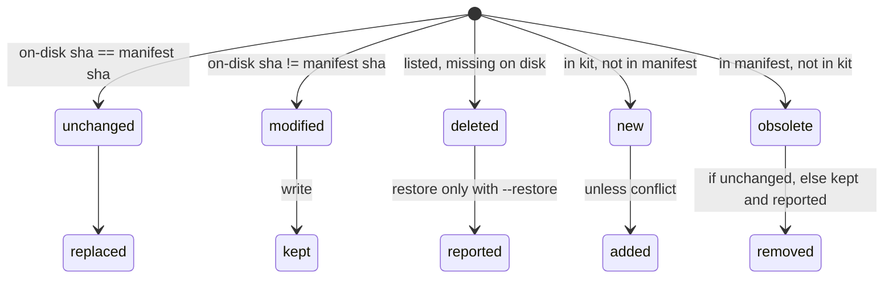

# Data Model: Devloops Project Setup

This feature adds project-level entities around 001's workspace model. 001's entities (Workspace,
Run state, Milestone, Trial, Invocation record, and so on) are unchanged except for the additive
fields listed in [§ Changes to 001 records](#changes-to-001-records). Every file is JSON, written
atomically, as in 001.

## Kit

The installed devloops files: loop definitions, prompts, schemas, hooks, default configuration,
and skill templates. Read-only to runs (FR-009).

| Field | Meaning |
|-------|---------|
| `root` | `loops/` in a source checkout, or `site-packages/devloops_kit/` when installed (research P-2) |
| `mode` | `source` or `installed` |
| `reserved` | Paths no target may overlap: the checkout's `loops/` and `bin/`, or both installed packages |
| `version` | `devloops.__version__` |
| `command` | How skills call devloops in a given project (research P-7) |

## Project

A directory containing `.devloops/devloops.json`, found from the current directory (FR-008).

| Field | Meaning |
|-------|---------|
| `root` | The parent of `.devloops/`. Every relative path in project files resolves against it |
| `config` | The Project configuration, merged with the Local configuration |
| `manifest` | The Install manifest |

**Rules**:
- The nearest project up from the current directory wins.
- `DEVLOOPS_PROJECT` overrides the search.

## Project configuration (`.devloops/devloops.json`) and Local configuration (`devloops.local.json`)

The schema is [contracts/project-config.schema.json](./contracts/project-config.schema.json). Both
files have the same shape, and the local one is deep-merged over the shared one.

| Field | Type | Default | Notes |
|-------|------|---------|-------|
| `schema_version` | 1 | 1 | |
| `workspace` | name | `main` | The default for `--workspace` |
| `workspaces_dir` | path | `.devloops/workspaces` | This repository sets `workspaces` (research P-17) |
| `dashboards_dir` | path | `.devloops/dashboards` | |
| `targets.backend-dev` / `targets.frontend-dev` | path or null | `backend` / `frontend` when `init` uses defaults | Validated by the target guard |
| `requirements` | `{path, story_file?}` or `{speckit_feature}` or null | null | Exactly one form; `"active"` means `.specify/feature.json` |
| `config` | 001 run configuration | `{}` | Layers 2 and 3 of research P-4 |

**Validation** (FR-016):
- unknown keys and wrong types are rejected, with the file and the key named;
- `requirements` must have exactly one of `path` and `speckit_feature`;
- a target that the guard would reject stops the command (exit 30).

**Lifecycle**:
- `init` writes `devloops.json` once. From then on, the developer owns it, and `--upgrade` never
  changes it.
- The local file is created by the developer, never by devloops.

## Install manifest (`.devloops/manifest.json`)

The schema is [contracts/manifest.schema.json](./contracts/manifest.schema.json).

| Field | Meaning |
|-------|---------|
| `devloops_version` | The version that last installed or upgraded |
| `kit_mode`, `command` | How `init` was run, and the command rendered into the skills |
| `installed_at`, `upgraded_at` | Timestamps |
| `ignore_rules` | The `.gitignore` lines added |
| `files` | `{path: sha256}` of every installed file, as written |

**Installed-file states**, computed by `--upgrade` (FR-027):

**Version rule**: if the manifest version is newer than the kit version, `--upgrade` is refused
(FR-028). If they differ in either direction, every other command warns (FR-029).

## Prompt source

One part of a composed prompt (research P-8).

| Field | Meaning |
|-------|---------|
| `part` | `common.md`, `steps/<step>.md`, or `<loop>/Loop-instructions.md` |
| `source` | `packaged` or `override` |
| `path` | The kit-relative or project-relative file used |
| `sha256` | The fingerprint of the content used |

The invocation record stores the list for each call. `run.json` stores the list in effect when the
configuration was frozen. A difference at a later start records a `prompt-sources-changed` event,
and `status` reports `prompt_drift` (FR-031, FR-032).

## Conversation copy

`<loop>/state/conversations/<seq>-<step>.jsonl` is the redacted, byte-for-byte copy of the call's
Claude Code transcript, made when the call ends (FR-042, research P-9).

| Invocation record field | Meaning |
|-------------------------|---------|
| `conversation_path` | Relative to the loop directory, or absent |
| `conversation` | `"copied"` or `"unavailable"` (with `conversation_reason`: `not-found`, `interrupted`, or `unreadable`) |

For records made before this feature, the full dashboard tries the Claude Code history at render
time. If it is not there, the conversation is shown as `unavailable`.

## Full dashboard

A self-contained HTML file. Its contract is [contracts/full-dashboard.md](./contracts/full-dashboard.md).

| Field | Meaning |
|-------|---------|
| `path` | `<dashboards_dir>/<workspace>/<UTC timestamp>[-n].html`, never overwritten |
| `generated_at`, `devloops_version`, `workspace` | Shown in the page header |
| `bytes`, `largest` | Reported by the command |
| `trigger` | `run-end` (final status) or `command` (`devloops dashboard`) |

Nothing records the generation in state. The dashboards directory itself is the history, and the
lightweight dashboard lists it newest first (FR-036a).

## Spec-kit feature

| Field | Meaning |
|-------|---------|
| `feature_dir` | Project-relative folder; `active` is resolved from `.specify/feature.json` at the first run |
| `spec` | `spec.md`, the requirements input (identity per 001 FR-051a) |
| `plan_md`, `tasks_md` | Optional. Each is recorded with its sha256 and checked on every start (FR-023c) |
| `phases[]` | Parsed from `tasks.md`: `{n, title, tasks: [{id, story, parallel, done, text}]}` |
| `stories` | `US<n>` → the `User Story <n>` heading found in `spec.md` |

**Parsing rules** (research P-16):
- a phase is a `## Phase <n>: <title>` heading;
- a task is a `- [ ]` / `- [x]` line starting with `T\d{3,}`;
- `[P]` sets `parallel`, and `[US<n>]` sets `story`.

Other lines are ignored.

**Recorded in `workspace.json`** as `requirements.speckit`. On a later start, a sha256 change is
`input-changed`, and a different `feature_dir` is `workspace-mismatch`.

## Check item (`devloops check`)

| Field | Meaning |
|-------|---------|
| `name` | `python`, `claude`, `curl`, `playwright-mcp`, `browser`, `git`, `display`, or `shared-visible-browser` |
| `status` | `ready`, `missing`, or `warning` |
| `detail`, `fix` | A one-line description and a one-line remedy |
| `needed_for` | The loops that need it, given the effective configuration |

`ready` (the overall result) is true when no `missing` item is needed (FR-019).

## Changes to 001 records

All changes are additive. Old workspaces stay valid (FR-033), and the schemas in
`loops/shared/schemas/` gain optional properties only.

| Record | Addition |
|--------|----------|
| `config.schema.json` `playwright` | `headless` (bool, default true); `executable_path` (string or null); `mcp_command` may be `null`, meaning derived (research P-15) |
| `invocation-record.schema.json` | `prompt_sources[]`; `conversation`; `conversation_path`; `conversation_reason` |
| `run-state.schema.json` | `config_sources` (sha256 per configuration file); `prompt_sources[]` |
| `plan.schema.json` | milestone `speckit_phase` (int or null); task `speckit_tasks[]`; plan `speckit_omitted[]` `{id, reason}` |
| `workspace.json` | `requirements.speckit`. Targets and paths are stored relative to the project root when inside it |
| `state.EVENT_TYPES` | `prompt-sources-changed` |
